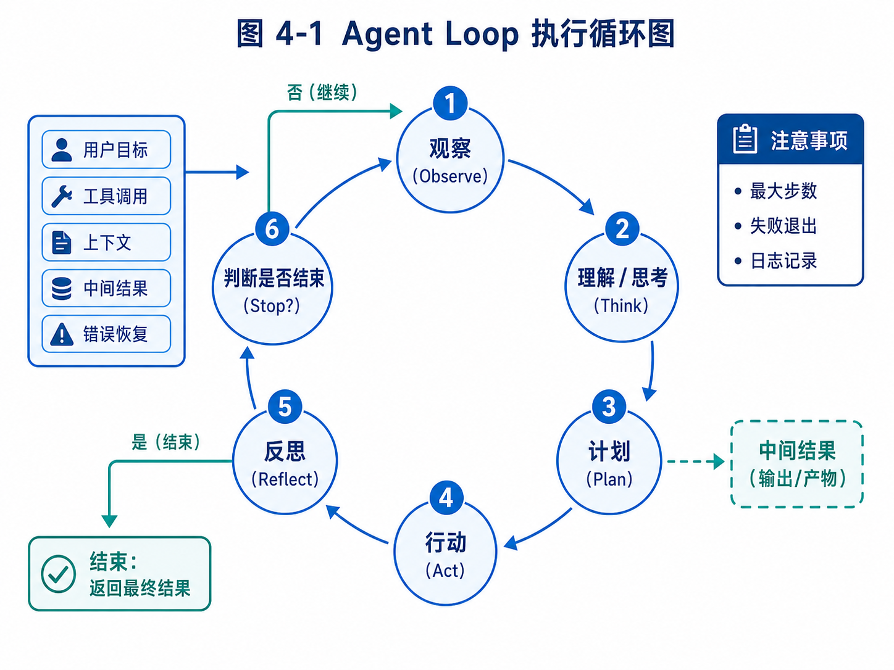

# 第 4 章：Agent Loop：从 Observe 到 Act

> 下图给出本章最核心的执行循环，后文会围绕 Observe、Think、Plan、Act、Reflect 与 Stop 逐步展开。



*图 4-1 Agent Loop 执行循环图*


在前面三章中，我们一直在强调：Agent 不是一个提示词，也不是一次工具调用，而是一套围绕目标持续执行的系统工程。到了本章，我们开始真正进入 Agent 内部，讨论一个最基础、也最容易被误解的核心机制：Agent Loop。

如果说工具系统是 Agent 的手脚，上下文工程是 Agent 的工作记忆，记忆系统是 Agent 的长期经验，那么 Agent Loop 就是 Agent 的心跳。它决定 Agent 如何从用户目标出发，观察当前状态，思考下一步，调用工具，接收结果，再继续推进任务，直到完成或停止。

很多初学者第一次写 Agent，通常会写出类似这样的代码：

```python
response = model.chat("请帮我完成这个任务")
print(response)
```

这当然可以得到一个回答，但它不是 Agent。因为这里没有持续观察，没有行动反馈，没有任务状态，也没有下一步决策。模型只是回答了一次。

后来，开发者可能会加上工具调用：

```python
response = model.chat(messages, tools=tools)
```

这已经比单轮问答更进一步。模型可以在需要时调用工具。但如果系统只是“模型请求工具，工具返回结果，模型再回答”，仍然只能算一个工具增强对话系统。真正的 Agent 需要一个循环：它必须能够在多轮工具调用和状态变化中持续推进目标。

这个循环，就是 Agent Loop。

本章会从概念、模式、实现和工程化四个层面展开。我们先理解 Agent Loop 为什么重要，再拆解 Observe、Think、Plan、Act、Reflect、Stop 等关键环节，然后实现一个最小 Agent Loop，最后讨论真实工程中必须处理的停止条件、失败恢复、日志记录、循环失控和人类干预。

本章的重点不是写一个“看起来能跑”的 Demo，而是让你真正理解 Agent 为什么需要循环，循环中每一步承担什么职责，以及如何让这个循环可控。

---

## 4.1 为什么 Agent 需要 Loop

人类完成复杂任务时，很少是一次性想清楚全部步骤，然后机械执行到底。更多时候，我们是在不断观察、判断、行动和修正。

例如，你想调研沙特市场的钢卷尺潜在客户。你可能先用搜索引擎输入关键词 “Saudi Arabia measuring tape importer”。如果结果不理想，你会换成 “hardware distributor Saudi Arabia”“tools wholesaler Riyadh”“construction tools supplier KSA”。当你打开一个公司网站时，你会观察它主营什么产品，是不是批发商，有没有联系方式，有没有进口业务信号。如果发现它只是零售小店，你会排除。如果发现它是大型五金分销商，你会记录下来。你还可能根据搜索中发现的新词调整后续搜索策略。

这整个过程不是一次推理，而是一个循环。

同样，代码开发也是循环。你接到一个 bug，先读错误日志，再搜索代码，再提出假设，再改一小处，再运行测试。如果测试失败，你再读新的错误信息，继续修正。没有一个开发者能在不了解项目的情况下，一次性写出完整正确补丁。

教育辅导也是循环。老师看学生错题，判断错因，布置练习，观察反馈，再调整教学。一次讲解不能保证学生真正掌握，必须通过持续反馈判断。

这些现实任务都具备一个共同特点：每一步行动都会改变下一步判断的依据。

Agent Loop 正是为了模拟这种“基于反馈的持续执行”。

一个最简单的 Agent Loop 可以抽象成：

```text
while not done:
    observe current state
    decide next action
    execute action
    observe result
    update state
```

这段伪代码看起来很简单，但它包含了 Agent 和普通模型调用的根本区别。普通模型调用只生成一次输出；Agent Loop 则让模型进入一个可持续推进任务的控制结构。

举一个具体例子。

用户输入：

```text
帮我找到 5 家阿联酋的五金工具批发商，并判断它们是否适合推广钢卷尺。
```

如果只是单次回答，模型可能凭已有知识生成一个列表，但列表可能过时、虚构或无法验证。

如果是 Agent Loop，它的执行可能是：

```text
第 1 步：理解任务，确定目标国家、客户类型、产品。
第 2 步：调用搜索工具，搜索 UAE hardware tools wholesaler。
第 3 步：读取搜索结果，发现很多是零售电商。
第 4 步：调整关键词为 building materials distributor UAE。
第 5 步：打开一个候选公司网站，提取主营业务和联系方式。
第 6 步：判断该公司是否批发五金工具。
第 7 步：记录合格客户。
第 8 步：重复搜索和筛选，直到找到 5 家或达到搜索上限。
第 9 步：生成最终表格和理由。
```

这里每一步都依赖前一步的结果。搜索结果不好，就换关键词；网页信息不足，就标记低置信度；客户数量不够，就继续搜索；达到目标后，就停止。

这就是 Agent Loop 的价值。

但是，Loop 也带来风险。如果没有停止条件，Agent 可能无限搜索；如果没有状态记录，它可能重复访问同一个网站；如果没有工具权限控制，它可能执行危险动作；如果没有日志，失败后无法复盘；如果没有人工确认，它可能把草稿直接发送给客户。

所以，学习 Agent Loop 不能只学“怎么循环”，还要学“如何让循环停下来、可观察、可审计、可控制”。

---

## 4.2 Agent Loop 的基本结构

一个完整的 Agent Loop 通常可以拆成六个环节：Observe、Think、Plan、Act、Reflect、Stop。

这六个词不是某个框架的固定接口，而是一种理解 Agent 行为的通用方式。不同框架可能用不同名字，有的把 Think 和 Plan 合并，有的没有显式 Reflect，有的把 Stop 做成状态图终止条件。但背后的问题是相似的。

### 4.2.1 Observe：观察当前状态

Observe 是 Agent 获取当前信息的过程。它回答的问题是：现在我知道什么？任务处于什么状态？外部环境给了我什么反馈？

在聊天场景中，Observe 可能只是读取用户输入。

在工具调用场景中，Observe 还包括读取工具返回结果。

在浏览器 Agent 中，Observe 可能是网页截图、DOM 文本、可点击元素列表、当前 URL 和页面标题。

在代码 Agent 中，Observe 可能是文件内容、目录结构、测试输出、git diff、错误日志。

在外贸 Agent 中，Observe 可能是搜索结果、公司官网内容、邮箱提取结果、客户评分表、历史触达记录。

举例来说，代码 Agent 运行测试后得到：

```text
FAILED tests/test_auth.py::test_login_with_email_code
AssertionError: expected status_code 200, got 500
```

这就是新的 observation。Agent 必须把它纳入下一步判断，而不是继续按照原计划盲目执行。

Observe 的质量决定了 Agent 后续决策的质量。如果观察信息不准确、不完整或没有结构，Agent 很容易误判。

例如，一个浏览器 Agent 如果只能看到网页截图，但看不到可点击元素的语义，它可能不知道哪个按钮是“下一页”。一个代码 Agent 如果只看到报错最后一行，看不到完整栈信息，可能修错地方。一个外贸 Agent 如果只看到公司名称，看不到主营业务，就无法判断是否适合钢卷尺。

因此，工程上经常需要把 observation 做成结构化格式，而不是简单文本。

例如外贸客户观察可以表示成：

```json
{
  "source": "search_result",
  "query": "UAE hardware distributor",
  "company_name": "Example Hardware Trading LLC",
  "url": "https://example.com",
  "snippet": "Wholesale supplier of tools, building materials and industrial supplies in Dubai.",
  "signals": ["wholesale", "tools", "Dubai", "industrial supplies"],
  "uncertainties": ["no email found yet"]
}
```

这样的结构比一段自由文本更适合后续处理。

### 4.2.2 Think：理解和判断

Think 是 Agent 对当前观察进行解释的过程。它回答的问题是：这些信息意味着什么？现在应该关注什么？任务是否发生变化？

例如，外贸 Agent 观察到一个公司网站写着：

```text
We are a leading supplier of hand tools, measuring tools, power tools and construction materials in Dubai.
```

它需要判断：这个公司可能适合钢卷尺。因为 hand tools 和 measuring tools 是强相关信号，Dubai 是目标地区，supplier 可能意味着分销或批发。

如果网站写的是：

```text
We provide home decoration services and interior design solutions.
```

Agent 应该判断：这个公司不是理想客户，除非它有工程采购部门。

Think 不一定要暴露完整推理过程给用户。在工程中，我们更关心它输出可执行判断，例如：是否继续、调用什么工具、记录什么状态、需要什么确认。

一个安全的 Think 输出可以是：

```json
{
  "assessment": "candidate_relevant",
  "reason": "Website mentions hand tools and measuring tools; target location matches UAE.",
  "next_need": "extract_contact_info",
  "confidence": 0.78
}
```

这个结构比让模型自由输出长篇思考更稳定，也更容易被系统使用。

### 4.2.3 Plan：决定下一步或多步计划

Plan 是把判断转化为执行路线。它回答的问题是：接下来要做什么？

有些 Agent 每次只计划一步。例如 ReAct 模式中，模型观察当前状态后，直接决定下一步工具调用。

有些 Agent 会先生成多步计划。例如 Plan-and-Execute 模式中，模型先列出整体计划，再由执行器逐步完成。

例如，对于“寻找 5 家阿联酋五金工具批发商”，多步计划可能是：

```text
1. 搜索 UAE hardware tools wholesaler / distributor。
2. 收集前 20 个候选网站。
3. 逐个判断是否为批发商或分销商。
4. 提取公司名称、网站、主营产品、邮箱、国家城市。
5. 根据产品匹配度和联系方式质量评分。
6. 输出前 5 家，并说明理由。
```

但在执行中，这个计划可能需要调整。如果搜索结果主要是零售电商，Agent 应该改变搜索策略。如果候选客户不够，Agent 应该扩大关键词。如果找到大型公司但没有邮箱，Agent 应该标记“需人工补充联系人”。

所以，Plan 不是一次写死的路线，而是可以随着 observation 更新。

### 4.2.4 Act：执行动作

Act 是 Agent 通过工具改变状态或获取信息的过程。它回答的问题是：现在调用哪个工具？用什么参数？期望得到什么结果？

Act 可以是低风险的信息动作，例如搜索、读取文件、查询数据库。

也可以是中风险的写入动作，例如创建草稿、写入报告、修改本地文件。

也可能是高风险动作，例如发送邮件、提交代码、删除文件、支付订单。

不同风险等级的动作应该有不同控制策略。

例如：

```text
search_web：可以自动执行。
read_file：通常可以自动执行，但要限制目录范围。
write_file：可以在工作区内自动执行，但需要记录 diff。
send_email：必须人工确认。
delete_file：必须人工确认，且需要可恢复。
execute_shell：需要命令白名单或用户确认。
```

在 Agent Loop 中，Act 不是“模型想做什么就做什么”。模型只能提出动作请求，系统负责验证、执行和记录。

一个工具调用请求可以表示成：

```json
{
  "tool_name": "search_web",
  "arguments": {
    "query": "UAE hardware tools wholesale distributor measuring tools",
    "max_results": 10
  },
  "reason": "Need to find candidate wholesale distributors in UAE."
}
```

系统收到请求后，要检查工具是否存在、参数是否有效、是否超出权限、是否超过调用频率。如果通过，才真正执行。

### 4.2.5 Reflect：反思结果和修正策略

Reflect 是 Agent 对执行结果进行复盘和调整。它回答的问题是：刚才的动作有效吗？是否接近目标？需要改变策略吗？

很多简单 Agent 没有显式 Reflect，只是把工具结果放回上下文，让模型下一轮自然处理。但在复杂任务中，显式反思很有价值。

例如，外贸 Agent 连续搜索三次都找到零售网站，就应该反思：当前关键词太偏终端消费者，需要改用 distributor、wholesale、importer、building materials supplier 等词。

代码 Agent 修改后测试失败，也应该反思：失败是语法错误、依赖缺失、接口不兼容，还是测试预期需要更新？

教育 Agent 发现学生连续做错同类题，也应该反思：当前讲解方式可能不够，应该降低难度或回到前置知识点。

Reflect 的输出不应该只是“我应该更努力”。它需要具体调整。

例如：

```json
{
  "reflection": "Search results are dominated by retail e-commerce pages.",
  "strategy_update": "Use B2B and distributor-oriented keywords; include terms such as 'LLC', 'trading', 'building materials', and 'industrial supplies'.",
  "next_action": "search_web"
}
```

Reflect 的作用，是避免 Agent 在错误方向上机械重复。

### 4.2.6 Stop：判断何时停止

Stop 是 Agent Loop 中最容易被忽视、却极其重要的环节。它回答的问题是：什么时候应该结束？

停止条件可以分为目标完成、资源耗尽、失败终止、等待人工和安全终止。

目标完成是最理想情况。例如已经找到 5 家符合条件的客户，并生成表格。

资源耗尽是指达到最大步数、最大 token、最大搜索次数、最大时间或预算上限。

失败终止是指连续失败，无法继续推进。例如搜索工具不可用，网页无法访问，模型连续输出无效工具调用。

等待人工是指任务进入审批节点。例如开发信已经生成，需要用户确认是否发送。

安全终止是指发现高风险行为。例如模型试图访问禁止路径、执行危险命令、泄露敏感信息。

一个没有 Stop 设计的 Agent 很容易失控。它可能无限搜索，重复调用工具，反复修改代码，或者在没有足够证据时强行完成任务。

因此，最小 Agent Loop 中必须包含停止条件。即使只是学习 Demo，也应该设置最大步数。

例如：

```python
MAX_STEPS = 10
for step in range(MAX_STEPS):
    action = agent.decide(state)
    if action.type == "final_answer":
        break
    result = execute_tool(action)
    state.add_observation(result)
else:
    state.mark_failed("Reached max steps without completion")
```

这个 `MAX_STEPS` 看起来简单，却是防止 Agent 无限循环的第一道防线。

---

## 4.3 ReAct：最经典的 Agent Loop 模式

Agent Loop 有很多实现方式，其中最经典的是 ReAct。ReAct 是 Reasoning and Acting 的缩写，核心思想是让模型在推理和行动之间交替进行。

一个典型 ReAct 循环可以表示为：

```text
Thought: 我需要先搜索目标信息。
Action: search_web(query="...")
Observation: 搜索结果如下...
Thought: 这些结果中第 2 个更相关，我需要打开网页。
Action: open_url(url="...")
Observation: 网页内容如下...
Thought: 我已经获得足够信息，可以回答。
Final: ...
```

在早期 Agent 教程中，ReAct 经常以显式文本形式出现。模型被要求输出 Thought、Action、Observation、Final。这种方式非常直观，适合教学。

例如，用户问：

```text
帮我判断 Example Hardware Trading LLC 是否适合推广钢卷尺。
```

ReAct 过程可能是：

```text
Thought: 我需要了解这家公司的主营业务和客户类型。
Action: search_web(query="Example Hardware Trading LLC measuring tools")
Observation: 搜索结果显示该公司供应 hand tools, measuring tapes, power tools, building materials。
Thought: 该公司有 measuring tapes 和 hand tools 相关信号，需要查看联系方式和业务类型。
Action: open_url(url="https://example.com/about")
Observation: About 页面显示它是 Dubai 的 wholesale distributor。
Thought: 它是目标市场中的五金工具批发商，和钢卷尺高度相关。
Final: 适合推广，理由是...
```

ReAct 的优点是简单、灵活、容易理解。它特别适合开放探索任务，因为模型可以根据每次 observation 决定下一步。

但 ReAct 也有缺点。

第一，它容易走偏。因为每一步都由模型即时决定，如果上下文提示不清，模型可能选择无关工具。

第二，它容易重复。模型可能多次搜索相似关键词，或者反复读取同一网页。

第三，它不擅长长任务规划。对于需要几十步的任务，纯 ReAct 可能缺少整体路线。

第四，它的中间推理如果完全暴露在上下文中，会占用大量 token。

第五，它不天然提供状态管理、审批、恢复和评估。

所以，ReAct 是理解 Agent Loop 的好起点，但不能把 ReAct 等同于完整 Agent 系统。

在工程中，我们可以保留 ReAct 的“观察-行动”思想，但把输出结构化，让系统更可控。

例如，让模型输出：

```json
{
  "decision_type": "tool_call",
  "tool_name": "search_web",
  "arguments": {
    "query": "UAE measuring tools distributor wholesale"
  },
  "rationale": "Need more candidates from B2B distributor sources."
}
```

而不是让模型自由生成一段 `Thought` 文本。这样系统更容易解析、验证和执行。

---

## 4.4 Plan-and-Execute：先规划，再执行

与 ReAct 相比，Plan-and-Execute 更强调先生成整体计划，再逐步执行。

它适合目标比较明确、任务链路较长、需要阶段性管理的场景。

例如用户说：

```text
帮我研究 OpenClaw、Hermes、Claude Code 三类 Agent 产品，比较它们对构建 Athena AI 员工系统的启发。
```

如果用纯 ReAct，Agent 可能边搜边写，容易散乱。更合理的做法是先生成计划：

```text
1. 明确比较维度：产品形态、任务类型、工具系统、长期运行、用户交互、安全边界。
2. 分别收集 OpenClaw 的公开信息和源码结构。
3. 收集 Hermes 的公开资料。
4. 基于公开行为分析 Claude Code 的工作流特征。
5. 生成对照表。
6. 提炼 Athena 可借鉴模块。
7. 标注哪些是已确认事实，哪些是设计推断。
```

然后执行器按计划逐步完成。

Plan-and-Execute 的优点是结构清晰，适合长任务，也更容易展示给用户审批。用户可以在执行前看到计划，并修改方向。

例如，外贸 Agent 开始搜索前，可以先展示：

```text
我计划按以下策略寻找客户：
1. 先搜索 UAE/Saudi 五金工具批发商。
2. 再搜索建筑材料和工业用品分销商。
3. 排除零售电商和平台店铺。
4. 对候选客户按产品匹配度、客户类型、联系方式质量评分。
5. 只生成开发信草稿，不自动发送。
```

用户可以补充：

```text
不要找 Saudi，先只找 UAE；优先 Dubai 和 Sharjah。
```

这样 Agent 的执行方向会更稳定。

但 Plan-and-Execute 也有问题。

第一，计划可能一开始就错。如果信息不足，模型生成的计划可能不适合实际情况。

第二，执行中环境变化，计划需要调整。如果搜索不到足够客户，原计划必须修改。

第三，计划过细会降低灵活性，计划过粗又没有指导意义。

因此，工程中常用的不是“固定计划执行到底”，而是“计划 + 执行 + 重新规划”。

可以表示成：

```text
生成初始计划
执行当前步骤
观察结果
判断计划是否仍然有效
如果无效，更新计划
继续执行
```

这其实又回到了 Loop，只是 Loop 中多了一个显式计划对象。

---

## 4.5 Workflow + Agent：真实产品中更常见的模式

在真实产品里，纯 ReAct 或纯 Plan-and-Execute 都不是最终答案。更常见的是 Workflow + Agent。

也就是说，系统用工作流控制大方向，用 Agent 处理其中不确定、需要判断的节点。

例如外贸客户开发流程可以设计成：

```text
输入任务配置
↓
生成搜索策略
↓
搜索候选客户
↓
客户网页读取
↓
客户类型判断
↓
客户评分
↓
生成开发信草稿
↓
人工审批
↓
发送或导出
↓
跟进调度
```

这个流程的大框架是确定的，不需要模型自由决定。但是每个节点内部可以使用 Agent 能力。

例如“客户类型判断”节点需要模型理解网页内容；“搜索策略生成”节点需要模型根据产品和国家设计关键词；“开发信草稿”节点需要模型写作；“回复理解”节点需要模型判断客户意图。

这种方式有几个好处。

首先，它更可控。系统知道任务处于哪个阶段，不会完全靠模型即兴发挥。

其次，它更容易恢复。任务失败时，可以从某个节点重新开始，而不是整个上下文丢失。

再次，它更容易审批。高风险节点可以固定设置人工确认。

最后，它更适合产品化。前端可以展示阶段进度，而不是只显示一堆模型日志。

代码 Agent 也适合这种模式：

```text
理解需求
↓
分析代码仓库
↓
生成修改计划
↓
用户确认计划
↓
修改文件
↓
运行测试
↓
失败修复循环
↓
生成 diff
↓
用户 review
```

在这个流程中，Agent 可以智能分析代码和修复测试失败，但不能跳过用户确认直接提交。

教育 Agent 也是类似：

```text
收集作业结果
↓
识别错因
↓
更新学生画像
↓
生成练习推荐
↓
老师确认
↓
推送给学生
↓
跟踪完成情况
```

可以看到，真实系统中的 Agent Loop 往往不是一个孤立 `while` 循环，而是嵌入在任务状态机和工作流中的局部循环。

这也是为什么本书后续会继续讲任务状态、长期调度、审批和可观测性。没有这些机制，Agent Loop 很难进入真实产品。

---

## 4.6 最小 Agent Loop 的实现

下面我们实现一个教学版最小 Agent Loop。它不会依赖复杂框架，也不追求生产可用，而是帮助你理解基本结构。

我们先定义几个核心对象：TaskState、Action、ToolResult、Agent。

### 4.6.1 TaskState：任务状态

任务状态需要记录用户目标、执行历史、当前结果和停止原因。

```python
from dataclasses import dataclass, field
from typing import Any, Dict, List, Optional

@dataclass
class StepRecord:
    step_id: int
    action: Dict[str, Any]
    observation: Dict[str, Any]

@dataclass
class TaskState:
    goal: str
    steps: List[StepRecord] = field(default_factory=list)
    final_answer: Optional[str] = None
    status: str = "running"
    stop_reason: Optional[str] = None

    def add_step(self, action: Dict[str, Any], observation: Dict[str, Any]) -> None:
        self.steps.append(
            StepRecord(
                step_id=len(self.steps) + 1,
                action=action,
                observation=observation,
            )
        )

    def mark_done(self, answer: str) -> None:
        self.status = "done"
        self.final_answer = answer
        self.stop_reason = "goal_completed"

    def mark_failed(self, reason: str) -> None:
        self.status = "failed"
        self.stop_reason = reason
```

这里的状态非常简单，但已经包含了关键思想：Agent 每一步都要留下记录，而不是只把信息放在 prompt 里。

如果后续出现问题，我们至少可以查看它调用了哪些动作、得到哪些观察、为什么停止。

### 4.6.2 Tool Registry：工具注册表

本章先实现一个非常简化的工具注册表，下一章会专门深入工具系统。

```python
from typing import Callable

class ToolRegistry:
    def __init__(self):
        self._tools: Dict[str, Callable[..., Dict[str, Any]]] = {}

    def register(self, name: str, func: Callable[..., Dict[str, Any]]) -> None:
        self._tools[name] = func

    def execute(self, name: str, arguments: Dict[str, Any]) -> Dict[str, Any]:
        if name not in self._tools:
            return {
                "ok": False,
                "error": f"Tool not found: {name}"
            }
        try:
            return self._tools[name](**arguments)
        except Exception as exc:
            return {
                "ok": False,
                "error": str(exc)
            }
```

注册几个模拟工具：

```python
def mock_search(query: str, max_results: int = 5) -> Dict[str, Any]:
    return {
        "ok": True,
        "results": [
            {
                "title": "Dubai Industrial Tools Trading LLC",
                "url": "https://example.com/dubai-tools",
                "snippet": "Wholesale supplier of hand tools, measuring tools and construction materials."
            },
            {
                "title": "Home Decor UAE",
                "url": "https://example.com/home-decor",
                "snippet": "Interior design and home decoration services."
            }
        ][:max_results]
    }

def save_note(filename: str, content: str) -> Dict[str, Any]:
    with open(filename, "w", encoding="utf-8") as f:
        f.write(content)
    return {
        "ok": True,
        "filename": filename
    }
```

### 4.6.3 Agent 决策接口

在真实系统中，Agent 的 `decide` 方法会调用大模型。为了突出结构，我们先用一个伪决策器模拟。

```python
class SimpleAgent:
    def decide(self, state: TaskState) -> Dict[str, Any]:
        if len(state.steps) == 0:
            return {
                "type": "tool_call",
                "tool_name": "search",
                "arguments": {
                    "query": state.goal,
                    "max_results": 5
                }
            }

        last_observation = state.steps[-1].observation
        if last_observation.get("ok") and "results" in last_observation:
            results = last_observation["results"]
            relevant = [
                r for r in results
                if "tools" in r["snippet"].lower() or "measuring" in r["snippet"].lower()
            ]
            answer = "找到以下可能相关客户：\n"
            for item in relevant:
                answer += f"- {item['title']}：{item['snippet']}\n"
            return {
                "type": "final_answer",
                "answer": answer
            }

        return {
            "type": "final_answer",
            "answer": "未找到足够相关信息。"
        }
```

这个示例很简单：第一步搜索，第二步整理结果并结束。

它不是智能 Agent，但它已经展示了 Loop 的结构。

### 4.6.4 运行循环

最后写运行器：

```python
class AgentRunner:
    def __init__(self, agent: SimpleAgent, tools: ToolRegistry, max_steps: int = 5):
        self.agent = agent
        self.tools = tools
        self.max_steps = max_steps

    def run(self, goal: str) -> TaskState:
        state = TaskState(goal=goal)

        for _ in range(self.max_steps):
            action = self.agent.decide(state)

            if action["type"] == "final_answer":
                state.mark_done(action["answer"])
                return state

            if action["type"] == "tool_call":
                observation = self.tools.execute(
                    action["tool_name"],
                    action.get("arguments", {})
                )
                state.add_step(action, observation)
                continue

            state.mark_failed(f"Unknown action type: {action.get('type')}")
            return state

        state.mark_failed("Reached max steps")
        return state
```

运行：

```python
if __name__ == "__main__":
    tools = ToolRegistry()
    tools.register("search", mock_search)
    tools.register("save_note", save_note)

    runner = AgentRunner(SimpleAgent(), tools, max_steps=5)
    state = runner.run("UAE hardware tools wholesaler measuring tape")

    print("Status:", state.status)
    print("Stop reason:", state.stop_reason)
    print("Answer:")
    print(state.final_answer)
```

输出可能是：

```text
Status: done
Stop reason: goal_completed
Answer:
找到以下可能相关客户：
- Dubai Industrial Tools Trading LLC：Wholesale supplier of hand tools, measuring tools and construction materials.
```

这个最小例子有几个关键点：

第一，任务有状态，而不是只有一次模型回答。

第二，Agent 每一步输出 action，系统执行 action。

第三，工具结果作为 observation 回到状态。

第四，循环有最大步数，防止无限执行。

第五，最终状态记录停止原因。

这就是 Agent Loop 的最小骨架。

---

## 4.7 把模型接入 Agent Loop

上面的 SimpleAgent 是手写逻辑。真实 Agent 需要让大模型根据状态决定下一步。

但接入模型时要注意：不要让模型输出完全自由的文本，而要让它输出结构化决策。

一个简化提示词可以是：

```text
你是一个任务执行 Agent。
你需要根据用户目标和历史观察，决定下一步动作。

你只能输出 JSON，格式如下：

如果需要调用工具：
{
  "type": "tool_call",
  "tool_name": "工具名",
  "arguments": { ... },
  "reason": "为什么调用"
}

如果任务完成：
{
  "type": "final_answer",
  "answer": "最终答案"
}

如果需要人工确认：
{
  "type": "need_approval",
  "question": "需要用户确认的问题"
}
```

然后把当前状态压缩后传给模型。

```python
import json

class LLMAgent:
    def __init__(self, model_client):
        self.model_client = model_client

    def decide(self, state: TaskState) -> Dict[str, Any]:
        messages = self.build_messages(state)
        raw = self.model_client.chat(messages)
        return json.loads(raw)

    def build_messages(self, state: TaskState) -> List[Dict[str, str]]:
        history = []
        for step in state.steps[-5:]:
            history.append({
                "step_id": step.step_id,
                "action": step.action,
                "observation": step.observation,
            })

        prompt = f"""
用户目标：{state.goal}

最近执行历史：
{json.dumps(history, ensure_ascii=False, indent=2)}

请决定下一步动作。
"""
        return [
            {"role": "system", "content": "你是一个安全、谨慎的任务执行 Agent。"},
            {"role": "user", "content": prompt}
        ]
```

这里有几个工程重点。

第一，只传最近几步历史，避免上下文无限增长。更完整的历史应该保存在状态数据库和 trace 系统中，而不是全部塞给模型。

第二，要求模型输出 JSON，方便系统解析。真实项目还需要 JSON schema 校验和失败重试。

第三，模型只是决策者，不直接执行工具。系统必须验证工具名和参数。

第四，`need_approval` 是一种动作类型。Agent 不一定只有工具调用和最终回答，它也可以进入等待人工状态。

---

## 4.8 Agent Loop 中的状态设计

很多初学者写 Agent 时，会把所有信息都追加到 messages 里：

```python
messages.append({"role": "assistant", "content": thought})
messages.append({"role": "tool", "content": tool_result})
```

这样做在简单 Demo 中可以，但在真实系统中会出现很多问题。

第一，上下文会越来越长，成本增加，模型注意力分散。

第二，历史信息缺少结构，难以查询和复盘。

第三，无法区分哪些是任务状态，哪些是工具结果，哪些是用户偏好。

第四，任务失败后难以恢复，因为状态只存在于 prompt 中。

因此，Agent Loop 需要显式状态设计。

一个稍微完整的任务状态可以包括：

```json
{
  "task_id": "task_001",
  "goal": "Find 5 UAE hardware wholesalers for measuring tape outreach",
  "status": "running",
  "current_phase": "candidate_search",
  "constraints": {
    "target_country": "UAE",
    "customer_types": ["wholesaler", "distributor"],
    "excluded_types": ["retailer", "marketplace", "competitor"]
  },
  "artifacts": {
    "candidate_leads": [],
    "approved_leads": [],
    "email_drafts": []
  },
  "visited_urls": [],
  "tool_call_count": 0,
  "created_at": "...",
  "updated_at": "..."
}
```

这样的状态比聊天历史更适合长期任务。

例如，Agent 搜索到一个 URL 后，可以加入 `visited_urls`，避免重复访问。找到候选客户后，可以写入 `candidate_leads`，后续评分节点再读取。生成邮件草稿后，可以放入 `email_drafts`，等待审批。

状态设计的关键是：把“任务推进所需的信息”从 prompt 中抽出来，变成系统可管理的数据。

这并不意味着 prompt 不重要。模型每次决策仍然需要上下文。但上下文应该由状态动态组装，而不是把所有历史原封不动塞进去。

这就是后续“上下文工程”章节要重点讨论的内容。

---

## 4.9 停止条件的工程设计

停止条件不是简单的 `max_steps`。真实 Agent 至少需要多层停止机制。

### 4.9.1 目标完成停止

目标完成停止要求 Agent 明确判断任务已经达成。

例如用户要求“找 5 家客户”，那么找到 5 家符合条件客户并输出结构化结果后，可以停止。

但这里有一个问题：什么叫“符合条件”？如果没有定义，模型可能把低质量客户也算进去。

所以目标完成条件最好结构化。

例如：

```json
{
  "required_leads": 5,
  "minimum_score": 70,
  "required_fields": ["company_name", "website", "country", "business_type", "reason"]
}
```

这样系统可以辅助判断，而不是完全依赖模型主观判断。

### 4.9.2 步数停止

步数停止是最基础保护。

例如：

```python
max_steps = 20
```

步数不是越大越好。步数太小，复杂任务无法完成；步数太大，可能浪费成本并增加风险。

一个合理做法是按任务类型配置：

```text
简单问答：1–2 步
信息查询：3–5 步
研究任务：10–30 步
长任务：拆成多个子任务，每个子任务有限步数
```

### 4.9.3 成本停止

模型调用和搜索工具都有成本。生产系统必须设置预算。

例如：

```json
{
  "max_model_calls": 30,
  "max_search_calls": 20,
  "max_tokens": 50000,
  "max_cost_usd": 2.0
}
```

如果达到预算，Agent 应该停止并汇报当前结果，而不是继续执行。

### 4.9.4 时间停止

长任务不能无限占用资源。

例如：

```text
单次同步任务最长 2 分钟。
后台研究任务最长 30 分钟。
定时任务超过 10 分钟自动暂停并记录原因。
```

### 4.9.5 连续失败停止

如果工具连续失败，继续执行意义不大。

例如：

```python
if consecutive_tool_errors >= 3:
    state.mark_failed("Too many consecutive tool errors")
```

### 4.9.6 等待人工停止

当 Agent 遇到高风险操作或信息不足时，应该进入 waiting 状态。

例如：

```json
{
  "status": "waiting_for_user",
  "reason": "Need approval before sending outreach emails",
  "pending_items": ["draft_001", "draft_002"]
}
```

这种停止不是失败，而是人机协同的一部分。

---

## 4.10 循环失控：Agent 最常见的问题之一

Agent Loop 最大的风险之一是循环失控。

循环失控不一定表现为真正的无限循环，也可能表现为低效重复、目标漂移、工具滥用、反复修复失败、不断扩大任务范围。

### 4.10.1 重复搜索

外贸 Agent 可能连续搜索：

```text
UAE hardware wholesaler
UAE hardware distributors
hardware distributor UAE
UAE tools distributor
```

这些关键词高度相似，如果没有去重和策略更新，Agent 会浪费调用。

解决方式包括：记录已搜索 query，计算相似度，要求新 query 必须引入新维度，例如城市、客户类型、行业目录。

### 4.10.2 重复访问

Agent 可能反复打开同一个网站，尤其当搜索结果重复时。

解决方式是维护 `visited_urls`，访问前检查。

### 4.10.3 目标漂移

用户要求找钢卷尺客户，Agent 搜着搜着开始研究整个五金市场趋势，最后生成宏观报告，却没有客户名单。

解决方式是每轮决策前注入任务目标和当前交付物要求，并在状态中维护 `success_criteria`。

### 4.10.4 过度反思

有些 Agent 会不断自我评价，却不执行有效动作。例如：

```text
我需要更好地搜索。
我应该优化策略。
我需要更深入分析。
```

但没有具体行动。

解决方式是要求 reflection 必须输出可执行策略更新，且不能连续多轮只反思不行动。

### 4.10.5 修复震荡

代码 Agent 修测试失败时，可能改 A 导致 B 失败，再改 B 导致 A 失败，反复震荡。

解决方式包括 checkpoint、diff 限制、失败分类、回滚、人工介入。

循环失控的根本原因，是 Agent Loop 只有“继续”的惯性，没有足够强的“停止、收敛、纠偏”机制。

---

## 4.11 Agent Loop 的日志与可观测性

没有日志的 Agent Loop 几乎不可调试。

传统程序出错时，我们可以看异常栈、输入参数、数据库记录。Agent 出错时，如果没有记录，就很难知道它为什么做出某个决策。

至少应该记录：

```text
task_id
step_id
timestamp
current_phase
model_input_summary
model_output
action_type
tool_name
tool_arguments
tool_result_summary
status_after_step
cost
tokens
latency
error
```

例如一条日志：

```json
{
  "task_id": "task_001",
  "step_id": 3,
  "phase": "candidate_search",
  "action_type": "tool_call",
  "tool_name": "search_web",
  "tool_arguments": {
    "query": "Dubai hand tools wholesale distributor"
  },
  "tool_result_summary": "10 results returned, 4 likely distributors",
  "latency_ms": 1300,
  "status_after_step": "running"
}
```

日志有几个用途。

第一，调试。你可以知道 Agent 为什么找不到客户，是搜索词不对，还是筛选规则太严格。

第二，评估。你可以统计工具调用成功率、平均步数、任务完成率。

第三，审计。高风险任务必须能回放执行过程。

第四，产品展示。用户可以看到 Agent 正在做什么，而不是面对一个黑箱。

在真实产品中，日志不只是开发者工具，也是用户信任机制。

例如，外贸 Agent 输出一个客户名单时，用户会问：你为什么认为这家公司适合我？如果系统能展示来源网页、提取信号、评分理由，用户更容易信任。如果只给一个公司名和邮箱，用户很难判断。

---

## 4.12 Agent Loop 与人机协同

Agent Loop 不应该只在“自动执行”和“最终回答”之间切换。它还需要第三种状态：等待人类。

很多真实任务都需要人类参与。

例如，外贸 Agent 找到客户后，需要用户确认是否生成开发信；生成开发信后，需要用户审核是否发送；客户回复价格太高时，需要业务员决定是否让价。

代码 Agent 修改计划生成后，需要开发者确认；修改完成后，需要开发者 review diff；测试失败超过一定次数，需要开发者介入。

教育 Agent 发现学生连续失败时，需要老师判断是否进行人工辅导。

因此，Agent Loop 中应该有 `need_approval` 或 `waiting_for_user` 动作。

例如：

```json
{
  "type": "need_approval",
  "approval_type": "send_email",
  "question": "是否向以下 5 家客户发送开发信？",
  "items": ["draft_001", "draft_002", "draft_003"]
}
```

Runner 收到这个动作后，不应该继续自动执行，而应该把任务状态设为等待：

```python
if action["type"] == "need_approval":
    state.status = "waiting_for_user"
    state.stop_reason = "approval_required"
    state.pending_approval = action
    return state
```

这说明人机协同不是 Agent 外围功能，而是 Agent Loop 的一部分。

一个安全 Agent 系统必须把“等待人类”作为合法状态，而不是异常。

---

## 4.13 从最小 Loop 到工程 Runtime

本章实现的是最小 Loop。真实 Agent Runtime 会复杂得多。

一个工程化 Agent Runtime 至少需要：

```text
任务创建：接收用户目标，生成 task_id。
状态管理：保存任务状态、阶段、产物、历史。
模型决策：构造上下文，调用模型，解析结构化输出。
工具执行：校验工具、执行工具、处理超时和错误。
审批系统：处理高风险动作和人工确认。
调度系统：支持后台任务、定时任务、恢复任务。
记忆系统：读取和写入长期记忆。
日志系统：记录每一步 trace。
评估系统：判断任务质量。
用户界面：展示进度、结果、审批和历史。
```

可以看到，Agent Loop 是 Runtime 的核心，但不是全部。

如果把 Agent Loop 比作发动机，那么工具系统、状态系统、记忆系统、审批系统、日志系统和 UI 就是整辆车的底盘、方向盘、刹车、仪表盘和安全带。

只造一个发动机，不能上路。

这也是为什么我们要系统学习 Agent，而不是只写一个循环。

---

## 4.14 本章小结前的综合例子

最后，我们用一个完整例子串一下本章概念。

用户输入：

```text
帮我找 3 家迪拜的五金工具批发商，适合推广钢卷尺，不要零售店。输出公司名称、网站、匹配理由。
```

Agent Loop 可以这样运行：

```text
Step 1 Observe:
收到用户目标，约束是 Dubai、五金工具批发商、钢卷尺、排除零售店。

Step 1 Think:
需要先搜索候选客户。

Step 1 Act:
search_web("Dubai hardware tools wholesale distributor measuring tools")

Step 1 Observation:
返回 10 个搜索结果，其中包含批发商、零售电商和装修服务公司。

Step 2 Think:
需要筛选批发商，排除零售和服务类公司。

Step 2 Act:
open_url("https://candidate-1.com/about")

Step 2 Observation:
网页显示该公司供应 hand tools, measuring tools, building materials，服务 B2B 客户。

Step 3 Think:
该客户匹配度高，记录为候选。

Step 3 Act:
save_candidate_lead(...)

Step 4 Observe:
已有 1 家合格客户，目标是 3 家。

Step 4 Think:
继续处理下一个搜索结果。

...

Step 9 Observe:
已有 3 家合格客户，字段完整。

Step 9 Stop:
生成最终表格，任务完成。
```

如果执行中只找到 2 家，Agent 可以停止并说明原因：

```text
在当前搜索范围内找到 2 家高匹配客户。第 3 家候选不足，建议扩大到 Sharjah 或使用 building materials distributor 关键词继续搜索。
```

这个结果比编造第 3 家更可靠。

一个好的 Agent Loop，不是保证永远完成目标，而是保证在执行过程中持续观察、合理行动、遇到边界时诚实停止。

---

## 练习题

### 练习 1：画出一个 Agent Loop

选择一个你熟悉的任务，例如“拼多多选品分析”“外贸客户开发”“代码 bug 修复”“学生错题复习”。

请画出它的 Agent Loop，至少包含：

1. Observe：Agent 需要观察什么信息？
2. Think：Agent 需要判断什么？
3. Plan：是否需要多步计划？
4. Act：需要调用哪些工具？
5. Reflect：什么情况下需要调整策略？
6. Stop：什么时候停止？

重点不是画得漂亮，而是把任务推进过程拆清楚。

### 练习 2：为外贸 Agent 设计停止条件

假设你要做一个外贸客户开发 Agent，任务是“每天寻找 10 个适合钢卷尺的潜在客户”。

请设计至少 6 类停止条件，包括：

1. 目标完成；
2. 搜索次数上限；
3. 时间上限；
4. 连续失败；
5. 低质量结果；
6. 等待人工审批。

并说明每个停止条件触发后，系统应该如何向用户汇报。

### 练习 3：识别循环失控

下面是一个 Agent 的执行日志：

```text
Step 1: search "UAE hardware wholesaler"
Step 2: search "hardware wholesaler UAE"
Step 3: search "UAE tools wholesaler"
Step 4: search "tools wholesale UAE"
Step 5: search "Dubai hardware wholesaler"
Step 6: search "hardware wholesaler Dubai"
```

请分析：

1. 这个 Agent 出现了什么问题？
2. 你会增加哪些状态记录？
3. 你会如何要求 Agent 更新搜索策略？
4. 是否应该触发停止或人工介入？

### 练习 4：实现一个最小 Agent Loop

请用 Python 实现一个最小 Agent Loop，要求：

1. 支持一个模拟搜索工具；
2. 支持最大步数；
3. 每一步记录 action 和 observation；
4. 支持 final_answer；
5. 达到最大步数后标记失败。

不要求接入真实模型，可以先用规则模拟 Agent 决策。

### 练习 5：加入人工确认状态

在练习 4 的基础上，增加一种动作类型：`need_approval`。

当 Agent 准备执行高风险操作时，例如“发送邮件”或“删除文件”，Runner 不应该继续执行，而应该把任务状态设置为 `waiting_for_user`。

请思考：等待用户确认时，任务状态中需要保存哪些信息？

---

## 检查清单

读完本章后，你应该能够确认自己理解以下问题：

```text
[ ] 我理解为什么 Agent 需要循环，而不是单次模型调用。
[ ] 我能解释 Observe、Think、Plan、Act、Reflect、Stop 的作用。
[ ] 我知道 ReAct 的优点和局限。
[ ] 我知道 Plan-and-Execute 适合什么任务。
[ ] 我理解真实产品中常见的是 Workflow + Agent。
[ ] 我能实现一个最小 Agent Loop。
[ ] 我知道为什么必须设置最大步数和停止条件。
[ ] 我能识别重复搜索、目标漂移、修复震荡等循环失控问题。
[ ] 我理解任务状态不能只存在于 prompt 中。
[ ] 我知道人工确认应该是 Agent Loop 的合法状态。
```

如果你只能写出一个 `while True`，但说不清什么时候停止、状态存在哪里、工具调用如何记录、失败如何恢复，那么你还没有真正掌握 Agent Loop。

---

## 本章总结

Agent Loop 是 Agent 系统的核心执行机制。它让模型不再只是一次性回答问题，而是能够围绕目标持续观察、判断、行动和修正。

本章从现实任务出发，解释了为什么外贸客户开发、代码 bug 修复、教育辅导等任务都需要基于反馈的循环执行。随后，我们拆解了 Agent Loop 的六个基本环节：Observe、Think、Plan、Act、Reflect、Stop。Observe 负责获取当前状态，Think 负责解释信息，Plan 负责制定路线，Act 负责调用工具，Reflect 负责修正策略，Stop 负责判断是否结束。

我们还比较了 ReAct、Plan-and-Execute 和 Workflow + Agent 三种模式。ReAct 灵活直观，适合开放探索；Plan-and-Execute 更适合长任务和阶段性执行；Workflow + Agent 则是更接近真实产品的方式，用工作流控制大方向，用 Agent 处理不确定节点。

在实现部分，我们用 Python 写了一个最小 Agent Loop，展示了任务状态、工具注册、动作执行、观察记录和停止条件。虽然这个例子很简单，但它包含了 Agent Runtime 的基本骨架。

更重要的是，本章强调了 Agent Loop 的工程风险：循环失控、重复搜索、目标漂移、工具滥用、修复震荡和缺少日志。一个好的 Agent Loop 不只是会继续执行，更要知道如何停止、如何记录、如何等待人工、如何在失败时诚实汇报。

从下一章开始，我们将进入 Agent 的另一个核心模块：工具系统。Agent Loop 决定 Agent 如何行动，而工具系统决定 Agent 能做什么、怎么做、做到什么边界。没有工具，Agent 只能停留在语言层面；没有安全可控的工具系统，Agent 又会变成危险的自动化黑箱。