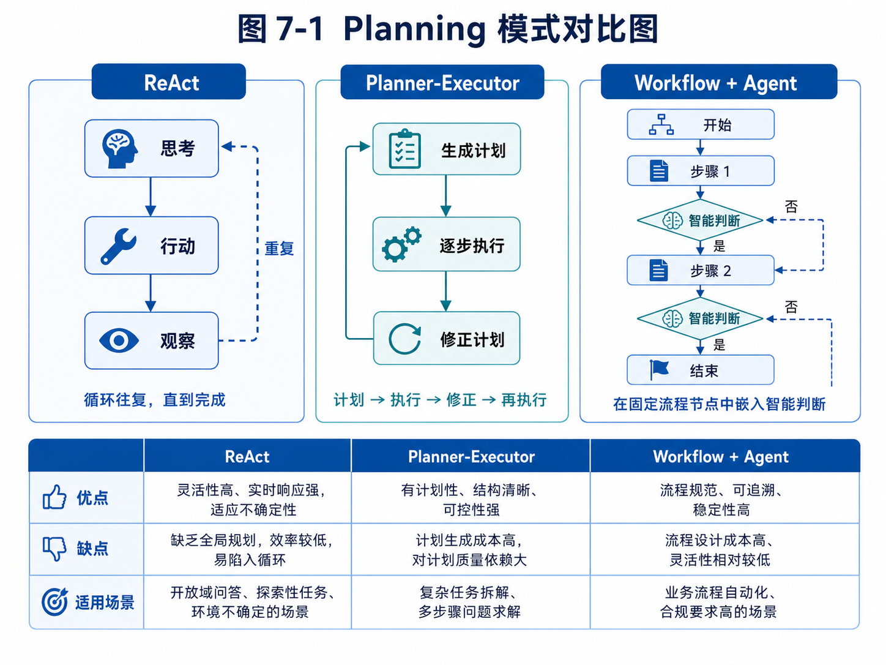

# 第 7 章：Planning：让 Agent 做正确的下一步

> 本章涉及多种 Planning 形态，先看模式对比图，有助于后续理解不同方案的优劣与适用场景。



*图 7-1 Planning 模式对比图*


前面几章已经搭建了 Agent 系统的几个关键基础。第 4 章讲 Agent Loop，让我们看到 Agent 如何在观察、思考、行动和反馈之间循环。第 5 章讲工具系统，让 Agent 获得操作外部世界的能力。第 6 章讲上下文工程，让模型在每一步都能看到合适的信息。

现在还缺一个关键问题：Agent 下一步到底应该做什么？

同样是一个目标，执行路径可能完全不同。用户说“帮我开发沙特钢卷尺客户”，Agent 可以先搜索客户，也可以先补充产品信息，也可以先询问目标客户类型，也可以先生成搜索关键词。用户说“修复登录 bug”，Agent 可以先读报错日志，也可以先看项目目录，也可以先运行测试，也可以先搜索代码中的 login 函数。

如果下一步选错，后续执行就会偏离。工具再强、上下文再好，也可能浪费在错误方向上。

Planning，就是解决这个问题的机制。

它关注的不是模型能不能回答，而是 Agent 如何把目标变成行动序列，如何在执行过程中判断进展，如何在失败后调整计划，如何避免无意义循环，如何在需要时请求用户确认。

Planning 不是让模型写一份漂亮计划就结束。真正的 Planning 是运行时能力。它和 Agent Loop、工具系统、上下文工程、任务状态、人机协同紧密连接。一个 Agent 每次决定下一步时，都在进行某种形式的规划。

本章会系统讲解 Agent Planning。我们会讨论 ReAct、Plan-and-Execute、Planner/Executor 分离、工作流与 Agent 结合、分层计划、重规划、停止条件和计划评估。更重要的是，我们会始终围绕工程问题来讲：什么任务需要规划？计划应该有多细？计划失败怎么办？哪些计划步骤必须人工确认？如何避免 Agent 看起来很忙但没有推进任务？

---

## 7.1 为什么 Agent 需要 Planning

在简单问答中，模型不需要复杂规划。用户问“什么是上下文工程”，模型直接解释即可。即使回答中有结构，也只是语言组织，不是执行规划。

在固定工具调用中，规划也很简单。用户问“今天北京天气怎么样”，系统调用天气工具，然后回答。只有一步，路径明确。

但 Agent 面对的是目标型任务。目标型任务通常有三个特点。

第一，目标和步骤之间存在距离。用户说的是结果，不是过程。比如“帮我找客户”不是一个具体步骤，而是一个目标。Agent 需要把它拆成搜索、筛选、评分、生成草稿等步骤。

第二，执行路径不确定。Agent 不知道第一次搜索能否找到好结果，不知道客户网站是否可访问，不知道代码测试会不会失败，不知道学生错因是否明显。它必须根据中间结果调整。

第三，任务有约束和风险。不是所有能做的步骤都应该做。比如找到邮箱后不能直接发送邮件，修改代码前最好先生成计划，删除文件必须确认。

因此，Agent 需要 Planning。

Planning 可以帮助 Agent 解决以下问题。

首先，把模糊目标拆成可执行步骤。例如把“开发客户”拆成“确认产品信息 → 生成搜索策略 → 搜索候选客户 → 筛选客户 → 评分 → 生成邮件草稿 → 审批”。

其次，选择下一步工具。例如当前缺少客户来源，就调用搜索；当前已有候选客户，就调用网页读取；当前需要生成草稿，就调用邮件草稿工具。

再次，控制执行范围。例如当前阶段只做筛选，不要提前写邮件；测试失败时先分析日志，不要盲目改多个文件。

然后，处理失败。例如搜索结果质量差时更换关键词；测试失败时回读错误；客户信息缺失时标记人工补充。

最后，决定停止。例如已经找到足够客户、达到最大步数、用户确认终止、风险过高、没有更多可行路径。

没有 Planning 的 Agent 很容易出现三类问题。

第一类是乱跳。它还没筛选完客户就开始写邮件，还没读代码就开始修改，还没确认学生水平就生成学习计划。

第二类是循环。它反复搜索同一关键词，反复读取同一文件，反复生成类似计划，但没有推进。

第三类是过度执行。它为了完成目标不断调用工具，越走越远，成本增加，风险上升。

Planning 的本质是给 Agent 的自主性加上方向感。

---

## 7.2 计划不是越详细越好

很多人听到 Planning，会以为第一步应该让模型生成一份非常详细的完整计划。例如：

```text
1. 搜索关键词 A；
2. 打开第 1 个搜索结果；
3. 提取公司名；
4. 打开 contact 页面；
5. 提取邮箱；
6. 保存到表格；
7. 搜索关键词 B；
...
```

这种计划看起来很完整，但在真实环境中往往脆弱。因为它假设未来步骤都可预测。实际上，搜索结果可能打不开，网页可能没有 contact 页面，公司可能不是目标客户，工具可能失败。过细的计划会很快过期。

反过来，如果计划太粗，也没有指导意义。例如：

```text
1. 找客户；
2. 分析客户；
3. 写邮件。
```

这只是目标复述，不能帮助 Agent 决定下一步。

所以，计划粒度很重要。

一个好的 Agent 计划通常应该满足三个条件。

第一，足够指导下一步。计划要能告诉执行器当前应该做什么，而不是只描述最终愿望。

第二，允许根据结果调整。计划不能假设所有步骤一定成功，而要允许重规划。

第三，匹配风险边界。低风险步骤可以细化执行，高风险步骤必须插入确认节点。

外贸客户开发任务可以这样规划：

```text
阶段 1：确认任务输入
- 检查产品信息、目标国家、客户类型是否足够。
- 如果缺关键字段，向用户澄清。

阶段 2：搜索候选客户
- 生成 3-5 组搜索关键词。
- 每组搜索后评估结果质量。
- 如果结果重复或偏零售，调整关键词。

阶段 3：筛选与画像
- 读取候选客户官网或可信来源。
- 判断客户类型，排除不匹配对象。
- 提取公司信息和联系方式。

阶段 4：评分
- 根据客户类型、产品匹配、联系方式、规模信号评分。
- 低置信度信息标记人工补充。

阶段 5：生成开发信草稿
- 只为高分客户生成草稿。
- 不直接发送，进入审批。
```

这个计划不是每一步点击什么按钮，而是定义了阶段、目标、判断标准和风险边界。它既有方向，又保留弹性。

代码 Agent 的计划也类似：

```text
阶段 1：理解问题
- 读取用户需求和错误描述。
- 如果没有复现信息，优先运行现有测试或询问用户。

阶段 2：定位相关代码
- 搜索与登录相关的文件、函数、路由和测试。
- 总结可能相关模块。

阶段 3：提出修改方案
- 说明问题原因和拟修改文件。
- 等待用户确认高风险改动。

阶段 4：实施修改
- 小步修改，避免一次改动过多文件。
- 记录 diff。

阶段 5：验证与修复
- 运行测试。
- 如果失败，读取错误并重规划。

阶段 6：交付
- 输出变更摘要、测试结果和剩余风险。
```

这种计划把不确定性留给执行过程，而不是试图提前写死所有细节。

---

## 7.3 ReAct：边想边做的规划方式

ReAct 是 Agent 中非常经典的一种模式。它的基本思想是把 Reasoning 和 Acting 结合起来：模型先根据当前观察进行推理，然后选择一个动作，执行工具后获得新观察，再继续推理和行动。

一个简化的 ReAct 轨迹可能是：

```text
Thought: 我需要先了解目标市场中有哪些潜在客户。
Action: search_web(query="Saudi hardware wholesalers measuring tools")
Observation: 搜索结果返回若干五金批发商和目录站。
Thought: 需要排除目录站，优先打开公司官网。
Action: read_webpage(url="...")
Observation: 该公司主营建筑材料和手工具，有 contact 邮箱。
Thought: 该公司可能符合目标客户，需要保存并继续寻找更多客户。
Action: save_candidate(...)
```

ReAct 的优点是灵活。它不要求一开始制定完整计划，而是根据每一步观察动态决定下一步。对于开放搜索、网页操作、代码排查等任务，ReAct 很自然。

但 ReAct 也有缺点。

第一，它容易局部贪心。模型只看当前观察，可能缺少全局计划。例如看到一个客户不错，就花太多时间深挖，而忘记目标是找 20 家候选。

第二，它容易循环。如果没有状态记录和停止条件，Agent 可能反复搜索类似关键词。

第三，它不适合高风险任务。边想边做如果连接了危险工具，就可能在计划不充分时执行高风险动作。

第四，它不适合需要用户预先确认的任务。代码修改、邮件发送、数据库更新等操作，不能完全靠 ReAct 自由执行。

因此，ReAct 更适合低风险、探索性、步骤不确定的任务片段。例如搜索资料、阅读网页、定位文件、分析日志。它不应该单独承担完整的高风险业务流程。

一个简化 ReAct Agent 可以这样实现：

```python
class ReActAgent:
    def __init__(self, model, tools, context_manager, max_steps=10):
        self.model = model
        self.tools = tools
        self.context_manager = context_manager
        self.max_steps = max_steps

    def run(self, task_state):
        observations = []

        for step in range(self.max_steps):
            context = self.context_manager.build_context(
                task=task_state,
                tool_results=observations,
                memories=[],
                step_instruction="根据当前观察，决定下一步动作。"
            )

            decision = self.model.generate(context)

            if decision["type"] == "final":
                return decision["content"]

            if decision["type"] == "tool_call":
                tool = self.tools.get(decision["tool_name"])
                result = tool.run(**decision["arguments"])
                observations.append(result)
                task_state.history_summary = self._update_summary(task_state, result)
                continue

            if decision["type"] == "ask_user":
                return {"status": "waiting_user", "question": decision["question"]}

        return {"status": "stopped", "reason": "达到最大步数"}
```

这个示例省略了很多细节，但可以看到 ReAct 的核心：每一步根据当前上下文决定工具调用或结束。

在真实系统中，ReAct 必须配合工具权限、最大步数、去重、状态记录、失败处理和人工确认，否则很容易失控。

---

## 7.4 Plan-and-Execute：先规划，再执行

与 ReAct 不同，Plan-and-Execute 模式会先生成一个计划，再逐步执行。

它的基本流程是：

```text
用户目标 → Planner 生成计划 → Executor 执行步骤 → 根据结果更新状态 → 必要时重规划 → 完成任务
```

这种模式适合目标明确、步骤相对可分解、需要全局控制的任务。

例如外贸客户开发、代码功能开发、研究报告生成、教育复习计划生成，都可以采用 Plan-and-Execute。

Plan-and-Execute 的优点是全局性强。系统可以在执行前看到大致路径，也可以插入审批节点和风险控制。例如代码 Agent 在修改文件前先输出计划，用户确认后再执行。

它的缺点是计划可能过时。开放环境中，初始计划很可能在执行中被现实打破。因此它必须支持重规划。

一个好的 Plan-and-Execute 系统通常包括几个对象。

首先是 Plan。它描述任务阶段、步骤、依赖关系和风险等级。

其次是 Step。它描述一个可执行单元，包括目标、输入、工具、完成条件和失败处理。

再次是 Executor。它负责执行当前 Step，调用工具并记录结果。

然后是 Monitor。它判断步骤是否完成、是否失败、是否需要重试或重规划。

最后是 Replanner。它根据新观察调整计划。

下面是一个简化数据结构：

```python
from dataclasses import dataclass, field
from typing import List, Optional

@dataclass
class PlanStep:
    id: str
    title: str
    description: str
    status: str = "pending"  # pending, running, done, failed, waiting_user
    risk_level: str = "low"  # low, medium, high
    required_tools: List[str] = field(default_factory=list)
    completion_criteria: str = ""

@dataclass
class Plan:
    goal: str
    steps: List[PlanStep]
    current_step_id: Optional[str] = None

    def next_step(self) -> Optional[PlanStep]:
        for step in self.steps:
            if step.status == "pending":
                return step
        return None
```

外贸客户开发的计划可以表示为：

```python
plan = Plan(
    goal="为沙特市场寻找钢卷尺潜在客户",
    steps=[
        PlanStep(
            id="s1",
            title="确认输入",
            description="检查产品、目标国家、客户类型是否完整",
            risk_level="low",
            completion_criteria="关键信息齐全或已向用户提问"
        ),
        PlanStep(
            id="s2",
            title="搜索候选客户",
            description="生成关键词并搜索候选客户",
            risk_level="low",
            required_tools=["search_web"],
            completion_criteria="至少获得 20 个候选结果或说明不足原因"
        ),
        PlanStep(
            id="s3",
            title="筛选客户",
            description="排除零售、竞争对手和无关公司",
            risk_level="medium",
            required_tools=["read_webpage"],
            completion_criteria="输出候选客户画像和排除依据"
        ),
        PlanStep(
            id="s4",
            title="生成开发信草稿",
            description="为高分客户生成邮件草稿，进入审批队列",
            risk_level="medium",
            required_tools=["create_email_draft"],
            completion_criteria="草稿已生成，未直接发送"
        ),
    ]
)
```

这种结构让系统更容易控制任务进度。用户也可以看到 Agent 正在执行哪一步，而不是只看到黑箱运行。

---

## 7.5 Planner 和 Executor 为什么要分离

在简单 Agent 中，一个模型既负责规划，也负责执行。这很方便，但复杂任务中容易混乱。

Planner/Executor 分离是一种常见架构。

Planner 负责回答：要完成目标，应该分几步？当前应该推进哪一步？风险在哪里？是否需要用户确认？

Executor 负责回答：给定当前步骤，具体调用哪个工具？如何处理工具结果？如何输出本步结果？

这种分离有几个好处。

第一，职责清晰。Planner 更关注全局，Executor 更关注局部。

第二，上下文不同。Planner 需要任务目标、历史摘要、约束和整体状态；Executor 需要当前步骤、工具说明和相关资料。不必让两个角色看到完全相同的信息。

第三，便于使用不同模型。Planner 可以用更强模型，Executor 某些简单步骤可以用更便宜模型。

第四，便于插入审批。Planner 标记高风险步骤，系统可以在 Executor 执行前请求用户确认。

第五，便于调试。任务失败时，可以判断是计划错误，还是执行错误。

举个代码 Agent 的例子。

Planner 输出：

```text
当前目标：修复登录后跳转失败。
计划：
1. 搜索登录相关路由和测试；
2. 读取 auth 路由、session 工具和测试文件；
3. 判断 session key 是否不一致；
4. 修改最小必要文件；
5. 运行测试；
6. 输出 diff。
风险：修改认证逻辑属于中风险，执行写文件前需要展示计划。
```

Executor 在第 1 步只负责搜索文件：

```text
当前步骤：搜索登录相关路由和测试。
可用工具：search_files。
输出：相关文件列表及理由。
```

这样比让一个模型在超长上下文里同时做所有事更稳定。

Planner/Executor 分离也不是万能的。它会增加系统复杂度，增加模型调用次数。对于简单任务，不一定需要。但对于长任务、高风险任务、多人协作任务，它非常有价值。

---

## 7.6 工作流 + Agent：真实产品更常见的规划方式

很多人想象中的 Agent 是完全自由规划的：用户给目标，Agent 自己决定所有步骤。真实产品中，更常见的方式是工作流 + Agent。

也就是说，主流程由确定性工作流控制，某些节点由 Agent 完成智能判断。

以外贸客户开发为例，主流程可以固定为：

```text
输入任务 → 搜索客户 → 筛选客户 → 评分 → 生成草稿 → 人工审批 → 发送 → 跟进
```

这个顺序不需要每次让模型重新发明。它可以由工作流引擎或状态机控制。

Agent 负责其中不确定的部分：搜索关键词如何生成，客户类型如何判断，评分依据如何解释，邮件如何个性化，回复如何理解。

代码开发也一样。主流程可以固定为：

```text
理解需求 → 读取上下文 → 生成计划 → 用户确认 → 修改代码 → 运行测试 → 生成总结
```

Agent 在每个节点内部发挥作用，而不是任意跳转。

这种方式的好处是稳定、可控、可审计。用户知道任务会经过哪些阶段，系统知道哪些阶段需要审批，开发者也更容易测试每个节点。

完全自由 Agent 的问题在于，每次路径可能不同，调试困难，评估困难，风险也更高。工作流 + Agent 则把确定性和智能结合起来。

可以把它理解为：

```text
工作流负责“必须经过哪些门”。
Agent 负责“在每扇门里如何判断和处理”。
```

在真实工程中，这是非常重要的架构原则。

---

## 7.7 重规划：计划失败后怎么办

计划一定会失败。搜索不到结果，网页打不开，测试失败，用户改变目标，工具返回错误，模型误判客户类型，这些都很正常。

因此，Planning 系统必须支持重规划。

重规划不是简单地“重新生成一份计划”。它应该基于当前状态和失败原因调整。

例如，外贸 Agent 搜索沙特钢卷尺进口商，结果很差。失败原因可能是关键词太窄。重规划应该改成搜索更宽的客户类型，如 hardware wholesalers、building materials distributors、construction tools suppliers，而不是继续重复原关键词。

代码 Agent 修改后测试失败。失败原因可能是测试 fixture 没更新，也可能是业务逻辑改错。重规划应该先读取错误日志和相关测试，而不是盲目改更多文件。

教育 Agent 推荐练习后，学生正确率仍然低。失败原因可能是题目太难，或者概念讲解不足。重规划应该降低难度或回到概念讲解。

一个重规划流程可以是：

```text
1. 收集失败信号：工具错误、测试失败、结果质量低、用户否定。
2. 判断失败类型：信息不足、策略错误、工具失败、目标冲突、风险过高。
3. 更新任务状态：记录失败原因和已尝试方案。
4. 调整计划：替换步骤、增加澄清、降低目标或请求人工介入。
5. 避免重复：禁止立即重复同一失败动作。
```

可以设计一个 Replanner：

```python
class Replanner:
    def __init__(self, model, context_manager):
        self.model = model
        self.context_manager = context_manager

    def replan(self, task_state, plan, failed_step, failure_reason):
        context = self.context_manager.build_context(
            task=task_state,
            tool_results=[],
            memories=[],
            step_instruction=f"""
当前计划步骤失败：{failed_step.title}
失败原因：{failure_reason}
请在不重复失败动作的前提下，调整后续计划。
输出要求：说明失败类型、调整后的步骤、是否需要用户确认。
"""
        )
        return self.model.generate(context)
```

真实系统中，重规划要配合执行历史。否则 Agent 可能陷入“搜索失败 → 换个说法搜索 → 搜索失败 → 再换个说法搜索”的循环。系统需要记录已经尝试过的路径，并在上下文中明确禁止重复。

---

## 7.8 停止条件：Agent 什么时候应该停下来

很多 Agent Demo 最大的问题之一，是不知道什么时候停。它会继续搜索、继续分析、继续调用工具，直到达到步数限制或报错。

一个可用 Agent 必须有明确停止条件。

停止条件可以分为几类。

第一类是目标完成。比如找到 20 个候选客户并完成评分；代码修改通过测试；学习计划生成并被老师确认。

第二类是达到上限。比如最大步数、最大成本、最大时间、最大搜索页数。

第三类是等待用户。比如缺少关键输入、高风险动作需要确认、多个方案需要用户选择。

第四类是无法继续。比如工具连续失败、没有足够数据、目标矛盾、权限不足。

第五类是风险停止。比如检测到潜在敏感操作、外部 prompt injection、删除文件风险、邮件发送风险。

停止条件应该写入系统，而不是完全交给模型判断。

例如，外贸 Agent 可以设置：

```text
- 每轮最多搜索 5 组关键词；
- 每个客户最多读取 3 个页面；
- 如果连续 3 次搜索低质量，停止并建议用户调整目标；
- 找到 20 个候选或 10 个高分客户即可进入下一阶段；
- 生成邮件后必须停止等待审批；
```

代码 Agent 可以设置：

```text
- 修改前必须输出计划；
- 每次最多修改 5 个文件；
- 测试失败最多自动修复 3 轮；
- 涉及删除文件、数据库迁移、依赖大升级时必须等待确认；
```

停止条件是 Planning 的一部分。一个没有停止条件的 Agent，不是更自主，而是不可靠。

---

## 7.9 计划质量如何评估

Planning 也需要评估。一个计划写得长，不代表质量高。

评估计划可以看几个维度。

第一，目标对齐。计划是否真正服务用户目标？有没有偏离？

第二，步骤可执行。每一步是否可以由工具或人完成？还是只是抽象口号？

第三，依赖清晰。是否先收集必要信息，再生成结果？是否把后置步骤提前了？

第四，风险控制。高风险动作是否被标记？是否有审批节点？

第五，失败处理。计划是否考虑工具失败、信息不足、结果质量差？

第六，停止条件。计划是否知道什么时候完成或停止？

第七，成本合理。是否为了小任务设计了过度复杂流程？

例如，一个外贸客户开发计划：

```text
1. 搜索客户；
2. 发送邮件；
3. 等待回复。
```

这个计划太粗，也没有筛选、评分、审批和去重。

另一个计划：

```text
1. 搜索 1000 家客户；
2. 读取每个客户所有网页；
3. 为每家公司生成 5 封邮件；
4. 自动发送。
```

这个计划看似积极，但成本和风险都过高。

更好的计划应该平衡效率、质量和风险。

代码 Agent 的计划也可以评估。如果计划在读代码前就决定修改哪个文件，说明过早下结论。如果计划打算一次性重构整个认证系统，可能超出用户需求。如果计划没有运行测试，则缺少验证。

在工程系统中，可以让 Planner 输出结构化计划，然后由一个 Plan Critic 进行检查。Plan Critic 可以是规则，也可以是模型。

例如规则检查：

```python
def validate_plan(plan):
    issues = []
    if not plan.steps:
        issues.append("计划为空")
    if any(step.risk_level == "high" and "approval" not in step.description for step in plan.steps):
        issues.append("高风险步骤缺少审批说明")
    if not any("验证" in step.title or "测试" in step.title for step in plan.steps):
        issues.append("计划缺少验证步骤")
    return issues
```

模型 Critic 则可以检查更语义化的问题，比如计划是否偏离目标、是否遗漏关键步骤。

---

## 7.10 分层 Planning：从战略到动作

复杂任务中，单层计划往往不够。我们需要分层。

高层计划回答：任务分几个阶段？每个阶段目标是什么？

中层计划回答：当前阶段要完成哪些子任务？

低层动作回答：下一步调用哪个工具，参数是什么？

以外贸客户开发为例。

高层计划：

```text
输入确认 → 搜索 → 筛选 → 评分 → 邮件草稿 → 审批 → 跟进
```

中层计划，在搜索阶段：

```text
1. 生成关键词；
2. 搜索五金批发商；
3. 搜索建筑用品分销商；
4. 搜索工程工具供应商；
5. 汇总候选。
```

低层动作：

```text
调用 search_web(query="Saudi hardware wholesalers measuring tools")
```

代码 Agent 也类似。

高层计划：理解需求 → 定位代码 → 提出方案 → 修改 → 测试 → 交付。

中层计划，在定位代码阶段：搜索 login、auth、session、user_id；读取相关文件；总结调用链。

低层动作：调用 `search_files(pattern="login")`。

分层 Planning 的好处是既保持全局方向，又能灵活执行局部动作。

如果只有高层计划，执行器不知道下一步做什么。如果只有低层动作，Agent 容易迷失全局。分层计划把两者连接起来。

---

## 7.11 Planning 和上下文工程的关系

Planning 依赖上下文。上下文差，计划一定差。

如果 Planner 不知道用户已经把目标国家从阿联酋改成沙特，它会制定错误计划。

如果 Planner 不知道客户开发信不能直接发送，它会把发送邮件当成普通步骤。

如果 Planner 不知道代码项目没有测试，它会计划运行不存在的测试命令。

如果 Planner 不知道学生每天只有 20 分钟学习时间，它会生成过重计划。

因此，规划前必须构造 Planner 所需上下文。Planner 的上下文通常包括：

- 当前目标；
- 用户约束；
- 任务历史摘要；
- 当前状态；
- 可用工具；
- 风险规则；
- 已知失败；
- 完成标准。

Executor 的上下文则更局部，包括：

- 当前步骤；
- 输入数据；
- 工具说明；
- 输出格式；
- 局部约束。

不要让 Planner 和 Executor 使用完全相同的上下文。Planner 需要全局视角，Executor 需要局部信息。上下文分工越清晰，系统越稳定。

---

## 7.12 Planning 和工具系统的关系

Planning 最终要落到工具调用上。一个无法执行的计划没有意义。

因此，Planner 必须知道可用工具的边界。

如果系统没有浏览器工具，计划中就不能写“打开网页并点击按钮”。如果系统只有邮件草稿工具，没有发送工具，计划中就不能写“自动发送邮件”。如果代码 Agent 没有 shell 权限，计划中就不能要求运行测试。

工具描述会直接影响计划质量。

例如，如果工具列表中有：

```text
search_web: 搜索互联网。
read_webpage: 读取网页内容。
create_email_draft: 创建邮件草稿。
```

Planner 可以合理规划搜索、读取和生成草稿。

但如果工具描述模糊，比如：

```text
do_email: 处理邮件相关任务。
```

模型就可能误以为可以发送邮件、读取邮箱、创建草稿、删除邮件。工具边界不清，计划就不可靠。

因此，工具系统和 Planning 必须一起设计。每个工具应该说明：能做什么、不能做什么、风险等级、是否需要审批、失败如何处理。

---

## 7.13 Planning 和人机协同

人类不应该只在任务结束时看到结果。很多任务需要人在规划阶段就参与。

例如，外贸 Agent 生成搜索计划后，可以让用户确认目标客户类型：

```text
我计划优先搜索以下三类客户：
1. 五金批发商；
2. 建筑材料分销商；
3. 工程工具供应商。
将排除纯零售店和同类制造商。是否确认？
```

代码 Agent 修改前，可以让用户确认：

```text
我判断登录失败可能来自 session key 不一致。计划修改以下文件：
- services/session.py
- routes/auth.py
- tests/test_auth.py
不会修改数据库 schema。是否继续？
```

教育 Agent 安排学习计划前，可以让老师确认：

```text
我计划本周重点补一次函数实际应用题建模，每天 20 分钟。是否符合你的教学安排？
```

这种人机协同不是降低 Agent 能力，而是提高系统可靠性。Agent 负责提出计划，人类负责关键方向确认。尤其在高风险、强业务偏好、目标模糊的任务中，规划阶段的确认非常有价值。

后续第 11 章会专门讨论 Human-in-the-loop。在这里需要先理解：人工确认不只是执行前审批，也可以发生在计划阶段。

---

## 7.14 一个完整 Planning 示例：外贸客户开发 Agent

下面我们把前面内容组合起来，设计一个外贸客户开发 Agent 的 Planning 流程。

用户输入：

> 帮我找沙特市场适合钢卷尺的潜在客户，优先批发商和工程用品分销商，先不要发邮件。

系统首先规范化目标：

```text
目标：在沙特市场寻找钢卷尺潜在 B2B 客户。
优先客户：五金批发商、建筑用品分销商、工程用品供应商。
禁止动作：不得直接发送邮件。
交付物：候选客户列表、商机评分、开发信草稿。
```

Planner 生成高层计划：

```text
1. 检查输入是否完整。
2. 生成搜索策略。
3. 搜索候选客户。
4. 筛选并去重。
5. 生成客户画像和商机评分。
6. 为高分客户生成开发信草稿。
7. 等待人工审批。
```

系统检查计划风险：生成草稿是中风险，发送邮件被禁止，因此计划中只能出现草稿和审批。

Executor 执行第 2 步：生成搜索策略。它输出关键词：

```text
Saudi hardware wholesaler measuring tools
Saudi building materials distributor hand tools
Riyadh tools supplier construction measuring tape
Jeddah hardware distributor tape measure
```

Executor 执行搜索。发现 “measuring tape importer” 结果很少，而 “hardware wholesaler” 结果质量更高。

Monitor 更新状态：

```text
有效策略：优先使用 hardware wholesaler、building materials distributor。
低质量策略：measuring tape importer 结果少且重复。
```

Planner 在搜索结果不足时重规划：

```text
增加搜索方向：工程用品供应商、承包商供应链、建筑工具分销商。
```

筛选阶段，Executor 读取候选公司官网，生成结构化画像。评分阶段，Planner 要求保守评分，低置信度标记人工补充。

最后，邮件生成阶段只调用 `create_email_draft`，不调用发送工具。任务状态变为：

```text
status: waiting_approval
pending: 6 封开发信草稿等待人工确认
```

这个流程体现了 Planning 的几个关键点：高层计划、阶段执行、重规划、风险控制、停止等待审批。

---

## 7.15 一个完整 Planning 示例：代码开发 Agent

再看代码 Agent。

用户输入：

> 帮我修复登录后仍然跳回登录页的问题。

Planner 不应该立刻修改代码，而应先制定定位计划：

```text
1. 收集复现信息和错误日志。
2. 搜索登录、session、auth 相关文件。
3. 读取路由、session 管理和测试文件。
4. 判断可能原因。
5. 输出修改计划并等待确认。
6. 小步修改。
7. 运行测试。
8. 如果失败，读取错误并重规划。
9. 输出 diff 和总结。
```

Executor 搜索文件，发现：

```text
routes/auth.py
services/session.py
tests/test_auth.py
```

读取后发现 session 写入和读取 key 不一致。Planner 输出修改计划：

```text
原因假设：验证码验证成功后写入 session['uid']，但登录状态检查读取 session['user_id']。
计划：统一使用 user_id；修改 services/session.py 和相关测试。
风险：认证逻辑中风险，不修改数据库 schema。
需要确认：是否继续？
```

用户确认后，Executor 修改文件并运行测试。如果测试失败，Replanner 读取错误日志，发现测试 fixture 仍使用旧 key，于是调整计划。

最后通过测试，Agent 输出：

```text
完成：统一 session key 为 user_id。
修改文件：...
测试：pytest tests/test_auth.py 通过。
剩余风险：未运行全量测试。
```

这里 Planning 的价值很明显。它防止 Agent 一开始就乱改，也让用户在关键点有机会确认。

---

## 7.16 最小实现：Planner + Executor Agent

下面给出一个简化版 Planner + Executor 框架。它不是生产代码，但能帮助你理解结构。

```python
class Planner:
    def __init__(self, model, context_manager):
        self.model = model
        self.context_manager = context_manager

    def create_plan(self, task_state):
        context = self.context_manager.build_context(
            task=task_state,
            tool_results=[],
            memories=[],
            step_instruction="请为当前目标生成可执行计划，标记风险步骤和完成标准。"
        )
        return self.model.generate(context)

    def update_plan(self, task_state, plan, observation):
        context = self.context_manager.build_context(
            task=task_state,
            tool_results=[observation],
            memories=[],
            step_instruction="根据最新观察更新计划。不要重复已经失败的动作。"
        )
        return self.model.generate(context)

class Executor:
    def __init__(self, model, tools, context_manager):
        self.model = model
        self.tools = tools
        self.context_manager = context_manager

    def execute_step(self, task_state, step):
        context = self.context_manager.build_context(
            task=task_state,
            tool_results=[],
            memories=[],
            step_instruction=f"执行当前步骤：{step.description}"
        )
        decision = self.model.generate(context)

        if decision["type"] == "tool_call":
            tool = self.tools.get(decision["tool_name"])
            if step.risk_level == "high":
                return {"status": "waiting_approval", "step": step}
            return tool.run(**decision["arguments"])

        return decision

class PlanAndExecuteAgent:
    def __init__(self, planner, executor, monitor, max_steps=20):
        self.planner = planner
        self.executor = executor
        self.monitor = monitor
        self.max_steps = max_steps

    def run(self, task_state):
        plan = self.planner.create_plan(task_state)

        for _ in range(self.max_steps):
            step = plan.next_step()
            if step is None:
                return {"status": "done", "plan": plan}

            if step.risk_level == "high":
                return {"status": "waiting_approval", "step": step, "plan": plan}

            step.status = "running"
            result = self.executor.execute_step(task_state, step)

            outcome = self.monitor.evaluate(step, result)
            if outcome == "done":
                step.status = "done"
            elif outcome == "failed":
                step.status = "failed"
                plan = self.planner.update_plan(task_state, plan, result)
            elif outcome == "waiting_user":
                step.status = "waiting_user"
                return {"status": "waiting_user", "step": step, "result": result}

        return {"status": "stopped", "reason": "达到最大执行步数", "plan": plan}
```

这个框架体现了几个重要思想：Planner 创建和更新计划，Executor 执行当前步骤，Monitor 判断结果，风险步骤可以暂停等待确认，失败后可以重规划。

真实系统还需要更多机制：计划结构化校验、工具参数验证、状态持久化、任务恢复、并行任务、日志、评估和 UI 展示。但核心思路已经具备。

---

## 7.17 常见误区

第一个误区是认为 Planning 就是让模型先写一份计划。

真正的 Planning 是运行时控制机制。计划要能指导执行、接受反馈、支持重规划和停止。

第二个误区是计划越细越好。

过细计划在开放环境中容易失效。好的计划应该在阶段层面明确，在动作层面灵活。

第三个误区是完全依赖 ReAct。

ReAct 灵活，但容易循环和局部贪心。对于长任务和高风险任务，通常需要 Plan-and-Execute 或工作流约束。

第四个误区是完全依赖初始计划。

初始计划只是起点。工具结果、用户反馈、失败信号都应该改变计划。

第五个误区是忽略停止条件。

没有停止条件的 Agent 会浪费成本，并可能扩大风险。

第六个误区是让 Planner 不知道工具边界。

Planner 如果不知道工具能做什么、不能做什么，就会生成无法执行或危险的计划。

第七个误区是把人类只放在最后验收。

很多任务应该在规划阶段就让人类确认方向，尤其是代码修改、客户触达、业务策略和高风险操作。

---

## 练习题

### 练习 1：为外贸客户开发设计计划

请为任务“寻找墨西哥市场适合钢卷尺的潜在客户”设计一个 Plan-and-Execute 计划。

要求包含：阶段、每阶段目标、可用工具、完成标准、风险等级、是否需要人工确认。

### 练习 2：比较 ReAct 和 Plan-and-Execute

同样是“研究一个开源 Agent 项目源码”，请分别写出 ReAct 执行方式和 Plan-and-Execute 执行方式。说明两者优缺点。

### 练习 3：设计代码 Agent 的停止条件

假设你的代码 Agent 可以读取文件、修改文件和运行测试。请设计至少 8 条停止条件，包括目标完成、风险停止、失败停止、等待用户和成本限制。

### 练习 4：重规划练习

外贸 Agent 连续三次搜索都得到零售店，而不是批发商。请写出失败原因分析和重规划方案。

要求避免简单重复原搜索关键词。

### 练习 5：计划质量评估

请评估下面计划的问题：

```text
1. 搜索客户。
2. 写邮件。
3. 自动发送。
4. 等回复。
```

指出它缺少哪些环节，并改写成更安全、可执行的计划。

---

## 检查清单

读完本章后，你应该能够检查自己是否理解以下问题：

```text
[ ] 我知道为什么 Agent 需要 Planning。
[ ] 我理解计划不是越详细越好。
[ ] 我能解释 ReAct 的优点和局限。
[ ] 我能解释 Plan-and-Execute 的基本结构。
[ ] 我理解 Planner 和 Executor 分离的价值。
[ ] 我知道真实产品中常见的是工作流 + Agent。
[ ] 我能设计重规划机制，避免重复失败动作。
[ ] 我能为 Agent 设计停止条件。
[ ] 我能评估一个计划是否可执行、安全、目标对齐。
[ ] 我能为外贸 Agent 或代码 Agent 写出阶段化计划。
```

如果你还习惯把 Planning 理解为“开头写一个计划”，建议重新阅读外贸客户开发和代码 Agent 的完整示例。真正的 Planning 是贯穿任务执行全过程的控制能力。

---

## 本章总结

Planning 解决的是 Agent 如何从目标走向行动的问题。用户给出的通常是结果，而不是步骤。Agent 必须把目标拆成可执行计划，并在执行过程中根据观察、失败和用户反馈不断调整。

本章讨论了几种关键 Planning 模式。ReAct 适合探索性、低风险、局部不确定的任务片段，它通过边观察边行动保持灵活。Plan-and-Execute 适合长任务和需要全局控制的任务，它先生成阶段化计划，再逐步执行并支持重规划。Planner/Executor 分离可以让全局规划和局部执行职责更清晰。工作流 + Agent 则是更接近真实产品的架构，把确定性流程交给系统，把不确定判断交给 Agent。

一个好的计划不应该只是文字清单，而应该包含阶段目标、执行步骤、工具边界、完成标准、风险等级、失败处理和停止条件。计划也不能一成不变。只要工具结果不符合预期、用户目标改变、风险上升或执行失败，系统就应该更新计划。

Planning 和前面几章密切相关。没有上下文工程，Planner 无法获得正确状态；没有工具系统，计划无法落地；没有 Agent Loop，计划无法在执行中反馈和调整；没有审批机制，高风险计划可能直接造成损失。

到这里，我们已经完成了 Agent 核心机制的前半部分：循环、工具、上下文和规划。接下来，第 8 章将进入 Memory，讨论 Agent 如何从一次性任务走向长期使用，如何记住用户、任务、领域知识和经验，同时避免错误记忆污染系统。