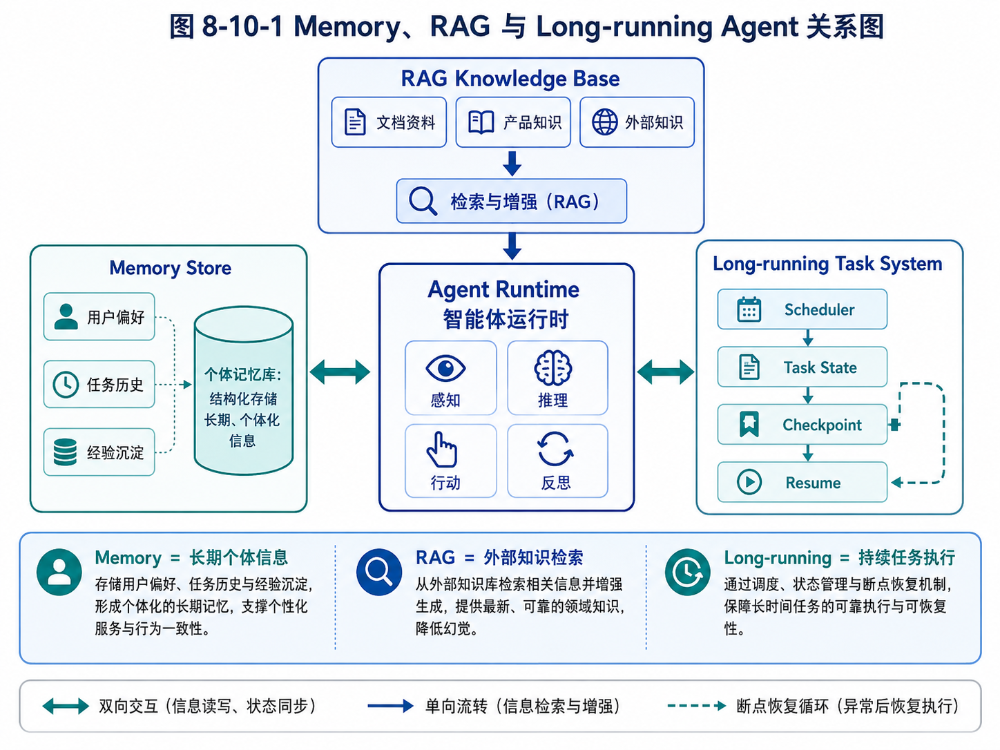

# 第 8 章：Memory：Agent 如何越用越懂你

> 本章建议配合下图阅读，先区分 Memory、RAG 与 Long-running 的边界，再理解 Memory 在系统中的位置。



*图 8-10-1 Memory、RAG 与 Long-running Agent 关系图*


在前面的章节中，我们已经讨论了 Agent 的能力模型、适用边界、执行循环、工具系统、上下文工程和规划机制。到这里，一个基础 Agent 已经可以完成不少任务：它能理解目标，能拆解步骤，能调用工具，能根据工具结果继续行动，也能在一定程度上规划下一步。

但是，如果这个 Agent 每次启动都像第一次认识用户、第一次接触任务、第一次进入业务现场，那么它仍然只是一个“临时工”。它可以完成一次任务，却很难成为持续工作的数字员工。

真正有价值的 Agent，必须能在使用中逐渐积累经验。它应该知道用户的偏好，知道某类任务过去怎么做效果更好，知道哪些客户已经联系过，知道哪些代码模块经常出问题，知道某个学生反复在什么知识点上犯错。换句话说，它应该具备某种形式的记忆。

但这里很容易产生误解。很多人一听到 Agent Memory，就会想到“把历史对话存起来”或者“接一个向量数据库”。这些做法都可能有用，但它们并不等于完整的记忆系统。记忆不是简单保存，记忆是选择、组织、更新、检索、使用和遗忘的系统工程。

本章要解决的问题是：Agent 到底需要什么样的 Memory？什么信息应该记，什么信息不该记？Memory 和上下文、RAG、数据库有什么区别？如何设计一个既有用又可控的记忆系统？

---

## 8.1 为什么 Agent 需要记忆

先看一个没有记忆的外贸客户开发 Agent。

第一天，用户输入：

> 帮我找 30 家沙特五金工具分销商，重点关注能卖钢卷尺的客户。

Agent 搜索网页，整理客户，生成表格和开发信草稿。用户审核后，选择其中 10 家发送邮件，并指出：

> 以后开发信不要写得太夸张，语气简洁一点；优先找有批发、工程用品、building materials 相关业务的公司；零售小店先不要放进高优先级。

如果 Agent 没有记忆，第二天用户再说：

> 继续帮我找阿联酋客户。

它可能会重新使用夸张的营销语气，继续把零售店列为高优先级，也不知道昨天哪些客户已经联系过。用户每次都要重新解释偏好、重新纠错、重新筛选。这样的 Agent 看起来智能，但使用体验很差。

再看一个代码开发 Agent。

用户第一次让它修改项目时，发现这个项目的测试命令不是 `pytest`，而是：

```bash
make test-unit
```

用户还告诉它：

> 这个项目不要直接改 generated 目录，那里是自动生成文件。

如果 Agent 没有记忆，下次它可能还是运行 `pytest`，甚至修改 generated 文件。它不会因为过去的经验而变得更懂项目。

教育 Agent 也是一样。学生每次问一道题，如果系统只回答当前题目，而不记录学生长期错误模式，就无法形成真正的学习闭环。一个学生连续五次在“函数图像与实际问题结合”上犯错，这个信息比单次题目答案更有价值。

这些例子说明：记忆让 Agent 从“一次性执行器”变成“持续协作者”。

记忆至少带来四个价值。

第一，减少重复解释。用户不必每次重新说明偏好、背景、限制条件。

第二，支持长期任务。Agent 可以知道任务历史、执行进度、已处理对象和待跟进事项。

第三，沉淀业务经验。Agent 可以记录哪些策略有效，哪些路径失败，哪些工具更适合某类任务。

第四，形成个性化服务。Agent 可以根据用户、项目、学生、客户或业务场景的历史情况调整行为。

但是，记忆也带来风险。如果 Agent 记错了，错误会被长期放大；如果它记了不该记的信息，会带来隐私和安全问题；如果它什么都记，检索会变得混乱；如果它不会忘，历史噪音会拖垮系统。

所以，本章的核心不是“如何让 Agent 记住更多”，而是“如何让 Agent 正确地记住有价值的信息”。

---

## 8.2 Memory、Context 和 RAG 的区别

在 Agent 系统中，Memory、Context 和 RAG 经常被混用。要设计好记忆系统，必须先把这三个概念区分清楚。

Context 是当前模型调用时能看到的信息。它存在于 prompt 中，包括系统指令、用户当前任务、对话历史摘要、工具结果、当前状态、相关资料等。Context 是模型的“工作台”。模型每次推理时，只能基于当前上下文做决定。

Memory 是跨时间保存、可被未来任务再次使用的信息。它可以来自用户偏好、任务结果、历史决策、长期画像、业务经验、失败记录等。Memory 不一定每次都进入 prompt，只有被检索到、被判断为相关时才会进入上下文。

RAG 是让模型使用外部知识的一套检索增强生成机制。它通常处理文档、知识库、网页、说明书、规范、论文等外部资料。RAG 的重点是“让模型查到知识”，而 Memory 的重点是“让系统记住经历和偏好”。

举一个外贸 Agent 的例子。

用户当前说：

> 这次只找阿联酋客户，优先找工程用品分销商。

这句话属于当前 Context。

用户过去多次强调：

> 我的开发信风格要简洁，不要像广告。

这属于用户偏好 Memory。

系统中保存了一份钢卷尺产品规格表，包括长度、宽度、包装、MOQ、交期、认证等。这属于业务知识，可以通过 RAG 检索。

昨天已经联系过的客户列表属于任务历史 Memory，或者更准确地说，是结构化业务状态。

如果把所有东西都叫 Memory，系统设计会变得混乱。正确做法是分层。

Context 解决“这次调用模型需要看什么”；Memory 解决“跨任务应该保留什么”；RAG 解决“外部知识应该如何检索”；数据库解决“结构化事实和业务状态如何可靠保存”。

再看代码 Agent。

当前用户需求“给登录页增加验证码倒计时”是 Context。

项目 README、API 文档、架构说明可以进入 RAG。

用户偏好“每次修改前先给计划，不要直接改”是 Memory。

项目中某次失败测试记录、上次修复方案、已知坑点，也可以作为项目经验 Memory。

Git 仓库本身是事实来源，不应该简单塞进 Memory。Agent 应该读取真实文件，而不是依赖记忆中可能过时的代码摘要。

这个例子说明：Memory 不是数据库的替代品，也不是文件系统的替代品。Memory 保存的是对未来行为有指导价值的信息，而事实数据仍应尽量保存在可靠系统中。

---

## 8.3 Agent 需要哪些类型的记忆

一个成熟 Agent 记忆系统通常不只有一种记忆。不同类型的记忆有不同来源、用途、更新方式和风险等级。

### 8.3.1 会话记忆

会话记忆指当前对话或当前任务中的临时信息。比如用户在一次任务中说：

> 刚才那个客户先放到低优先级。

在当前任务里，Agent 应该记住这个判断。但这句话是否应该永久保存，要看它有没有长期价值。如果只是针对当前客户列表的一次操作，它更适合存在任务状态中，而不是长期用户记忆。

会话记忆通常用于保持多轮对话连贯。例如：

用户：帮我找沙特客户。

Agent：你希望优先找哪类客户？

用户：五金批发商，不要零售店。

这里“不要零售店”至少应该在当前任务中持续生效。

会话记忆的特点是生命周期短、和当前任务强相关、过期风险高。它不应该无脑写入长期记忆。

### 8.3.2 用户记忆

用户记忆记录用户长期偏好、工作方式和稳定约束。例如：

- 用户喜欢先看执行计划，再确认是否继续；
- 用户做外贸开发信时偏好简洁、专业、不夸张；
- 用户希望输出 Markdown 文件；
- 用户在代码任务中希望保留完整可运行版本，不喜欢只给片段；
- 用户偏好“先讲判断逻辑，再给结论”。

这些信息对未来多类任务都有用，适合进入用户记忆。

但用户记忆要谨慎。不是用户说过的所有话都应该记。比如用户今天说“我有点累”，通常不应长期保存。用户临时说“这次写得激进一点”，也不一定代表长期偏好。

用户记忆的关键是稳定性和可复用性。只有在未来可能反复影响回答方式或执行方式的信息，才值得保存。

### 8.3.3 任务记忆

任务记忆记录某个长期任务的历史和状态。例如外贸客户开发任务中：

- 已搜索过哪些关键词；
- 已访问过哪些网站；
- 已找到哪些客户；
- 哪些客户被排除，原因是什么；
- 哪些客户已生成开发信；
- 哪些客户已发送邮件；
- 哪些客户已回复；
- 下一次跟进时间是什么。

这些信息不一定是自然语言记忆，更适合结构化保存。

例如：

```json
{
  "lead_id": "lead_1024",
  "company_name": "ABC Building Materials LLC",
  "country": "UAE",
  "website": "https://example.com",
  "lead_type": "hardware_distributor",
  "score": 82,
  "status": "email_draft_approved",
  "last_contacted_at": "2026-05-01",
  "next_follow_up_at": "2026-05-08",
  "exclude_reason": null
}
```

任务记忆的价值在于防止 Agent 重复劳动，并支持长期推进。它比普通对话历史更可靠，因为它有明确字段、状态和时间。

### 8.3.4 领域记忆

领域记忆记录业务领域中的稳定知识和判断标准。比如外贸 Agent 中：

- 钢卷尺常见规格；
- 客户类型分类；
- 不同国家常见渠道；
- MOQ、包装、认证、交期；
- 哪些关键词更容易找到批发商；
- 哪些网站类型容易产生低质量线索。

教育 Agent 中的领域记忆可能包括：

- 知识点体系；
- 常见错因分类；
- 不同年级能力要求；
- 复习间隔策略；
- 老师常用评语模板。

代码 Agent 中的领域记忆可能包括：

- 某个框架的项目结构；
- 常见测试命令；
- 某类错误的排查路径；
- 团队代码风格约束。

领域记忆有时和 RAG 重叠。如果是文档化的知识，适合放知识库；如果是系统在实践中总结出的经验，适合进入经验记忆。

### 8.3.5 经验记忆

经验记忆是 Agent 在执行任务中沉淀出来的“做事经验”。它比事实更像策略。

例如，外贸 Agent 多次执行后发现：

> 在阿联酋找五金分销商时，搜索 “building materials supplier UAE measuring tools” 比 “tape measure importer UAE” 更容易找到高质量客户。

这条经验可以帮助未来搜索。

代码 Agent 发现：

> 这个项目运行测试前必须先执行 `pnpm install`，否则会出现依赖缺失错误。

教育 Agent 发现：

> 某学生在几何证明题中不是不会定理，而是经常漏写中间理由，需要训练表达完整性。

经验记忆非常有价值，但也最容易污染。如果一次偶然成功被错误总结为普遍规律，就会误导未来行为。因此，经验记忆最好有来源、置信度、适用范围和更新时间。

例如：

```json
{
  "memory_type": "experience",
  "content": "搜索 UAE building materials supplier measuring tools 通常能找到比 tape measure importer 更宽泛但更有效的五金分销商。",
  "scope": "foreign_trade.lead_generation.uae.hardware_tools",
  "evidence_count": 3,
  "confidence": 0.72,
  "created_at": "2026-05-06",
  "last_used_at": "2026-05-06"
}
```

---

## 8.4 什么应该记，什么不应该记

设计 Memory 的第一原则是：不是所有信息都值得记。

很多初学者会想：“既然记忆有用，那就尽量全都存下来。”这是一种危险思路。记忆越多，噪音越多；噪音越多，检索越不准；检索不准，Agent 就会把无关历史带入当前任务，导致行为偏移。

判断一条信息是否应该进入长期记忆，可以看五个问题。

第一，它是否稳定？

用户说“以后开发信都写得简洁一点”，这是稳定偏好。用户说“这次语气强一点”，这是临时要求。前者适合记，后者只适合当前任务使用。

第二，它是否可复用？

“用户喜欢 Markdown 输出”可以复用于很多任务。“用户刚才把某个客户排到第 3 位”只对当前任务有用。

第三，它是否对未来决策有影响？

“某学生反复在二次函数图像题中犯错”会影响未来学习推荐，值得记。“学生今天做了第 5 题”只有在任务记录中有意义，不一定进入长期记忆。

第四，它是否有明确来源？

如果记忆来自用户明确表达，可信度较高。如果来自模型推断，就要标明置信度，必要时让用户确认。

第五，它是否敏感或有风险？

个人隐私、健康、政治、身份、财务、敏感商业信息等都要谨慎处理。即使技术上能保存，也要考虑是否必要、是否合规、是否可删除。

可以把记忆分成三类。

第一类，应该记。包括稳定偏好、长期任务状态、明确业务规则、反复出现的问题、经过验证的经验。

第二类，只在当前任务中使用。包括临时要求、当前筛选条件、一次性判断、中间草稿、尚未确认的模型推断。

第三类，不应该记。包括敏感私人信息、无关闲聊、短期情绪、未经确认的重要判断、可能造成歧视或风险的标签。

举一个教育 Agent 的例子。

“学生最近 10 次错题集中在一次函数应用题”，应该记录，因为它影响后续学习计划。

“学生今天说有点困”，通常只在当前会话中使用，不应长期记忆。

“学生家庭经济情况不好”，如果不是教学任务必要信息，不应该记录。

“模型推断该学生很懒”，绝对不应该作为长期记忆，因为这是主观、伤害性强、不可验证的标签。

外贸 Agent 也一样。

“某客户已经明确回复暂不采购”，应该记录，因为未来要避免短期内重复触达。

“某客户官网上没有邮箱”，可以作为当前线索状态记录。

“某国家客户都不靠谱”，不应该作为记忆。这种过度泛化会污染系统判断。

---

## 8.5 记忆写入：谁来决定写什么

Agent Memory 有一个关键问题：记忆写入由谁决定？

最简单的做法是，模型每次对话后自动总结并写入记忆。但这种方式风险很高。模型可能把临时信息当成长期偏好，也可能把自己的错误推断写进去。

更合理的方式是分层写入。

### 8.5.1 显式写入

显式写入是最安全的方式。用户明确说：

> 记住，以后开发信要简洁，不要写太多夸张表达。

这时系统可以把它写入用户记忆。

显式写入的优点是来源明确，用户意图清楚。缺点是用户不会每次都主动说“记住”。

### 8.5.2 半自动写入

半自动写入是 Agent 提出建议，由用户确认。例如：

> 我注意到你多次要求开发信保持简洁、专业、不夸张。是否将其保存为长期偏好？

用户确认后再写入。

这种方式适合重要偏好和高影响记忆。

### 8.5.3 自动写入

自动写入适合低风险、结构化、事实性状态。例如：

- 客户已联系；
- 任务已完成；
- 某文件已读取；
- 某测试命令失败；
- 某邮件草稿已生成但未发送。

这些信息是系统执行产生的事实，不需要每次让用户确认。

但自动写入也要有范围。模型的主观判断不应直接自动写成长期记忆。例如模型认为“该客户很高价值”，最好作为评分结果保存，并附带依据，而不是变成不可解释的永久结论。

### 8.5.4 记忆写入策略

可以设计一个 Memory Writer，专门负责判断是否写入。

它的输入包括：当前用户消息、任务状态、模型输出、工具结果、已有记忆。它的输出不是直接写入，而是候选记忆：

```json
{
  "should_write": true,
  "memory_type": "user_preference",
  "content": "用户偏好开发信简洁、专业，不使用夸张营销语气。",
  "scope": "foreign_trade.email_drafting",
  "confidence": 0.95,
  "source": "user_explicit_instruction",
  "requires_confirmation": false
}
```

对于低风险记忆，可以自动写入；对于高影响记忆，可以进入待确认队列；对于不确定记忆，则不写入。

这个设计看起来复杂，但它可以避免一个常见问题：Agent 越用越“偏”，因为它把太多未经确认的推断写成了长期事实。

---

## 8.6 记忆检索：什么时候想起什么

有了记忆，还要能正确检索。记忆系统不是仓库，而是“在正确时机想起正确信息”的机制。

最简单的检索方式是关键词匹配。例如用户说“开发信”，系统搜索包含“开发信”的记忆。这个方法简单，但容易漏掉语义相关信息。

向量检索可以根据语义相似度找到相关记忆。例如用户说“邮件不要太销售化”，系统可以检索到“用户偏好开发信简洁、专业、不夸张”。

但只靠相似度也不够。因为记忆还需要考虑作用范围、时间、置信度和任务类型。

例如，用户在外贸任务中偏好简洁开发信，不代表在写电商广告文案时也要极度克制。记忆应该有 scope。

```json
{
  "scope": "foreign_trade.email_drafting"
}
```

当当前任务属于这个 scope 时，记忆才更应该被使用。

时间也很重要。用户三个月前说“优先做沙特市场”，今天说“转向墨西哥市场”，旧记忆应该降低权重，或者被新记忆覆盖。

置信度也重要。用户明确说过的偏好，比模型推断出来的偏好更可信。

一个实用的记忆检索流程可以是：

第一步，根据当前任务生成检索查询。

第二步，从用户记忆、任务记忆、经验记忆中分别检索候选。

第三步，根据 scope、时间、置信度、重要性重新排序。

第四步，只选取少量最相关记忆进入上下文。

第五步，在 prompt 中明确标注这些是“可参考记忆”，而不是不可违背事实。

例如：

```text
以下是与当前任务相关的历史记忆，请在适用时参考：

1. 用户偏好外贸开发信简洁、专业，不使用夸张营销语气。
2. 用户之前要求优先筛选五金批发商和工程用品分销商，零售小店不放入高优先级。
3. 在 UAE 市场，building materials supplier 与 hardware distributor 关键词曾产生较高质量线索。
```

注意，记忆进入上下文时要表达清楚来源和范围。否则模型可能把“历史偏好”误当成“当前绝对要求”。

---

## 8.7 记忆更新与遗忘

记忆不是写进去就永远不变。现实中，用户偏好会变化，任务状态会变化，经验会过时，错误记忆需要修正。

因此，Memory 系统必须支持更新和遗忘。

### 8.7.1 更新

用户可能说：

> 之前我说开发信要简洁，但这次针对大客户，可以稍微正式和完整一点。

这句话不一定推翻长期偏好，而是给当前任务增加例外。

用户也可能说：

> 以后不用再那么简短了，开发信可以详细一点，但不要夸张。

这就可能需要更新长期偏好。

更新记忆时，要避免简单追加导致冲突。例如系统中同时存在：

- 用户偏好开发信简洁；
- 用户偏好开发信详细；

如果不处理冲突，Agent 会混乱。更好的方式是为记忆增加版本、状态和更新时间。旧记忆可以标记为 superseded。

```json
{
  "id": "mem_001",
  "content": "用户偏好开发信简洁。",
  "status": "superseded",
  "superseded_by": "mem_018"
}
```

新记忆写成：

```json
{
  "id": "mem_018",
  "content": "用户偏好开发信专业、信息完整，但避免夸张营销语气。",
  "status": "active"
}
```

### 8.7.2 遗忘

遗忘不是缺陷，而是能力。

有些记忆过期后应自动降低权重。例如一年前的搜索经验，可能已经不适用于今天的搜索环境。

有些记忆用户明确要求删除，必须支持删除。

有些记忆被证明错误，应标记为 invalid，而不是继续使用。

有些临时任务状态在任务完成后可以归档，不必继续参与检索。

一个简单的遗忘策略包括：

- 为每条记忆设置 `created_at` 和 `last_used_at`；
- 长期未使用的低重要性记忆降低权重；
- 用户明确删除时立即移除或标记不可用；
- 被纠正的记忆保留修订历史，但不再进入上下文；
- 任务完成后，将中间状态归档。

忘记不等于销毁全部历史。有些场景需要审计记录，例如邮件触达历史、代码修改历史、审批记录。这些不应该被普通 Memory 删除逻辑随意清除，而应进入审计或业务数据库。

---

## 8.8 一个最小 Memory Store 实现

下面设计一个简化的 Memory Store。它不追求生产可用，而是帮助理解记忆系统的基本结构。

我们先定义 Memory 数据结构。

```python
from dataclasses import dataclass, field
from datetime import datetime
from typing import Literal, Optional
import uuid

MemoryType = Literal[
    "user_preference",
    "task_state",
    "domain_knowledge",
    "experience",
    "project_note"
]

@dataclass
class Memory:
    content: str
    memory_type: MemoryType
    scope: str
    source: str
    confidence: float = 1.0
    importance: float = 0.5
    id: str = field(default_factory=lambda: str(uuid.uuid4()))
    created_at: datetime = field(default_factory=datetime.utcnow)
    updated_at: datetime = field(default_factory=datetime.utcnow)
    last_used_at: Optional[datetime] = None
    status: str = "active"
    metadata: dict = field(default_factory=dict)
```

这里有几个关键字段。

`content` 是记忆内容。

`memory_type` 用于区分用户偏好、任务状态、领域知识、经验等。

`scope` 表示适用范围，例如 `foreign_trade.email_drafting`。

`source` 表示来源，例如 `user_explicit_instruction`、`tool_result`、`agent_summary`。

`confidence` 表示可信度。

`importance` 表示重要性。

`status` 用于支持 active、archived、invalid、superseded 等状态。

再实现一个内存版 Memory Store。

```python
class MemoryStore:
    def __init__(self):
        self.memories: list[Memory] = []

    def add(self, memory: Memory) -> Memory:
        self.memories.append(memory)
        return memory

    def search(
        self,
        query: str,
        memory_type: str | None = None,
        scope_prefix: str | None = None,
        limit: int = 5,
    ) -> list[Memory]:
        candidates = [m for m in self.memories if m.status == "active"]

        if memory_type:
            candidates = [m for m in candidates if m.memory_type == memory_type]

        if scope_prefix:
            candidates = [m for m in candidates if m.scope.startswith(scope_prefix)]

        scored = []
        for memory in candidates:
            score = self._simple_score(query, memory)
            scored.append((score, memory))

        scored.sort(key=lambda x: x[0], reverse=True)
        result = [m for score, m in scored[:limit] if score > 0]

        now = datetime.utcnow()
        for memory in result:
            memory.last_used_at = now

        return result

    def update(self, memory_id: str, **kwargs) -> Memory | None:
        for memory in self.memories:
            if memory.id == memory_id:
                for key, value in kwargs.items():
                    setattr(memory, key, value)
                memory.updated_at = datetime.utcnow()
                return memory
        return None

    def delete(self, memory_id: str) -> bool:
        for memory in self.memories:
            if memory.id == memory_id:
                memory.status = "deleted"
                memory.updated_at = datetime.utcnow()
                return True
        return False

    def _simple_score(self, query: str, memory: Memory) -> float:
        query_terms = set(query.lower().split())
        content_terms = set(memory.content.lower().split())
        overlap = len(query_terms & content_terms)
        return overlap + memory.importance + memory.confidence
```

这个实现非常粗糙，没有 embedding，也没有数据库，但它体现了 Memory Store 的基本职责：写入、检索、更新、删除、状态管理、作用域过滤。

在生产系统中，可以把它替换为 PostgreSQL、SQLite、Redis、向量数据库或混合存储。关键不是具体存储，而是数据模型和使用策略。

---

## 8.9 Memory 如何进入 Agent Loop

Memory 不应该孤立存在。它必须进入 Agent Loop。

一个带 Memory 的执行流程可以这样设计：

第一步，用户输入任务。

第二步，Context Manager 根据当前任务生成 memory query。

第三步，Memory Store 检索相关记忆。

第四步，Context Manager 把少量高相关记忆注入 prompt。

第五步，Agent 执行任务并调用工具。

第六步，任务结束或阶段结束后，Memory Writer 分析是否产生新记忆。

第七步，写入低风险记忆，或将高影响记忆放入待确认队列。

用伪代码表示：

```python
def run_agent(task: str):
    task_state = create_task_state(task)

    relevant_memories = memory_store.search(
        query=task,
        scope_prefix=detect_scope(task),
        limit=5,
    )

    context = context_manager.build(
        task=task,
        task_state=task_state,
        memories=relevant_memories,
    )

    result = agent_loop.run(context)

    memory_candidates = memory_writer.extract(
        task=task,
        result=result,
        task_state=task_state,
    )

    for candidate in memory_candidates:
        if candidate.requires_confirmation:
            approval_queue.add(candidate)
        else:
            memory_store.add(candidate.to_memory())

    return result
```

这个流程有一个重要思想：Memory 的读取和写入都应该被系统控制，而不是让模型随意决定。

模型可以参与判断，但最终要经过策略层。例如，模型可以提出“这可能是用户偏好”，但系统要根据来源、置信度、敏感性和作用范围决定是否写入。

---

## 8.10 外贸 Agent 的 Memory 设计案例

下面用外贸客户开发 Agent 做一个完整案例。

用户长期目标是：开发海外钢卷尺客户。系统需要记住四类信息。

第一类是用户偏好。

```json
{
  "memory_type": "user_preference",
  "scope": "foreign_trade.email_drafting",
  "content": "用户偏好开发信简洁、专业、少营销化，不使用夸张表达。",
  "source": "user_explicit_instruction",
  "confidence": 0.95,
  "importance": 0.8
}
```

第二类是客户触达状态。

```json
{
  "lead_id": "lead_uae_001",
  "company_name": "ABC Building Materials LLC",
  "status": "contacted",
  "last_contacted_at": "2026-05-01",
  "next_follow_up_at": "2026-05-08",
  "last_message_type": "initial_outreach",
  "reply_status": "no_reply"
}
```

这类信息更适合业务数据库，而不是自然语言 Memory。Agent 使用时可以查询数据库。

第三类是搜索经验。

```json
{
  "memory_type": "experience",
  "scope": "foreign_trade.lead_generation.uae.hardware_tools",
  "content": "搜索 UAE building materials supplier measuring tools 往往比直接搜索 tape measure importer 更容易找到综合五金分销商。",
  "source": "agent_observation_with_user_validation",
  "confidence": 0.75,
  "importance": 0.7
}
```

第四类是排除规则。

```json
{
  "memory_type": "user_preference",
  "scope": "foreign_trade.lead_scoring",
  "content": "零售小店不进入高优先级客户列表，除非其显示批发或项目供应能力。",
  "source": "user_explicit_instruction",
  "confidence": 0.9,
  "importance": 0.8
}
```

当用户下次说：

> 帮我找阿联酋钢卷尺客户。

Agent 应该自动检索这些记忆，并在计划中体现出来：

- 搜索关键词不只用 tape measure importer，也用 building materials supplier、hardware distributor、measuring tools supplier；
- 评分时降低纯零售店优先级；
- 生成开发信时保持简洁专业；
- 排除已联系客户；
- 对已联系但未回复客户进入跟进策略，而不是当成新客户。

这就是 Memory 的价值：让 Agent 不是每次从零开始。

---

## 8.11 教育 Agent 的 Memory 设计案例

教育 Agent 的 Memory 更强调学生画像和学习过程。

假设系统服务的是老师，而不是直接替代老师。Agent 需要帮助老师形成监督闭环：布置任务、批改、分析错因、推荐练习、提醒干预、生成报告。

学生长期画像可以包括：

```json
{
  "student_id": "stu_001",
  "subject": "math",
  "grade": "middle_school",
  "weak_knowledge_points": [
    {
      "name": "一次函数实际应用",
      "evidence_count": 8,
      "last_seen_at": "2026-05-03",
      "confidence": 0.82
    }
  ],
  "common_error_types": [
    {
      "type": "审题遗漏条件",
      "evidence_count": 5,
      "confidence": 0.76
    }
  ],
  "teacher_notes": [
    "老师希望先训练该学生完整写出解题过程。"
  ]
}
```

这里的重点不是给学生贴标签，而是记录可验证、可干预的信息。

不应该写入：

> 该学生不努力。

这种记忆主观、伤害性强、不可操作。

应该写入：

> 该学生在最近 5 次几何证明中有 4 次漏写关键推理理由，需要训练证明步骤表达完整性。

这条记忆有证据、有范围、有教学用途。

教育 Agent 的 Memory 还必须支持老师修正。例如老师发现模型误判了错因，可以修改或删除。否则错误画像会持续影响推荐。

这说明，记忆系统不是“模型说了算”，而应该有人类可审查、可修正的界面。

---

## 8.12 Memory 的产品界面

很多 Agent 系统把 Memory 藏在后端，用户完全看不到。这会带来信任问题。

如果 Agent 的行为越来越个性化，用户会问：它为什么这样推荐？它记住了什么？能不能删除？能不能修改？

因此，成熟产品需要 Memory UI。

一个简单的记忆管理界面可以包括：

- 当前 Agent 记住了哪些用户偏好；
- 每条记忆的来源；
- 最近使用时间；
- 适用范围；
- 是否可编辑；
- 是否可删除；
- 是否被用于当前回答。

例如，当外贸 Agent 生成开发信时，可以提示：

```text
本次生成参考了以下偏好：
1. 开发信保持简洁、专业。
2. 避免夸张营销表达。
3. 优先突出工厂能力和可稳定供货。
```

这样用户能理解 Agent 为什么这样写，也能及时纠正。

代码 Agent 也可以在项目设置中显示：

```text
项目记忆：
- 测试命令：make test-unit
- 禁止修改：generated/ 目录
- 修改前需要先展示计划
```

这类界面看似不是核心算法，但对真实使用非常重要。记忆越强，透明度越重要。

---

## 8.13 Memory 的常见失败模式

记忆系统很容易出问题。下面列出几个典型失败模式。

第一，过度记忆。

系统把用户每句话都存下来，导致记忆库充满无关信息。结果是检索时经常把无关历史带入当前任务。

第二，错误记忆。

模型误解用户意思，把错误总结写入长期记忆。比如用户说“这次不要太详细”，系统记成“用户永远不喜欢详细回答”。

第三，冲突记忆。

旧偏好和新偏好并存，没有版本管理，导致 Agent 行为摇摆。

第四，记忆过时。

业务策略已经变化，但 Agent 仍然使用旧经验。例如目标市场从沙特转向墨西哥，但旧的沙特搜索经验仍被高权重调用。

第五，敏感记忆。

系统保存了不必要的私人或敏感信息，造成信任和合规风险。

第六，记忆不可见。

用户不知道 Agent 记了什么，也无法修改，导致系统越来越不可控。

第七，记忆污染上下文。

检索到太多记忆，prompt 变长，模型反而抓不住当前任务重点。

解决这些问题，需要从设计上加入：写入策略、范围标记、置信度、更新时间、人工确认、删除机制、检索排序和 UI 透明度。

---

## 练习题

### 练习 1：区分记忆类型

请判断下面信息分别属于会话记忆、用户记忆、任务记忆、领域记忆、经验记忆，还是不应该记录。

1. 用户说：“以后开发信尽量简洁。”
2. Agent 昨天已经联系过 ABC 公司。
3. 某学生最近 6 次在一次函数应用题上出错。
4. 用户今天说：“我有点累。”
5. Agent 发现搜索 “building materials supplier UAE” 比 “tape measure importer UAE” 更容易找到客户。
6. 项目测试命令是 `make test-unit`。
7. 模型推断某客户“可能不靠谱”。

### 练习 2：设计 Memory Schema

为你自己的一个 Agent 项目设计 Memory 数据结构。至少包含：

- memory_type；
- content；
- scope；
- source；
- confidence；
- importance；
- created_at；
- last_used_at；
- status；
- metadata。

并说明每个字段的作用。

### 练习 3：判断是否写入长期记忆

请分析下面用户输入是否应该写入长期记忆，并说明理由。

1. “这次报告写得简短一点。”
2. “以后所有技术文档都先给架构图，再讲细节。”
3. “记住，这个项目不要直接修改 generated 目录。”
4. “我今天不想看太多解释。”
5. “以后给我外贸客户评分时，优先看是否有批发能力。”

### 练习 4：设计记忆检索策略

假设用户说：

> 帮我继续开发阿联酋钢卷尺客户。

请设计 Memory 检索策略：

1. 应该检索哪些类型的记忆？
2. 应该使用什么 query？
3. 哪些记忆应该进入 prompt？
4. 哪些信息应该从业务数据库读取，而不是 Memory？

### 练习 5：设计 Memory UI

为一个代码开发 Agent 设计记忆管理界面。请列出至少 5 个用户应该能看到或修改的项目记忆，并说明为什么。

---

## 检查清单

```text
[ ] 我能区分 Memory、Context 和 RAG。
[ ] 我知道 Memory 不是简单保存聊天历史。
[ ] 我能说出至少五种 Agent 记忆类型。
[ ] 我知道哪些信息适合长期记忆，哪些只适合当前任务。
[ ] 我理解记忆写入需要策略，而不是让模型随意保存。
[ ] 我知道记忆检索要考虑 scope、时间、置信度和重要性。
[ ] 我理解遗忘和更新是 Memory 系统的一部分。
[ ] 我能设计一个最小 Memory Store。
[ ] 我知道外贸 Agent、教育 Agent、代码 Agent 分别需要什么记忆。
[ ] 我理解 Memory UI 对用户信任的重要性。
```

---

## 本章总结

Memory 是 Agent 从一次性工具走向长期协作者的关键机制。没有记忆，Agent 每次都从零开始；有了记忆，它才能逐渐理解用户偏好、任务历史、项目特点、学生画像和业务经验。

但 Memory 不是越多越好。真正有用的记忆系统必须解决四个问题：记什么、怎么记、什么时候想起、什么时候忘记。用户偏好、任务状态、领域知识、经验总结和项目约束，都可能成为记忆，但它们需要不同的数据结构、生命周期和使用策略。

本章特别强调了 Memory、Context 和 RAG 的区别。Context 是当前模型调用的工作台，RAG 是外部知识检索机制，Memory 是跨任务保存并影响未来行为的信息系统。三者可以协同，但不能混为一谈。

在工程实现上，一个最小 Memory Store 至少需要支持写入、检索、更新、删除、作用域、来源、置信度和状态管理。更成熟的系统还需要人工确认、冲突处理、遗忘机制、审计记录和用户可见的 Memory UI。

后续第 9 章，我们会进一步讨论 RAG 与知识库。Memory 让 Agent 记住经历，RAG 让 Agent 使用外部知识。两者结合，Agent 才能既懂用户和任务，又能查阅可靠资料。