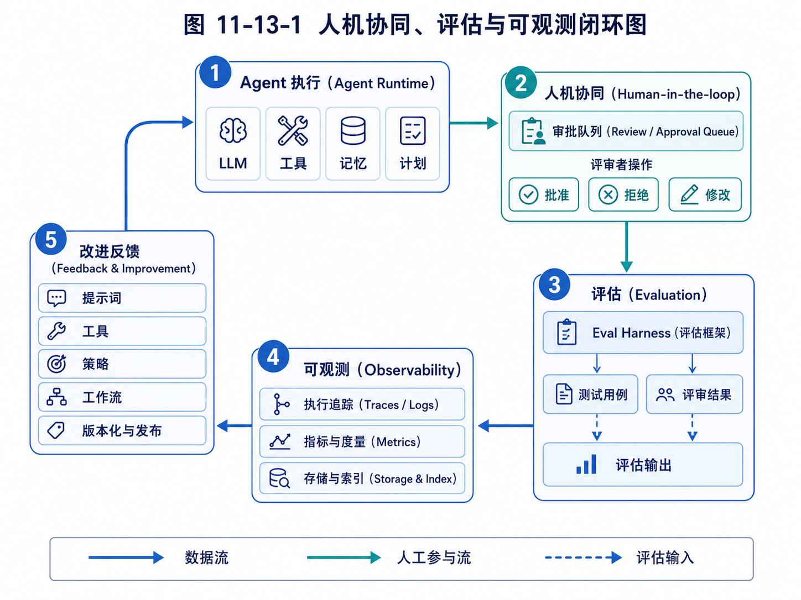

# 第 13 章：Observability：让 Agent 的行为可追踪

> 可观测性最容易被低估。先看闭环图，有助于理解 traces、metrics 与改进反馈在系统中的位置。



*图 11-13-1 人机协同、评估与可观测闭环图*


当一个普通后端接口出错时，工程师通常会查看日志、指标和链路追踪。请求从哪里进来，调用了哪些服务，数据库耗时多少，哪个环节抛出异常，错误码是什么。这些信息帮助工程师定位问题。

Agent 系统同样需要可观测性，而且需要得更多。

因为 Agent 的失败往往不是简单的异常。它可能没有报错，但方向跑偏了；它可能工具调用成功，但参数选错了；它可能输出流畅，但中间没有查证；它可能遵守了代码语法，却违背了用户意图；它可能没有执行危险动作，但花费大量成本陷入无效循环。

如果没有可观测性，你只能看到最终输出。你不知道 Agent 为什么这么做，不知道它读了哪些信息，不知道它有没有遵守计划，不知道它是不是重复调用工具，不知道它是否受到了外部内容干扰，也不知道它为什么失败。

这会导致两个结果。

第一，用户不信任。用户看到一个结果，但不知道结果从何而来，不敢用于真实决策。

第二，开发者无法改进。系统失败了，但没有轨迹，只能猜测原因，继续调 prompt。

因此，可观测性是 Agent 从 Demo 走向产品的关键基础设施。它连接了前面两章：没有可观测性，审批系统缺少依据；没有可观测性，评估系统缺少数据。

本章要解决的问题是：如何设计 Agent 的日志、事件、trace、指标和回放机制，让 Agent 的行为可追踪、可复盘、可审计、可优化。

---

## 13.1 Agent 可观测性和传统后端可观测性的区别

传统后端系统的可观测性通常围绕三类数据：日志、指标和 trace。

日志记录离散事件，例如请求参数、错误信息、业务状态变化。

指标记录聚合数据，例如 QPS、延迟、错误率、CPU 使用率。

Trace 记录一次请求跨多个服务的调用链路。

Agent 系统也需要这些，但还不够。因为 Agent 的核心不是单次请求，而是一个由模型推理、工具调用、上下文变化、状态转移和人机交互组成的执行过程。

传统后端 trace 可能记录：

```text
HTTP request -> auth service -> user service -> database -> response
```

Agent trace 可能记录：

```text
接收用户目标 -> 解析任务 -> 生成计划 -> 调用搜索工具 -> 读取网页 -> 判断客户类型 -> 保存候选客户 -> 去重 -> 评分 -> 生成开发信 -> 提交审批 -> 等待用户确认
```

这里每一步都包含模型输入、模型输出、工具输入、工具输出、上下文快照、状态更新和可能的风险判断。

传统后端错误通常是异常、超时、错误码。Agent 错误可能是语义层面的：

理解错目标；

选择错工具；

遗漏约束；

把不可信网页内容当指令；

使用过时记忆；

过度自信；

生成无来源结论；

重复执行无效搜索；

没有在高风险动作前审批。

这些错误如果没有专门记录，普通日志很难发现。

所以 Agent 可观测性需要记录的不只是“系统发生了什么”，还要记录“Agent 为什么这样行动”。当然，这并不意味着要暴露完整模型私有推理链。系统可以记录可审计的决策摘要、计划、动作理由、输入输出、证据和状态变化，而不是依赖不可控的自由思考文本。

---

## 13.2 Agent Trace：一次任务的执行轨迹

Agent 可观测性的核心对象是 Trace，也就是一次任务从开始到结束的执行轨迹。

一个 Trace 可以包含多个 Span。每个 Span 表示一个有边界的执行单元，例如一次模型调用、一次工具调用、一次计划生成、一次审批等待、一次记忆检索。

可以这样理解：

```text
Trace：一次完整任务。
Span：任务中的一个阶段或动作。
Event：Span 内部发生的具体事件。
Artifact：任务产生的中间或最终产物。
Metric：执行过程中的数值指标。
```

例如外贸 Agent 的 Trace：

```text
Trace: 寻找沙特钢卷尺客户
  Span 1: task_intake
  Span 2: planning
  Span 3: web_search
  Span 4: read_candidate_websites
  Span 5: classify_leads
  Span 6: deduplicate
  Span 7: score_leads
  Span 8: generate_email_drafts
  Span 9: submit_approval
```

每个 Span 需要记录开始时间、结束时间、输入、输出、状态和错误。

一个简化 Span 数据结构：

```python
class Span:
    id: str
    trace_id: str
    parent_id: str | None
    name: str
    type: str
    start_time: datetime
    end_time: datetime | None
    status: str
    input_summary: dict
    output_summary: dict
    error: str | None
    metadata: dict
```

对于模型调用 Span，可以记录：

```text
模型名称；
输入 token 数；
输出 token 数；
温度等参数；
输入摘要；
输出结构；
成本；
延迟；
是否通过 schema 校验。
```

对于工具调用 Span，可以记录：

```text
工具名称；
参数；
返回摘要；
成功或失败；
错误信息；
耗时；
重试次数；
风险级别。
```

对于审批 Span，可以记录：

```text
提案 ID；
风险级别；
审批人；
审批决定；
用户反馈；
等待时长。
```

Trace 的价值在于，它能把 Agent 的黑箱过程拆成可查看、可搜索、可分析的结构化记录。

---

## 13.3 事件日志：记录状态变化和关键节点

Trace 更像任务执行树，而 Event Log 更像时间线。

事件日志记录“什么时候发生了什么”。它适合展示给用户，也适合审计和回放。

外贸 Agent 的事件日志可能是：

```text
10:00 用户创建任务：寻找沙特钢卷尺客户。
10:01 Agent 生成搜索计划：优先查找 hardware wholesaler、tool distributor。
10:02 调用搜索工具，关键词：Saudi Arabia hardware wholesaler measuring tape。
10:04 读取 12 个候选网站。
10:08 排除 5 个零售网站。
10:10 保存 7 个候选客户。
10:12 发现重复域名 2 个，已合并。
10:15 为 5 个高分客户生成开发信草稿。
10:16 提交 5 封邮件到审批队列。
```

这个时间线非常适合用户理解任务进展。用户不需要看模型内部细节，但需要知道系统在做什么、做到哪一步、结果是什么。

事件可以设计成结构化对象：

```python
class AgentEvent:
    id: str
    trace_id: str
    task_id: str
    timestamp: datetime
    event_type: str
    message: str
    data: dict
    visibility: str
```

`event_type` 可以包括：

```text
TASK_CREATED
PLAN_CREATED
TOOL_CALLED
TOOL_FAILED
MEMORY_RETRIEVED
STATE_UPDATED
ARTIFACT_CREATED
APPROVAL_REQUESTED
APPROVAL_DECIDED
TASK_PAUSED
TASK_RESUMED
TASK_COMPLETED
TASK_FAILED
USER_INTERRUPT
```

`visibility` 用于区分事件是否展示给用户。例如系统内部调试事件可以只给开发者看，而任务进展事件可以给用户看。

事件日志是 Agent 产品界面的基础。任务列表、进度条、通知、历史记录、失败复盘，都可以从事件日志生成。

---

## 13.4 工具调用日志：最重要的可观测数据之一

在 Agent 系统中，工具调用日志非常重要。因为工具是 Agent 影响外部世界的方式。

每一次工具调用都应该被记录，尤其是带副作用的工具。

一个工具调用日志可以包含：

```python
class ToolCallLog:
    id: str
    trace_id: str
    tool_name: str
    tool_version: str
    input: dict
    output_summary: dict
    status: str
    error: str | None
    start_time: datetime
    end_time: datetime
    risk_level: str
    approval_id: str | None
    idempotency_key: str | None
```

为什么要记录 tool_version？因为工具实现可能变化。今天的 `search_web` 和一个月后的 `search_web` 可能逻辑不同。如果不记录版本，回放和评估会不准确。

为什么要记录 idempotency_key？因为某些工具不能重复执行。例如发送邮件、创建订单、更新 CRM。如果任务恢复时重复调用，可能造成重复发送或重复写入。幂等键可以帮助系统判断某个动作是否已经执行过。

为什么 output 只记录 summary，而不是全部内容？因为工具输出可能很大，也可能包含敏感信息。系统需要在可观测性和隐私之间平衡。对于网页读取工具，可以保存 URL、标题、提取摘要和 hash，而不是完整页面内容。对于邮件工具，可以保存主题、收件人、正文版本 ID，而不是在所有日志中复制正文。

工具日志能帮助诊断很多问题。

如果外贸 Agent 找到的客户质量差，你可以查看搜索关键词和读取的网站。

如果代码 Agent 修改错文件，你可以查看它之前搜索和读取了哪些文件。

如果教育 Agent 推荐不合适练习，你可以查看它是否读取了学生最近错题。

没有工具日志，Agent 的行动就是黑箱。

---

## 13.5 上下文快照：理解模型当时看到了什么

当模型做出错误判断时，最关键的问题之一是：它当时看到了什么？

如果上下文里没有用户关键约束，模型忘记约束就不是模型单独的问题，而是 Context Manager 的问题。

如果上下文里注入了错误记忆，模型做错判断可能是 Memory 检索问题。

如果工具结果太长，被截断后丢失关键事实，模型误判可能是压缩策略问题。

因此，Agent 可观测性需要记录上下文快照。

但要注意，上下文快照不一定要保存完整 prompt，尤其当里面包含敏感数据时。可以保存结构化摘要和引用：

```python
class ContextSnapshot:
    id: str
    trace_id: str
    step_id: str
    system_prompt_version: str
    task_prompt: str
    included_memories: list[str]
    included_artifacts: list[str]
    tool_results: list[str]
    token_count: int
    redacted_preview: str
```

这里的 `included_memories` 可以记录记忆 ID，而不是复制完整内容。`included_artifacts` 记录引用的文档或中间产物。`redacted_preview` 是脱敏后的上下文预览。

上下文快照可以回答：

模型是否看到了用户最新约束？

是否注入了过期记忆？

是否上下文过长导致关键信息被压缩？

是否把外部网页内容和系统指令混在一起？

是否遗漏了工具返回结果？

例如外贸 Agent 错误地给零售店高分。查看上下文快照后可能发现，客户分类 prompt 中没有明确“排除零售小店”的规则。那就应该改进任务约束注入。

代码 Agent 忘记“不引入新依赖”。查看上下文后发现用户这句话在早期对话里，但被压缩掉了。那就说明上下文压缩策略需要保护关键约束。

上下文快照是调试 Agent 行为的关键证据。

---

## 13.6 Artifact：保存中间产物和最终产物

Agent 执行过程中会产生很多产物。它们不只是最终答案，也包括计划、搜索结果、候选列表、草稿、评分表、代码 diff、测试报告、审批提案等。

这些产物应该作为 Artifact 保存，而不是只混在对话文本里。

一个 Artifact 可以这样表示：

```python
class Artifact:
    id: str
    task_id: str
    trace_id: str
    type: str
    name: str
    content_ref: str
    version: int
    created_by: str
    created_at: datetime
    metadata: dict
```

外贸 Agent 的 Artifact 包括：

```text
search-plan.md
raw-leads.csv
deduplicated-leads.csv
lead-scores.xlsx
email-drafts.md
approval-proposals.json
outreach-history.csv
```

代码 Agent 的 Artifact 包括：

```text
repo-summary.md
change-plan.md
patch.diff
test-output.txt
review-summary.md
```

教育 Agent 的 Artifact 包括：

```text
student-error-analysis.md
weekly-plan.md
teacher-review.md
parent-report-draft.md
```

保存 Artifact 有几个好处。

第一，用户可以查看和下载中间结果，而不是只拿到最终回答。

第二，任务失败时可以从中间产物恢复，不必重跑所有步骤。

第三，评估系统可以基于产物打分。

第四，审批系统可以引用具体产物版本。例如审批的是 email-draft v2，而不是一个不稳定的对话片段。

第五，后续任务可以复用产物。例如外贸 Agent 下一次跟进客户时，可以读取之前的 lead-scores 和 outreach-history。

因此，Artifact Store 是 Agent 可观测性和长期任务系统的重要组成。

---

## 13.7 指标：从单次任务到系统健康度

Trace 和日志适合看单次任务，指标适合看整体趋势。

Agent 系统需要关注两类指标：运行指标和业务指标。

运行指标包括：

```text
任务数量；
任务成功率；
失败率；
平均执行时长；
平均模型调用次数；
平均工具调用次数；
平均 token 成本；
工具失败率；
审批等待时长；
用户中断次数；
重试次数；
循环终止原因分布。
```

业务指标根据场景不同而不同。

外贸 Agent：

```text
每日新增候选客户数；
高质量客户比例；
重复客户比例；
邮件草稿通过率；
客户回复率；
有效询盘数；
人工审核耗时。
```

代码 Agent：

```text
任务完成率；
测试通过率；
平均修改文件数；
patch 被接受率；
review 修改次数；
回滚次数。
```

教育 Agent：

```text
练习完成率；
错因识别准确率；
老师采纳建议比例；
学生薄弱点改善趋势；
学习报告修改率。
```

指标的价值在于发现系统趋势。例如：

工具失败率突然上升，可能是外部 API 变了。

平均 token 成本持续增加，可能是上下文压缩失效。

审批通过率很低，说明 Agent 生成的提案质量差。

用户中断次数增加，说明任务方向经常不符合预期。

客户重复比例高，说明去重机制有问题。

指标帮助你从“单次调试”进入“系统运营”。

---

## 13.8 Replay：失败任务如何回放

Agent 失败后，最有价值的能力之一是回放。

回放不是简单重新运行任务，因为模型输出和外部环境可能变化。回放更像“根据当时保存的 trace、工具输出、上下文快照和状态变化，重现执行过程”。

回放可以分为三种。

第一种是只读回放。用户或开发者按时间线查看任务当时发生了什么。这适合复盘和审计。

第二种是局部重放。从某个 checkpoint 开始，用同样输入重新执行某一步。这适合调试模型或工具策略。

第三种是对比回放。用新版本 Agent 在同一任务上运行，然后和旧版本 trace 对比。这适合评估改进效果。

例如外贸 Agent 任务失败，原因是客户质量差。只读回放可以看到它搜索了哪些关键词。局部重放可以从“生成搜索策略”这一步重新执行，测试新的搜索 prompt。对比回放可以比较新旧策略找到的客户质量。

代码 Agent 中，测试失败后可以回放修改计划和 diff，找到它为什么改错文件。

教育 Agent 中，如果老师认为学习建议不合适，可以回放 Agent 使用了哪些错题记录和错因标签。

要支持 Replay，系统需要保存：

```text
任务输入；
系统版本；
prompt 版本；
模型版本；
工具版本；
工具返回结果；
上下文快照；
状态变化；
中间产物；
随机参数。
```

不一定所有任务都需要完整保存，生产系统可以根据风险级别决定保存粒度。高风险任务保存更完整，低风险任务保存摘要。

---

## 13.9 Debug：从失败现象定位到模块问题

可观测性的最终目的，是帮助开发者定位问题。

Agent 失败后，不应该只说“模型不行”。要把失败定位到具体模块。

常见失败现象和可能原因如下。

如果 Agent 理解错目标，可能是任务解析 prompt 不清晰，或缺少澄清机制。

如果 Agent 忘记用户约束，可能是上下文管理或记忆注入问题。

如果 Agent 选择错工具，可能是工具描述混乱，工具太多，或 Planner 策略不足。

如果工具参数错误，可能是 schema 不清晰，缺少参数校验，或模型输出解析失败。

如果 Agent 重复搜索，可能是状态记录没有保存已尝试策略。

如果 Agent 编造结果，可能是缺少检索强约束或输出验证。

如果 Agent 越权执行，可能是策略引擎和工具权限设计有漏洞。

如果任务成本过高，可能是上下文太长、计划不收敛、工具调用重复。

通过 trace，你可以定位：

问题发生在哪个 Span；

当时输入是什么；

模型输出是什么；

工具返回什么；

状态如何变化；

是否有审批；

最终如何导致失败。

这就把 Agent 调试从“玄学调 prompt”变成了工程分析。

---

## 13.10 用户可见的透明度

可观测性不只服务开发者，也服务用户。

用户不一定需要看到所有技术日志，但需要看到足够透明的信息来建立信任。

一个外贸 Agent 应该让用户看到：

```text
当前任务进度；
已经找到多少客户；
排除了多少无关客户；
每个客户的判断依据；
哪些邮件等待审批；
哪些信息不确定；
下一步计划是什么。
```

代码 Agent 应该让用户看到：

```text
读取了哪些文件；
计划修改哪些文件；
测试结果如何；
diff 内容；
风险提示；
回滚方案。
```

教育 Agent 应该让老师看到：

```text
学生画像来自哪些错题；
推荐练习依据是什么；
哪些判断是高置信度；
哪些需要老师确认；
本周变化趋势。
```

用户可见透明度有一个原则：展示决策需要的信息，而不是倾倒全部内部日志。

如果展示太少，用户不信任；展示太多，用户被淹没。好的产品界面应该分层：默认展示摘要，允许展开查看证据和详情。

例如客户评分可以默认显示：

```text
评分：82/100
理由：五金批发商，主营工具和建筑用品，有官网邮箱，目标市场匹配。
```

用户点击展开后再看来源网页、提取片段、评分维度。

这种透明度能显著提升 Agent 的可用性。

---

## 13.11 隐私与脱敏：不是所有日志都能随便存

可观测性越强，记录的数据越多，隐私和安全风险也越高。

Agent 可能处理客户邮箱、合同、报价、学生信息、代码密钥、内部文档。如果把所有 prompt、工具输出和文件内容原样写入日志，就可能造成数据泄露。

因此，可观测性系统必须设计脱敏和权限。

常见策略包括：

敏感字段脱敏。例如邮箱、手机号、API Key、身份证号、学生姓名。

日志分级。普通用户只能看任务进展，管理员可以看更多审计信息，开发者只能看脱敏 trace。

内容引用而非复制。日志中保存 artifact ID，而不是复制完整正文。

保留期限。低风险日志保存较短，高价值审计日志按合规要求保存。

访问审计。谁查看了敏感 trace，也要记录。

环境隔离。生产数据不应随意进入开发调试环境。

例如代码 Agent 读取 `.env` 文件时，即使工具被允许读取，日志也不应该保存完整密钥。可以记录：

```text
读取文件：.env
检测到敏感字段：OPENAI_API_KEY，已脱敏。
```

而不是保存：

```text
OPENAI_API_KEY=sk-...
```

教育 Agent 中，学生隐私更敏感。日志展示给开发者时，可以用学生 ID 替代真实姓名，并隐藏家庭信息。

隐私保护不是可观测性的反面，而是可观测性工程的一部分。真正成熟的系统，不是“不记录”，而是“记录必要信息，并以安全方式记录”。

---

## 13.12 一个最小可观测实现

下面用一个简化实现说明如何为 Agent Runtime 增加 trace 和事件记录。

首先定义 Trace 和 Span：

```python
from dataclasses import dataclass, field
from datetime import datetime
from typing import Any
import uuid

@dataclass
class SpanRecord:
    trace_id: str
    name: str
    span_type: str
    input_summary: dict[str, Any] = field(default_factory=dict)
    id: str = field(default_factory=lambda: str(uuid.uuid4()))
    parent_id: str | None = None
    start_time: datetime = field(default_factory=datetime.utcnow)
    end_time: datetime | None = None
    status: str = "running"
    output_summary: dict[str, Any] = field(default_factory=dict)
    error: str | None = None
    metadata: dict[str, Any] = field(default_factory=dict)

@dataclass
class TraceRecord:
    task_id: str
    name: str
    id: str = field(default_factory=lambda: str(uuid.uuid4()))
    start_time: datetime = field(default_factory=datetime.utcnow)
    end_time: datetime | None = None
    status: str = "running"
```

定义 Trace Store：

```python
class TraceStore:
    def __init__(self):
        self.traces: dict[str, TraceRecord] = {}
        self.spans: list[SpanRecord] = []
        self.events: list[dict[str, Any]] = []

    def start_trace(self, task_id: str, name: str) -> TraceRecord:
        trace = TraceRecord(task_id=task_id, name=name)
        self.traces[trace.id] = trace
        return trace

    def start_span(self, trace_id: str, name: str, span_type: str, input_summary=None, parent_id=None):
        span = SpanRecord(
            trace_id=trace_id,
            name=name,
            span_type=span_type,
            input_summary=input_summary or {},
            parent_id=parent_id,
        )
        self.spans.append(span)
        return span

    def end_span(self, span: SpanRecord, output_summary=None, error: str | None = None):
        span.end_time = datetime.utcnow()
        span.output_summary = output_summary or {}
        span.error = error
        span.status = "failed" if error else "success"

    def emit_event(self, trace_id: str, event_type: str, message: str, data=None):
        self.events.append({
            "trace_id": trace_id,
            "event_type": event_type,
            "message": message,
            "data": data or {},
            "timestamp": datetime.utcnow().isoformat(),
        })
```

在工具调用时插桩：

```python
class ToolExecutor:
    def __init__(self, trace_store: TraceStore):
        self.trace_store = trace_store

    def call_tool(self, trace_id: str, tool_name: str, tool_fn, **kwargs):
        span = self.trace_store.start_span(
            trace_id=trace_id,
            name=f"tool:{tool_name}",
            span_type="tool_call",
            input_summary={"tool": tool_name, "args": kwargs},
        )
        self.trace_store.emit_event(trace_id, "TOOL_CALLED", f"调用工具 {tool_name}", {"args": kwargs})

        try:
            result = tool_fn(**kwargs)
            self.trace_store.end_span(span, output_summary={"result_preview": str(result)[:500]})
            return result
        except Exception as e:
            self.trace_store.end_span(span, error=str(e))
            self.trace_store.emit_event(trace_id, "TOOL_FAILED", f"工具 {tool_name} 调用失败", {"error": str(e)})
            raise
```

在 Agent 运行时：

```python
trace = trace_store.start_trace(task_id="task_001", name="寻找沙特钢卷尺客户")
trace_store.emit_event(trace.id, "TASK_CREATED", "任务已创建")

plan_span = trace_store.start_span(trace.id, "planning", "model_call")
# 调用模型生成计划
trace_store.end_span(plan_span, output_summary={"steps": 5})
trace_store.emit_event(trace.id, "PLAN_CREATED", "Agent 已生成执行计划")
```

这个最小实现已经能支持：

记录任务 trace；

记录模型和工具 span；

记录事件时间线；

记录失败；

为评估和回放提供基础数据。

生产系统可以继续扩展：接入 OpenTelemetry、数据库持久化、前端 trace viewer、指标聚合、日志脱敏、权限控制、artifact store 等。

---

## 13.13 可观测性与前面模块的关系

可观测性不是一个孤立模块，它和前面所有机制都有关系。

和 Agent Loop 的关系：每一轮 Observe、Think、Act、Reflect 都应该产生 trace。否则无法知道循环为什么继续或停止。

和工具系统的关系：每次工具调用都要记录输入、输出、耗时、错误和风险级别。

和上下文工程的关系：需要保存上下文快照，帮助判断模型是否看到了正确的信息。

和 Planning 的关系：计划本身应该是 Artifact，计划执行情况应该可追踪。

和 Memory 的关系：记忆检索和写入都应记录，避免错误记忆污染系统而无法追查。

和 RAG 的关系：检索到了哪些文档、哪些片段进入上下文、来源质量如何，都要可见。

和 Long-running Agent 的关系：长任务需要状态变化日志、checkpoint、恢复记录。

和审批系统的关系：审批提案、决策、修改和执行结果都要进入审计日志。

和评估系统的关系：Eval Harness 需要读取 trace、tool log、artifact 和指标进行评分。

因此，可观测性应该从一开始就嵌入 Agent Runtime，而不是等系统变复杂后再补。后补可观测性往往很痛苦，因为关键数据没有保存，失败已经无法复盘。

---

## 13.14 常见可观测性错误

第一个错误，是只保存最终答案。

最终答案无法说明 Agent 为什么成功或失败。必须保存过程。

第二个错误，是日志全是自然语言，缺少结构化字段。

自然语言日志适合人看，但不利于统计和评估。工具名、任务 ID、风险级别、状态、耗时、成本等必须结构化。

第三个错误，是记录太多敏感原文。

完整 prompt、网页内容、用户文件、密钥、学生信息都可能敏感。需要脱敏、引用和权限控制。

第四个错误，是没有 prompt、工具和模型版本。

如果版本不记录，后续无法解释为什么同一任务表现不同。

第五个错误，是没有把 trace 和用户界面连接起来。

可观测性不只是后台日志。用户也需要看到适当透明的信息。

第六个错误，是没有指标聚合。

只看单次日志，无法发现系统性问题。必须有成功率、失败率、成本、工具错误率等指标。

第七个错误，是没有回放能力。

没有回放，失败任务只能靠猜。尤其是长任务和高风险任务，回放非常重要。

---

## 练习题

### 练习 1：设计外贸 Agent 的 Trace

请为“寻找阿联酋钢卷尺客户并生成开发信草稿”设计一条 Trace，列出至少 8 个 Span，并说明每个 Span 的输入和输出摘要。

### 练习 2：设计工具调用日志

为 `send_email_draft` 或 `web_search` 工具设计 ToolCallLog 字段，要求包含：

```text
工具名、版本、输入、输出摘要、状态、错误、耗时、风险级别、审批 ID、幂等键。
```

### 练习 3：上下文快照分析

假设 Agent 忘记了用户要求“不要自动发送邮件”，最后调用了发送工具。请说明你会查看哪些上下文快照和日志，以定位问题来自：

```text
任务约束遗漏；
上下文压缩错误；
工具权限缺失；
审批策略失效。
```

### 练习 4：设计用户可见任务时间线

为代码开发 Agent 设计一个用户可见时间线。用户不需要看到所有内部日志，但要能理解 Agent 做了什么。请列出至少 10 个事件。

### 练习 5：隐私脱敏方案

假设教育 Agent 的 trace 中包含学生姓名、错题内容、老师评价和家长联系方式。请设计一套日志脱敏规则，说明哪些内容可以保存原文，哪些需要脱敏，哪些只能保存引用。

---

## 检查清单

读完本章后，你应该能够检查自己是否理解以下问题：

```text
[ ] 我知道 Agent 可观测性为什么比普通后端日志更复杂。
[ ] 我能区分 Trace、Span、Event、Artifact 和 Metric。
[ ] 我知道一次 Agent 任务应该记录哪些关键执行信息。
[ ] 我理解工具调用日志为什么重要。
[ ] 我知道上下文快照可以帮助定位哪些问题。
[ ] 我理解 Artifact Store 对任务恢复、审批和评估的价值。
[ ] 我能为 Agent 设计运行指标和业务指标。
[ ] 我知道 Replay 对调试和回归评估的重要性。
[ ] 我理解用户可见透明度和开发者调试日志的区别。
[ ] 我知道可观测性系统必须考虑隐私、脱敏和权限控制。
```

---

## 本章总结

Agent 系统如果不可观测，就无法真正被信任、评估和改进。和传统后端相比，Agent 的可观测性不仅要记录请求、错误和耗时，还要记录任务目标、计划、模型调用、工具调用、上下文快照、状态变化、审批决策、中间产物、成本和失败原因。

本章介绍了 Agent 可观测性的核心对象：Trace 表示一次完整任务，Span 表示任务中的执行单元，Event 表示状态变化和关键节点，Artifact 保存中间和最终产物，Metric 反映系统运行和业务效果。通过这些结构，开发者可以回放失败任务，定位问题发生在哪个模块，用户也可以看到足够透明的执行过程。

可观测性连接了审批和评估。审批需要依据，评估需要数据，调试需要轨迹，用户信任需要透明度。没有可观测性，Agent 开发会停留在“看最终输出、凭感觉调 prompt”的阶段。有了可观测性，Agent 系统才能进入可复盘、可审计、可持续优化的工程状态。

到这里，第四篇“可控、安全、可评估的 Agent”已经完成。接下来，我们将进入第五篇，讨论如何阅读 Agent 项目源码，如何从 OpenClaw、Hermes、Claude Code 等系统中提炼架构模式，并最终设计属于自己的 Agent Runtime。