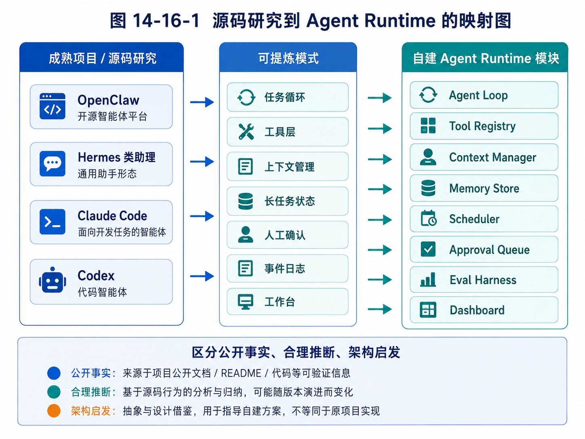

# 第 16 章：从源码中提炼自己的 Agent Runtime

> 设计自己的 Agent Runtime 时，最重要的是把前面观察到的成熟模式映射成清晰模块。



*图 14-16-1 源码研究到 Agent Runtime 的映射图*


前两章完成了两件事。第 14 章给出了一套阅读 Agent 项目源码的方法，第 15 章从 OpenClaw、Hermes 类助理、Claude Code 和 Codex 等代表性形态中提炼了可迁移设计模式。现在，我们要把这些经验收敛到一个更具体的问题：如果要设计自己的 Agent Runtime，应该长什么样？

这里的 Agent Runtime，不是某个框架的简单封装，也不是一个只能跑 Demo 的循环，而是一套支撑 Agent 长期、可控、可观测执行任务的基础设施。

它要回答：

```text
任务如何进入系统？
Agent 如何决定下一步？
工具如何注册和执行？
上下文如何构造？
状态如何保存？
记忆如何使用？
长任务如何调度？
高风险动作如何审批？
执行过程如何追踪？
失败后如何恢复？
多个业务 Agent 如何复用同一底座？
```

本章不会追求一次设计出庞大系统。相反，我们会设计一套可演进的 Runtime：先能跑通最小闭环，再逐步增加工具、上下文、记忆、审批、调度、评估和工作台。这样的设计适合个人开发者，也适合后续交给 Codex 或其他代码 Agent 分阶段实现。

---

## 16.1 为什么需要自己的 Agent Runtime

有人可能会问：既然已经有 LangGraph、OpenAI Agents SDK、CrewAI、AutoGen 等框架，为什么还要设计自己的 Agent Runtime？

这里的“设计自己的 Runtime”不等于完全从零造轮子，也不等于拒绝框架。它的真正含义是：你要理解并掌握 Agent 系统的核心抽象，知道自己需要什么，再决定哪些部分用框架，哪些部分自己实现。

如果没有自己的 Runtime 思维，你很容易被框架牵着走。

例如，某个框架提供了多 Agent 对话，你可能就开始设计一堆角色互相聊天；某个框架提供图节点，你可能就把所有流程画成复杂图；某个框架提供工具调用，你可能就把所有 API 都暴露给模型。结果系统看起来很“Agent”，但真实业务价值并不清楚。

拥有 Runtime 思维后，你会先问：

```text
我的任务是否需要长期状态？
是否需要人工审批？
是否需要工具权限控制？
是否需要多入口？
是否需要多 Agent？
是否需要后台调度？
是否需要记忆？
是否需要评估？
```

然后再选择实现方式。

自己的 Agent Runtime 至少有三点价值。

第一，形成稳定抽象。

框架会变化，但任务、状态、工具、上下文、记忆、审批、日志这些概念长期存在。你掌握这些抽象，就能跨框架迁移。

第二，贴合业务场景。

外贸 Agent、教育 Agent、代码 Agent 的工具、状态、审批规则完全不同。通用框架不可能替你定义业务对象。你需要自己的 domain model。

第三，便于工程演进。

从 Demo 到产品，最大的变化不是模型，而是周边机制：用户系统、权限、日志、调度、审批、评估、数据治理。如果一开始没有 Runtime 架构，后期会很难加。

因此，本章的目标不是发明一个新框架，而是定义一套你能理解、能实现、能扩展的 Agent Runtime 蓝图。

---

## 16.2 Runtime 的总体架构

一个实用的 Agent Runtime 可以分为八层：

```text
1. Entry Layer：任务入口层
2. Task Layer：任务与状态层
3. Runtime Layer：执行循环层
4. Context Layer：上下文层
5. Tool Layer：工具层
6. Memory & Knowledge Layer：记忆与知识层
7. Control Layer：审批、安全与调度层
8. Observability & Eval Layer：可观测与评估层
```

可以画成下面的结构：

```text
┌──────────────────────────────────────────────┐
│ Entry Layer                                  │
│ CLI / Web / Chat / Scheduler / Webhook        │
└───────────────────────┬──────────────────────┘
                        │ normalized event
┌───────────────────────▼──────────────────────┐
│ Task Layer                                    │
│ Task / State / Event / Artifact / Checkpoint  │
└───────────────────────┬──────────────────────┘
                        │ task state
┌───────────────────────▼──────────────────────┐
│ Runtime Layer                                 │
│ Agent Loop / Planner / Executor / Stop Policy │
└─────────────┬───────────────┬────────────────┘
              │               │
┌─────────────▼───────┐ ┌─────▼────────────────┐
│ Context Layer        │ │ Tool Layer            │
│ Prompt / Compression │ │ Registry / Executor   │
│ Memory Injection     │ │ Permission / Sandbox  │
└─────────────┬───────┘ └─────┬────────────────┘
              │               │
┌─────────────▼───────────────▼────────────────┐
│ Memory & Knowledge Layer                      │
│ Memory Store / RAG / Domain Data / Profiles   │
└───────────────────────┬──────────────────────┘
                        │
┌───────────────────────▼──────────────────────┐
│ Control Layer                                 │
│ Approval / Scheduler / Policy / Notification  │
└───────────────────────┬──────────────────────┘
                        │
┌───────────────────────▼──────────────────────┐
│ Observability & Eval Layer                    │
│ Trace / Logs / Metrics / Replay / Eval Report │
└──────────────────────────────────────────────┘
```

这张图表达了一个重要原则：Agent Runtime 不是单个 loop，而是围绕任务执行的一整套基础设施。

最小版本可以只实现其中一部分，但架构上要给未来留下位置。

---

## 16.3 Entry Layer：任务入口层

任务入口层负责把外部输入转换成统一内部事件。

入口可以很多：

```text
CLI：用户在终端输入任务。
Web：用户在工作台创建任务。
Chat：用户通过微信、Telegram、Slack、飞书发送消息。
Scheduler：系统定时触发任务。
Webhook：外部系统事件触发任务。
API：其他服务调用 Agent。
```

如果每个入口都直接调用 Runtime，系统会很快混乱。正确做法是先统一成 `InputEvent`：

```python
from dataclasses import dataclass
from typing import Literal, Optional, Dict, Any

@dataclass
class InputEvent:
    source: Literal["cli", "web", "chat", "scheduler", "webhook", "api"]
    user_id: str
    session_id: Optional[str]
    content: str
    metadata: Dict[str, Any]
```

这样 Runtime 不需要关心输入来自哪里。它只处理标准化事件。

例如，用户在 Web 中点击“创建客户开发任务”，内部事件可能是：

```json
{
  "source": "web",
  "user_id": "u_001",
  "session_id": "s_100",
  "content": "寻找沙特钢卷尺批发商，生成 20 条线索和开发信草稿",
  "metadata": {
    "product_id": "steel_tape_measure",
    "target_country": "Saudi Arabia",
    "customer_type": "wholesaler"
  }
}
```

用户在聊天中发同样指令，也被转换成同样结构。未来接入新渠道时，只新增 adapter，不改 Runtime。

这就是 OpenClaw 类多渠道系统给我们的启发：入口可以多样，但内部事件要统一。

---

## 16.4 Task Layer：任务、状态、事件与产物

Agent 的基本单位不是“聊天消息”，而是“任务”。

任务有目标、状态、历史、产物和生命周期。一个任务可以持续几秒，也可以持续几天。

可以定义一个基础 Task：

```python
from dataclasses import dataclass, field
from typing import Dict, Any, List, Literal, Optional
from datetime import datetime

TaskStatus = Literal[
    "created",
    "planning",
    "running",
    "waiting_for_tool",
    "waiting_for_approval",
    "paused",
    "completed",
    "failed",
    "cancelled",
]

@dataclass
class Task:
    task_id: str
    user_id: str
    goal: str
    status: TaskStatus
    created_at: datetime
    updated_at: datetime
    state: Dict[str, Any] = field(default_factory=dict)
    artifacts: List[str] = field(default_factory=list)
    parent_task_id: Optional[str] = None
```

任务状态不是随便写一段文本，而应该结构化。例如外贸客户开发任务的 state 可以包含：

```json
{
  "target_country": "Saudi Arabia",
  "product": "steel tape measure",
  "search_queries": [],
  "lead_candidates": [],
  "qualified_leads": [],
  "email_drafts": [],
  "approval_items": [],
  "completed_steps": [],
  "next_step": "generate_search_queries"
}
```

代码开发任务的 state 则完全不同：

```json
{
  "repo_path": "/workspace/project",
  "relevant_files": [],
  "plan": [],
  "modified_files": [],
  "test_commands": [],
  "test_results": [],
  "diff_summary": null,
  "next_step": "inspect_repo"
}
```

这说明 Runtime 要有通用 Task 抽象，但业务 state 可以由具体 Agent 定义。

除了 Task，还需要 Event。

Event 记录任务执行过程中发生的每件事：

```python
@dataclass
class TaskEvent:
    event_id: str
    task_id: str
    type: str
    payload: Dict[str, Any]
    created_at: datetime
```

事件类型可以包括：

```text
task.created
plan.generated
model.called
tool.called
tool.completed
approval.requested
approval.approved
state.updated
task.completed
task.failed
```

为什么需要事件？因为事件是可观测性、回放、调试和前端展示的基础。

最后，还需要 Artifact。

Artifact 是任务产物，例如报告、客户表、邮件草稿、代码 diff、学习计划。不要把所有产物都塞进最终回答。结构化产物应该单独保存，并和任务关联。

---

## 16.5 Runtime Layer：Agent Loop、Planner 与 Executor

Runtime Layer 是 Agent 的执行核心。

最小 runtime 可以只有一个 loop：

```python
class AgentRuntime:
    def __init__(self, model, context_manager, tool_executor, task_store, tracer):
        self.model = model
        self.context_manager = context_manager
        self.tool_executor = tool_executor
        self.task_store = task_store
        self.tracer = tracer

    def run(self, task_id: str):
        task = self.task_store.get(task_id)
        step = 0

        while not self.should_stop(task, step):
            context = self.context_manager.build(task)
            decision = self.model.generate(context)
            action = self.parse_decision(decision)

            if action.type == "tool_call":
                result = self.tool_executor.execute(action.tool_name, action.args, task)
                task = self.apply_tool_result(task, action, result)
            elif action.type == "final_answer":
                task.status = "completed"
                task.state["final_answer"] = action.content
            elif action.type == "request_approval":
                task.status = "waiting_for_approval"
                self.create_approval(task, action)
                break
            else:
                task = self.handle_unknown_action(task, action)

            self.task_store.save(task)
            step += 1
```

这只是骨架。真实 runtime 还要处理异常、重试、暂停、恢复、并发、成本限制、审批和 trace。

随着系统复杂，可以把 Runtime 拆成 Planner 和 Executor。

Planner 负责制定或更新计划：

```python
class Planner:
    def create_plan(self, task: Task) -> list[dict]:
        ...

    def revise_plan(self, task: Task, feedback: dict) -> list[dict]:
        ...
```

Executor 负责执行计划中的一步：

```python
class Executor:
    def execute_next_step(self, task: Task) -> Task:
        ...
```

Planner / Executor 分离的好处是：计划可以被展示和审批，执行可以被控制和回滚。

例如外贸 Agent 的初始计划：

```text
1. 生成沙特五金批发商搜索关键词；
2. 搜索候选公司；
3. 读取公司网站；
4. 判断客户类型；
5. 去重；
6. 评分；
7. 生成开发信草稿；
8. 等待人工审批。
```

用户可以在执行前修改计划，比如增加“优先 Riyadh 和 Jeddah 公司”，或排除某类客户。

代码 Agent 的计划也类似：

```text
1. 读取 README 和项目结构；
2. 找到 auth 相关文件；
3. 分析登录 bug；
4. 修改代码；
5. 运行测试；
6. 修复失败；
7. 展示 diff。
```

Runtime 的核心能力，不是让模型自由发挥，而是把模型的推理嵌入可控执行循环。

---

## 16.6 Context Layer：上下文管理器

Context Manager 负责把任务、状态、工具、记忆和规则组装成模型输入。

它是 Agent 行为质量的关键模块。

一个基础接口可以是：

```python
class ContextManager:
    def build(self, task: Task) -> list[dict]:
        system = self.build_system_message(task)
        task_context = self.build_task_context(task)
        state_context = self.build_state_context(task)
        tool_context = self.build_tool_context(task)
        memory_context = self.retrieve_memory(task)
        output_contract = self.build_output_contract(task)

        return [
            system,
            task_context,
            state_context,
            tool_context,
            memory_context,
            output_contract,
        ]
```

上下文管理器要解决几个问题。

第一，分层。

系统规则、用户输入、工具结果、网页内容、记忆内容必须清楚分隔，避免模型把外部内容当成高优先级指令。

第二，预算。

上下文不能无限增长。需要决定哪些信息保留原文，哪些摘要，哪些检索，哪些丢弃。

第三，相关性。

不是所有记忆都注入。只注入当前任务相关的记忆。

第四，输出契约。

模型输出应该符合结构，例如：

```json
{
  "thought_summary": "...",
  "action": {
    "type": "tool_call",
    "tool_name": "search_web",
    "args": {"query": "Saudi hardware wholesalers steel tape measure"}
  }
}
```

注意这里使用 `thought_summary`，不是要求模型暴露完整推理过程。系统只需要可审计的简要决策依据，不需要依赖私密链式思考。

一个好的 Context Manager 应该像项目经理：它把当前任务最重要的信息整理好，让模型在正确边界内做判断。

---

## 16.7 Tool Layer：工具注册、执行与权限

Tool Layer 包括 Tool Registry、Tool Executor、Permission Policy 和 Sandbox。

基础工具定义可以是：

```python
from dataclasses import dataclass
from typing import Callable, Dict, Any, Literal

RiskLevel = Literal["low", "medium", "high", "forbidden"]

@dataclass
class ToolSpec:
    name: str
    description: str
    parameters_schema: Dict[str, Any]
    risk_level: RiskLevel
    requires_approval: bool
    handler: Callable[..., Any]
```

Tool Registry 负责注册工具：

```python
class ToolRegistry:
    def __init__(self):
        self.tools = {}

    def register(self, spec: ToolSpec):
        self.tools[spec.name] = spec

    def get(self, name: str) -> ToolSpec:
        return self.tools[name]

    def list_for_agent(self, task: Task) -> list[dict]:
        return [self.to_model_schema(t) for t in self.tools.values()]
```

Tool Executor 负责执行工具：

```python
class ToolExecutor:
    def __init__(self, registry, approval_service, tracer):
        self.registry = registry
        self.approval_service = approval_service
        self.tracer = tracer

    def execute(self, tool_name: str, args: dict, task: Task):
        spec = self.registry.get(tool_name)

        if spec.risk_level == "forbidden":
            raise PermissionError(f"Tool {tool_name} is forbidden")

        if spec.requires_approval:
            return self.approval_service.request_tool_approval(task, spec, args)

        self.validate_args(spec, args)
        self.tracer.record_tool_call(task.task_id, tool_name, args)
        result = spec.handler(**args)
        self.tracer.record_tool_result(task.task_id, tool_name, result)
        return result
```

工具系统必须坚持几个原则。

第一，默认最小权限。

Agent 不应该默认拥有所有工具。不同角色、不同任务、不同用户权限，对应不同工具集。

第二，高风险动作必须审批。

例如发送邮件、删除文件、提交代码、修改 CRM、付款、群发通知，都不应该默认自动执行。

第三，工具返回值要结构化。

工具不要返回一大段不可解析文本，而应该返回带字段的数据。

第四，工具执行要可审计。

每次调用都记录参数、结果、时间、状态和错误。

第五，业务工具优先于裸工具。

外贸 Agent 不要只给 `web_search`，还可以设计 `search_leads`、`score_lead`、`create_email_draft`。代码 Agent 不要只给 `shell`，还可以设计 `run_tests`、`get_diff`、`apply_patch`。

工具层是 Agent Runtime 的“手脚”，但手脚必须有规则。

---

## 16.8 Memory & Knowledge Layer：记忆与知识

Memory & Knowledge Layer 负责长期信息。

这里要继续坚持第 8、9 章的区分：Memory 不是 RAG，RAG 也不是全部记忆。

可以定义四类存储：

```text
User Memory：用户偏好、长期设置、常用风格。
Task Memory：历史任务摘要、成功经验、失败原因。
Domain Memory：业务实体，如客户、学生、项目、产品。
Knowledge Base：文档、资料、手册、课程、产品规格。
```

一个外贸 Agent 的长期数据包括：

```text
产品知识库：钢卷尺规格、MOQ、包装、交期。
客户库：公司、国家、类型、联系方式、来源。
触达历史：何时发过什么邮件、对方是否回复。
用户偏好：邮件风格、目标国家、客户类型偏好。
黑名单：不要再联系的客户或域名。
经验记忆：哪些搜索策略有效，哪些无效。
```

一个教育 Agent 的长期数据包括：

```text
学生画像：知识点掌握、错因模式、学习习惯。
错题记录：题目、答案、错因、复习状态。
教师偏好：报告格式、提醒频率、干预方式。
课程知识库：教材、知识点、例题、题型。
```

Memory Store 可以先用简单数据库实现：

```python
@dataclass
class MemoryItem:
    memory_id: str
    user_id: str
    type: str
    content: str
    tags: list[str]
    source_task_id: str | None
    confidence: float
    created_at: datetime
    updated_at: datetime
```

写入记忆时，要有策略：

```text
不是所有信息都写入长期记忆；
临时偏好不自动永久化；
重要记忆需要可编辑；
错误记忆可以删除；
敏感信息要限制；
记忆使用要记录来源。
```

知识库则适合通过文档加载、切分、索引、检索和引用管理实现。

Runtime 不应该直接把全部记忆塞进 prompt，而应该通过 Context Manager 按任务检索相关内容。

---

## 16.9 Control Layer：审批、安全、调度与通知

Control Layer 是 Agent 从 Demo 变成产品的关键。

它包含四个核心模块：Approval、Policy、Scheduler、Notification。

Approval 负责人工审批。

审批对象可以是：

```text
邮件草稿；
文件修改；
shell 命令；
客户黑名单更新；
CRM 写入；
付款动作；
外部消息发送；
长期记忆写入。
```

审批记录可以这样表示：

```python
@dataclass
class ApprovalItem:
    approval_id: str
    task_id: str
    action_type: str
    title: str
    payload: dict
    risk_level: str
    status: str  # pending / approved / rejected / revised
    created_at: datetime
```

Policy 负责规则判断。

例如：

```text
低风险工具可自动执行；
中风险工具记录日志；
高风险工具必须审批；
禁止工具直接拒绝；
批量邮件每日不超过 N 封；
同一客户 14 天内不重复触达；
shell 命令不能访问上级目录；
记忆写入敏感字段需人工确认。
```

Scheduler 负责长期任务。

外贸 Agent 可能每天早上搜索新客户，每三天提醒跟进，每周生成客户开发报告。教育 Agent 可能每天推送练习，每周生成学习报告。

Scheduler 不应该直接调用模型，而应该创建标准 Task。这样定时任务和人工任务走同一 Runtime。

Notification 负责通知用户。

通知不是简单推送消息，而是把任务状态变成用户可理解的更新：

```text
“已找到 36 个候选客户，其中 12 个高匹配，5 封开发信待审批。”
“登录功能修改完成，测试通过 18 项，1 项失败，需要你确认是否继续修复。”
“学生本周几何证明错因集中在缺少推理依据，建议老师关注。”
```

Control Layer 体现了一个核心观点：Agent 的自主性必须被系统设计，而不是只靠模型自觉。

---

## 16.10 Observability & Eval Layer：追踪、复盘与评估

没有可观测性，就没有可靠 Agent。

Trace 系统应该记录：

```text
每次任务开始和结束；
每一轮模型调用；
每次工具调用；
每次状态变化；
每次审批；
每次错误；
每次重试；
成本、耗时和 token；
最终停止原因。
```

基础 trace 数据结构：

```python
@dataclass
class TraceSpan:
    span_id: str
    task_id: str
    parent_span_id: str | None
    name: str
    input: dict
    output: dict | None
    status: str
    started_at: datetime
    ended_at: datetime | None
```

Eval Layer 负责判断 Agent 是否真的有用。

对外贸 Agent，可以评估：

```text
客户相关性；
联系方式有效率；
重复率；
高价值客户命中率；
开发信事实准确性；
审批通过率；
回复率；
人工节省时间。
```

对代码 Agent，可以评估：

```text
测试通过率；
修改范围是否合理；
是否引入新错误；
diff 可读性；
需求满足度；
用户 review 通过率。
```

对教育 Agent，可以评估：

```text
错因识别准确率；
练习推荐匹配度；
学生完成率；
复习效果；
教师采纳率。
```

评估不是最后才做，而应该从 Runtime 设计时就预留数据。

例如，如果你没有记录客户来源和判断依据，就无法评估客户筛选质量；如果没有记录工具调用，就无法评估工具选择是否正确；如果没有记录用户审批结果，就无法知道 Agent 生成内容是否被采纳。

---

## 16.11 业务 Agent 如何复用 Runtime

一个好的 Runtime 应该支持多个业务 Agent 复用。

可以把 Agent 定义成角色配置：

```python
@dataclass
class AgentRole:
    role_id: str
    name: str
    description: str
    system_rules: str
    allowed_tools: list[str]
    memory_policy: dict
    approval_policy: dict
    output_contracts: dict
```

外贸 Agent 的配置可能是：

```yaml
role_id: foreign_trade_agent
name: 外贸客户开发 Agent
allowed_tools:
  - search_web
  - read_webpage
  - extract_company_profile
  - score_lead
  - create_email_draft
  - request_approval
approval_policy:
  send_email: always
  update_blacklist: medium_and_above
  write_crm: always
memory_policy:
  remember_user_email_style: true
  remember_rejected_leads: true
  remember_temporary_task_constraints: false
```

代码 Agent 的配置可能是：

```yaml
role_id: code_agent
name: 代码开发 Agent
allowed_tools:
  - list_files
  - read_file
  - search_code
  - apply_patch
  - run_tests
  - get_diff
approval_policy:
  apply_patch: medium
  run_shell: high
  git_commit: always
memory_policy:
  remember_project_conventions: true
  remember_failed_commands: true
```

教育 Agent 的配置则完全不同。

这说明 Runtime 是通用底座，Role 是业务定义，Tools 是行动能力，Memory Policy 是长期行为规则，Approval Policy 是安全边界。

这正是 AI 员工系统 Athena 可以采用的方向：不同 AI 员工共享底层 Runtime，但有不同职责、工具、记忆和权限。

---

## 16.12 最小可实现版本

虽然上面的架构看起来比较完整，但第一版不应该一次做完。建议按四个版本演进。

### v0：最小 Agent Loop

目标：跑通基本任务执行。

包含：

```text
Task
Agent Loop
Model Client
Tool Registry
少量低风险工具
简单日志
```

适合实现研究 Agent 或简单文件处理 Agent。

### v1：可控工具与上下文

目标：让 Agent 的行动可控。

增加：

```text
Context Manager
Tool Schema 校验
工具风险等级
最大步数
错误处理
结构化工具结果
```

适合实现代码阅读、资料整理、客户搜索原型。

### v2：长期任务与审批

目标：进入真实业务流程。

增加：

```text
Task State 持久化
Approval Queue
Scheduler
Notification
Artifact Store
```

适合外贸客户开发 Agent、教育任务管理 Agent。

### v3：记忆、评估与工作台

目标：产品化。

增加：

```text
Memory Store
RAG Knowledge Base
Trace Replay
Eval Harness
Web Dashboard
多角色配置
权限系统
```

适合 Athena AI 员工系统。

这样演进的好处是，每一步都有可运行成果，不会陷入大而全设计。

---

## 16.13 推荐目录结构

一个适合本书配套项目的目录可以是：

```text
mini-agent-runtime/
├── README.md
├── pyproject.toml
├── src/
│   ├── entry/
│   │   ├── cli.py
│   │   ├── web_api.py
│   │   └── event_adapter.py
│   ├── task/
│   │   ├── models.py
│   │   ├── store.py
│   │   └── events.py
│   ├── runtime/
│   │   ├── loop.py
│   │   ├── planner.py
│   │   ├── executor.py
│   │   └── stop_policy.py
│   ├── context/
│   │   ├── manager.py
│   │   ├── compressor.py
│   │   └── templates.py
│   ├── tools/
│   │   ├── registry.py
│   │   ├── executor.py
│   │   ├── permissions.py
│   │   ├── file_tools.py
│   │   ├── search_tools.py
│   │   └── email_tools.py
│   ├── memory/
│   │   ├── store.py
│   │   ├── policy.py
│   │   └── retriever.py
│   ├── rag/
│   │   ├── loader.py
│   │   ├── splitter.py
│   │   ├── index.py
│   │   └── retriever.py
│   ├── control/
│   │   ├── approval.py
│   │   ├── scheduler.py
│   │   ├── notification.py
│   │   └── policy.py
│   ├── observability/
│   │   ├── tracer.py
│   │   ├── logger.py
│   │   └── replay.py
│   ├── eval/
│   │   ├── cases.py
│   │   ├── harness.py
│   │   └── report.py
│   └── roles/
│       ├── foreign_trade_agent.yaml
│       ├── research_agent.yaml
│       └── code_agent.yaml
└── examples/
    ├── research_agent/
    ├── foreign_trade_agent/
    └── code_agent_mini/
```

这个结构不是唯一答案，但它体现了模块边界。

注意：不要把所有东西都放在 `agent.py`。那样第一天写得快，第三周就会难以维护。

---

## 16.14 三个综合项目如何落在 Runtime 上

后面第 17–19 章会实现三个综合项目。它们都可以基于同一 Runtime。

### 研究 Agent

使用模块：

```text
Task
Agent Loop
Search Tool
RAG
Context Manager
Artifact Store
Trace
Eval
```

核心流程：

```text
用户问题 -> 拆解研究计划 -> 搜索资料 -> 阅读摘要 -> 生成报告 -> 标注来源 -> 评估质量
```

### 外贸客户开发 Agent

使用模块：

```text
Task State
Search Tool
Lead Extractor
Scoring Tool
Email Draft Tool
Approval Queue
Memory Store
Scheduler
Notification
Dashboard
```

核心流程：

```text
产品与国家 -> 搜索客户 -> 识别公司 -> 去重 -> 评分 -> 邮件草稿 -> 审批 -> 跟进
```

### 代码开发 Agent Mini 版

使用模块：

```text
Repo Context
File Tools
Patch Tool
Test Runner
Shell Permission
Diff Artifact
Approval
Trace
```

核心流程：

```text
需求 -> 读取项目 -> 计划 -> 修改 -> 测试 -> 修复 -> diff -> 用户 review
```

这三个项目看似不同，但共享底层机制。通过它们，读者会真正理解 Runtime 的复用价值。

---

## 16.15 设计 Runtime 时最容易犯的错误

第一，过早多 Agent 化。

很多人一开始就设计 Planner Agent、Researcher Agent、Writer Agent、Reviewer Agent、Manager Agent。多 Agent 看起来很高级，但会引入协调成本、上下文成本和错误传播。第一版应优先做单 Agent + 明确工具 + 清晰状态。只有当职责确实需要分离时，再多 Agent 化。

第二，把工具做得太底层。

只给模型 `http_request`、`shell`、`database_query`，看似灵活，实际风险高、稳定性差。应该尽量设计领域工具。

第三，没有任务状态。

如果每一步只是靠对话历史连接，长任务很快会混乱。必须有结构化 Task State。

第四，没有审批系统。

真实业务中，高风险动作一定会出现。没有审批，后期很难补。

第五，没有 trace。

Agent 失败后无法复盘，就无法改进。

第六，记忆乱写。

把所有用户输入都当长期记忆，会污染系统。记忆写入要有策略。

第七，前端只做聊天框。

聊天框适合输入，不适合管理复杂任务。需要结构化工作台。

第八，只关注模型，不关注数据闭环。

Agent 的长期价值来自任务数据、用户反馈、审批结果和评估集。没有数据闭环，系统无法持续改进。

---


## 16.16 从成熟项目模式到 Runtime 模块的映射表

第 15 章讨论成熟项目时，我们反复强调不要照搬表面功能，而要提炼可迁移模式。到了本章，这些模式必须落到自己的 Runtime 模块上。否则，“源码研究”会停留在感想层面，无法转化为工程能力。

| 成熟项目中可观察的模式 | 解决的问题 | Runtime 中对应的模块 | 最小实现方式 |
|---|---|---|---|
| 多入口消息接入 | 用户可能从聊天、Web、CLI、IDE 发起任务 | Entry Layer / Channel Adapter | 把所有入口统一转成 `AgentTask` |
| 控制平面与执行平面分离 | 用户控制任务，Agent 执行任务 | Task Manager + Agent Runtime | 前端只提交任务和审批，Runtime 负责执行 |
| 代码库上下文读取 | Agent 不能盲改代码 | Context Manager + Repo Tools | 先生成仓库摘要，再选择文件读取 |
| 工具风险分级 | 工具调用可能有副作用 | Tool Registry + Permission Policy | 为工具设置 read/write/destructive 等等级 |
| 修改前计划 | 避免 Agent 直接乱改 | Planner + Approval Queue | 先生成计划，用户确认后执行 |
| 后台任务执行 | 长任务不能阻塞前端 | Scheduler + Task State Machine | 任务入队、异步执行、状态可查询 |
| 结果可审查 | 用户需要信任输出 | Artifact Store + Trace Logger | 保存报告、diff、邮件草稿和轨迹 |
| 失败可复盘 | 失败不是黑盒 | Observability + Eval Harness | 保存每一步输入、输出、工具结果和停止原因 |
| 长期个性化 | Agent 要越用越懂业务 | Memory Store | 把用户偏好、业务规则和历史结果结构化保存 |

这张表的意义在于：你不需要知道成熟产品内部每个类怎么写，也能把它们表现出来的优秀模式转成自己的系统设计。

## 16.17 Agent Runtime 的最小接口契约

一个 Runtime 是否清晰，关键不在目录有多漂亮，而在核心对象是否稳定。下面是一组最小接口契约。它们不是最终标准，而是本书后续综合项目可以共同复用的语言。

```python
from dataclasses import dataclass, field
from typing import Any, Literal

TaskStatus = Literal[
    "created", "planning", "waiting_approval", "running",
    "paused", "failed", "completed", "cancelled"
]

@dataclass
class AgentTask:
    id: str
    goal: str
    user_id: str
    agent_type: str
    status: TaskStatus = "created"
    constraints: dict[str, Any] = field(default_factory=dict)
    created_at: str = ""
    updated_at: str = ""

@dataclass
class AgentEvent:
    task_id: str
    event_type: str
    payload: dict[str, Any]
    created_at: str

@dataclass
class AgentAction:
    task_id: str
    action_type: Literal["tool_call", "ask_approval", "write_artifact", "finish"]
    payload: dict[str, Any]
    risk_level: Literal["low", "medium", "high"] = "low"

@dataclass
class ToolResult:
    tool_name: str
    success: bool
    data: dict[str, Any]
    error: str | None = None

@dataclass
class ApprovalDecision:
    task_id: str
    proposal_id: str
    decision: Literal["approved", "rejected", "needs_revision"]
    comment: str = ""

@dataclass
class Artifact:
    task_id: str
    artifact_type: Literal["report", "lead_list", "email_draft", "diff", "log"]
    path: str
    summary: str
```

这些对象让研究 Agent、外贸 Agent 和代码 Agent 共享同一套 Runtime。研究 Agent 的报告、外贸 Agent 的客户列表、代码 Agent 的 diff，本质上都是 `Artifact`；外贸 Agent 的开发信审批、代码 Agent 的修改计划审批，本质上都是 `ApprovalDecision`；搜索网页、读取文件、运行测试，本质上都是 `ToolResult`。

## 16.18 一次任务在 Runtime 中的完整流转

以“帮我调研沙特钢卷尺潜在客户，并生成开发信草稿”为例，一次任务在 Runtime 中可以这样流转：

1. 用户在 Workbench 输入目标，Entry Layer 创建 `AgentTask`；
2. Task Manager 把任务状态从 `created` 改为 `planning`；
3. Planner 读取用户目标、产品档案和历史偏好，生成搜索计划；
4. Context Manager 组装当前任务上下文，包括产品能力、目标国家、排除名单和过去触达记录；
5. Executor 调用搜索工具，Tool Registry 检查权限并执行；
6. ToolResult 写入事件日志，Observability 记录 trace；
7. Agent 根据结果继续读取网页、提取客户信息、去重和评分；
8. 当需要生成开发信时，系统创建 `email_draft` Artifact；
9. 因为发送邮件属于高风险动作，Runtime 不调用发送工具，而是创建审批请求；
10. 用户在 Approval Queue 中批准、驳回或要求修改；
11. Scheduler 根据审批结果安排后续跟进；
12. 任务完成后，Eval Harness 记录质量指标，Memory Store 保存可复用经验。

这个流转说明：Runtime 的核心价值不是“让模型连续说话”，而是让任务在目标、状态、工具、上下文、审批、产物、评估和记忆之间稳定流动。

## 练习题

### 练习 1：画出自己的 Agent Runtime 架构

根据本章八层架构，画出你自己的 Agent Runtime 图。要求至少包含：Entry、Task、Runtime、Context、Tool、Memory、Control、Observability。

### 练习 2：定义一个 Task State

选择一个业务场景，例如外贸客户开发、代码修复、教育错题管理。为它设计 Task State JSON，至少包含 10 个字段，并说明每个字段用途。

### 练习 3：设计工具风险等级

为你的 Agent 设计 15 个工具，并分成 low、medium、high、forbidden 四类。说明哪些需要审批，哪些可以自动执行。

### 练习 4：设计一个 Agent Role

使用本章 `AgentRole` 思路，为一个 AI 员工定义角色配置，包括职责、工具、系统规则、记忆策略、审批策略和输出契约。

### 练习 5：制定四阶段实现路线

把你的 Agent Runtime 拆成 v0、v1、v2、v3 四个版本。每个版本写清楚：目标、功能、验收标准和不做什么。

---

## 检查清单

```text
[ ] 我理解 Agent Runtime 不是一个 loop，而是一套任务执行基础设施。
[ ] 我能说出 Runtime 的八层架构。
[ ] 我知道入口层应该统一成 InputEvent。
[ ] 我能定义 Task、TaskState、TaskEvent 和 Artifact。
[ ] 我理解 Planner / Executor 分离的价值。
[ ] 我知道 Context Manager 应该负责分层、预算、相关性和输出契约。
[ ] 我能设计带权限和审批的 Tool Layer。
[ ] 我能区分 User Memory、Task Memory、Domain Memory 和 Knowledge Base。
[ ] 我知道 Control Layer 包含审批、安全、调度和通知。
[ ] 我理解 Trace 和 Eval 必须从一开始预留。
[ ] 我能把外贸 Agent、教育 Agent、代码 Agent 落到同一 Runtime 上。
[ ] 我知道 Runtime 应该分版本演进，而不是一次做成大而全。
```

---

## 本章总结

自己的 Agent Runtime 不是为了重复造轮子，而是为了掌握 Agent 系统的核心抽象。只有理解任务入口、任务状态、执行循环、上下文、工具、记忆、审批、调度、可观测和评估这些基础设施，才能真正构建可控、可维护、可产品化的 Agent 系统。

本章提出的八层架构把 Agent Runtime 分为 Entry、Task、Runtime、Context、Tool、Memory & Knowledge、Control、Observability & Eval。它既可以支持简单研究 Agent，也可以逐步扩展到外贸客户开发 Agent、教育 Agent、代码开发 Agent 和 Athena AI 员工系统。

一个好的 Runtime 应该坚持几个原则：统一入口、结构化任务状态、可控工具、分层上下文、可编辑记忆、风险审批、长期调度、完整 trace、持续评估。它不追求第一版功能庞大，而追求每一步都能形成可运行闭环。

从下一章开始，我们将进入综合实战项目。第 17 章会先实现一个任务型研究 Agent，用它把搜索、阅读、上下文组织、报告生成、来源标注和评估串起来。这会是我们把前面机制真正落到代码和项目中的第一步。