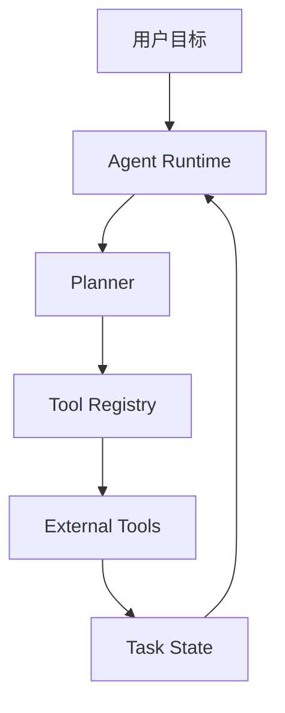

# 本书写作总控约束

> 本文档用于作为《从零构建 AI Agent 系统：理论、架构、源码研究与工程实现》的长期写作总控约束。  
> 后续无论在当前对话继续写，还是新开窗口继续写，都应优先遵循本文档。

---

## 1. 书名与定位

### 1.1 主书名

《从零构建 AI Agent 系统：理论、架构、源码研究与工程实现》

### 1.2 副标题建议

从 Agent Loop、工具系统、上下文工程、记忆系统到长期任务与真实产品落地

### 1.3 本书定位

本书不是一本简单介绍 AI Agent 概念的科普书，也不是某个框架的 API 手册，而是一本帮助读者系统建立 **AI Agent 架构理解、机制拆解能力、工程实现能力和产品落地判断力** 的技术教程书。

本书的目标不是让读者只会调用某个 Agent 框架，而是让读者真正理解：

- 什么任务适合 Agent；
- 什么任务不适合 Agent；
- Agent 与 Chatbot、Tool Calling、Workflow 的区别；
- Agent 系统由哪些核心机制组成；
- Agent Loop 如何工作；
- 工具系统如何设计；
- 上下文工程如何组织；
- Memory 与 RAG 如何区分；
- 长期任务如何调度和恢复；
- 人工审批、安全边界、评估和可观测性为什么重要；
- 如何从 OpenClaw、Hermes、Claude Code、Codex 等系统中提炼架构经验；
- 如何最终构建一个真实可运行的 Agent Runtime 和综合项目。

### 1.4 核心写作立场

全书必须反复坚持以下立场：

1. Agent 不是会调用工具的聊天机器人。
2. Tool Calling 不等于 Agent。
3. 能用函数解决的，不要用 Agent。
4. 能用确定性工作流解决的，不要交给 LLM 自由发挥。
5. Agent 的自主性必须被设计，而不能被放任。
6. 真正有价值的 Agent 系统，必须具备任务、工具、上下文、记忆、状态、评估、安全、人机协同和产品交互。
7. 学习 Agent 的重点不是追框架，而是掌握底层机制。
8. 源码研究很重要，但不能替代系统学习。
9. Agent 产品不是单纯后端能力，还需要产品界面、审批流、日志、追踪和用户控制面。
10. 本书要帮助读者从“看懂 Agent 概念”进步到“能够设计和实现 Agent 系统”。

---

## 2. 目标读者

本书主要面向以下读者：

1. 有一定编程基础，想系统进入 AI Agent 开发的人；
2. 用过 ChatGPT、Claude、Codex、Claude Code，但想理解背后机制的人；
3. 想从普通 LLM 应用开发升级到 Agent 系统设计的人；
4. 想构建个人助理、外贸获客 Agent、教育 Agent、代码 Agent、企业流程 Agent 的开发者；
5. 有工程背景，但还没形成 Agent 架构能力的人；
6. 希望通过源码研究提升 Agent 工程能力的人；
7. 希望将 AI Agent 应用到真实业务场景的人。

默认读者：

- 懂基本编程；
- 能阅读 Python 或 JavaScript 示例；
- 不默认熟悉 LangGraph、OpenAI Agents SDK、RAG、任务队列、向量数据库、工作流引擎等；
- 不默认具备完整 Agent 系统设计经验。

---

## 3. 全书总体结构

全书分为 6 篇，共 20 章。

---

# 第一篇：重新理解 Agent

目标：建立 Agent 的基础认知和判断力，避免把 Agent 简化理解为“聊天机器人 + 工具调用”。

## 第 1 章：为什么要系统学习 Agent

核心目标：

- 解释为什么 Agent 不是简单 Prompt；
- 区分 Chatbot、Tool Calling、Agent；
- 说明 Demo 到产品之间的差距；
- 建立系统学习 Agent 的必要性；
- 引出全书后续机制。

状态：已完成。

## 第 2 章：Agent 的能力模型

核心目标：

- 建立 Agent 的能力分层模型；
- 解释任务理解、规划、工具、上下文、记忆、状态、安全、评估、人机协同、产品交互等能力；
- 帮助读者形成 Agent 系统全景图。

## 第 3 章：什么时候该用 Agent，什么时候不该用 Agent

核心目标：

- 讲清 Agent 的适用边界；
- 区分函数、工作流、Agent；
- 建立任务适用性判断表；
- 防止滥用 Agent。

---

# 第二篇：Agent 核心机制

目标：进入 Agent 内部机制，开始理解和实现 Agent Runtime 的核心部件。

## 第 4 章：Agent Loop：从 Observe 到 Act

核心目标：

- 解释 Agent Loop；
- 介绍 Observe、Think、Plan、Act、Reflect、Stop；
- 对比 ReAct、Plan-and-Execute；
- 实现最小 Agent Loop。

## 第 5 章：工具系统：Agent 的手和脚

核心目标：

- 设计 Tool Registry；
- 解释 tool schema、参数校验、工具返回值、工具错误、权限控制、dry-run、timeout、retry；
- 说明为什么高风险工具必须审批；
- 以邮件工具、文件工具、搜索工具、shell 工具为例。

## 第 6 章：上下文工程：Agent 的工作记忆

核心目标：

- 解释上下文结构；
- 区分 system prompt、developer prompt、task prompt、tool result、conversation history、scratchpad；
- 讲清哪些信息放 prompt，哪些信息放数据库，哪些信息放向量库；
- 介绍 context compression、context injection、上下文污染。

## 第 7 章：Planning：让 Agent 做正确的下一步

核心目标：

- 解释 Agent 的规划机制；
- 对比 ReAct、Plan-and-Execute、Workflow + Agent；
- 介绍 Planner / Executor 分离；
- 讨论多 Agent 协作的边界；
- 实现简单 Planner-Executor。

---

# 第三篇：记忆、知识库与长期任务

目标：让 Agent 从一次性对话，变成可以持续工作的系统。

## 第 8 章：Memory：Agent 如何越用越懂你

核心目标：

- 区分会话记忆、任务记忆、用户记忆、领域知识、技能记忆、经验记忆；
- 解释什么该记、什么不该记；
- 说明记忆污染、错误记忆、隐私风险；
- 实现 Memory Store。

## 第 9 章：RAG 与知识库：让 Agent 使用外部知识

核心目标：

- 区分 RAG 和 Memory；
- 解释文档切分、embedding、向量数据库、检索、rerank、query rewrite、context injection；
- 实现最小 RAG 系统；
- 强调来源引用和不确定性标记。

## 第 10 章：Long-running Agent：长任务、调度与恢复

核心目标：

- 解释长期任务系统；
- 介绍 task state、job queue、scheduler、checkpoint、resume、cancellation、retry、notification、audit log；
- 说明用户打断、失败恢复、人工确认节点；
- 设计一个每天运行的外贸获客 Agent 调度流程。

---

# 第四篇：可控、安全、可评估的 Agent

目标：让 Agent 从 Demo 变成可真实使用的系统。

## 第 11 章：Human-in-the-loop：人机协同与审批系统

核心目标：

- 解释为什么真实 Agent 不能完全自动；
- 设计审批队列；
- 说明风险分级、Review UI、用户打断、状态修改；
- 以外贸邮件 Agent 和代码 Agent 为例。

## 第 12 章：Evaluation：如何判断 Agent 是否真的有用

核心目标：

- 建立 Agent 评估体系；
- 介绍任务成功率、工具调用正确率、结果质量、安全合规、成本、延迟、可解释性；
- 实现 Agent Eval Harness；
- 设计外贸客户开发 Agent 的评估集。

## 第 13 章：Observability：让 Agent 的行为可追踪

核心目标：

- 解释 trace、span、event log、tool call log、token usage、cost、latency、failure reason、replay；
- 让 Agent 执行过程可回放、可审计、可排查；
- 给前面的 Agent 增加可观测性。

---

# 第五篇：源码研究与架构模式

目标：学会从成熟项目中提炼架构能力，而不是盲目抄代码。

## 第 14 章：如何阅读 Agent 项目源码

核心目标：

- 建立 Agent 源码阅读方法；
- 从产品入口、任务层、运行时、工具层、记忆层、存储层、前端控制面等维度阅读源码；
- 输出 Agent 项目源码阅读模板。

## 第 15 章：OpenClaw、Hermes、Claude Code 的学习价值

核心目标：

- 对比 OpenClaw、Hermes、Claude Code、Codex 等系统的外部行为、产品形态和架构启发；
- 谨慎处理闭源项目，不编造内部实现；
- 提炼可借鉴模块，而不是照搬表象。

## 第 16 章：从源码中提炼自己的 Agent Runtime

核心目标：

- 汇总前面机制；
- 设计自己的 Agent Runtime；
- 包括 agent-runtime、tool-registry、context-manager、memory-store、task-state-machine、approval-system、scheduler、event-bus、eval-harness、dashboard；
- 输出模块职责、接口设计和架构图。

---

# 第六篇：综合实战项目

目标：把前面所有机制串起来，做出真实可用的 Agent 原型。

## 第 17 章：项目一：任务型研究 Agent

核心目标：

- 实现自动研究和报告生成 Agent；
- 包括问题拆解、资料搜索、信息提取、报告生成、来源标记、不确定性标记、结果保存；
- 用于训练检索、上下文组织、报告生成和评估。

## 第 18 章：项目二：外贸客户开发 Agent

核心目标：

- 实现全书最重要的商业化综合项目；
- 包括产品输入、目标国家、客户搜索、客户识别、画像生成、商机评分、开发信生成、人工审批、触达记录、跟进调度；
- 强调不能自动乱发邮件，必须有审批节点。

## 第 19 章：项目三：代码开发 Agent Mini 版

核心目标：

- 实现简化版代码 Agent；
- 包括 repo 读取、需求理解、文件搜索、修改计划、代码修改、测试运行、diff、checkpoint、rollback；
- 用于理解 Claude Code / Codex 类产品的工程模式。

## 第 20 章：从 Demo 到产品：Agent 系统如何持续演进

核心目标：

- 讲清 Agent 从个人原型到商业产品的演进路线；
- 包括 CLI 到 Web UI、单用户到多用户、单 Agent 到多 Agent、手动触发到定时任务、记忆到技能沉淀；
- 给出 90 天学习路线和 6 个月项目路线。

---

## 4. 每章写作要求

### 4.1 字数要求

每章默认字数要求：

- 理论认知章节：6000–9000 字；
- 核心机制章节：9000–13000 字；
- 工程实现章节：10000–15000 字；
- 综合项目章节：12000–18000 字。

如果用户明确要求某章“不少于 8000 字”或“不少于 9000 字”，必须按用户要求执行。

如果一轮输出写不完，应：

1. 先写本章前半部分；
2. 结尾标注“第 X 章未完，下一次继续”；
3. 下一轮从断点继续；
4. 不要重新开始同一章。

### 4.2 文体要求

必须写成完整书稿，而不是提纲。

允许使用标题和小节，但每个小节必须有完整论述、案例和过渡，不允许只列 bullet point。

整体风格：

- 技术书风格；
- 工程实践导向；
- 概念解释清晰；
- 不堆砌术语；
- 不写成营销文；
- 不写成泛泛科普；
- 不写成论文综述；
- 不夸大 Agent 能力；
- 不制造不确定事实；
- 对闭源产品保持谨慎表达。

### 4.3 每章固定结构

每章建议采用以下结构：

```markdown
# 第 X 章：章节标题

## X.1 本章要解决的问题

## X.2 核心概念一

## X.3 核心概念二

## X.4 典型误区

## X.5 架构设计或工程机制

## X.6 最小实现或示例

## X.7 工程化改进

## X.8 与成熟 Agent 产品 / 框架的对照

## 练习题

## 检查清单

## 本章总结
```

不要求每章小节标题完全相同，但每章结尾必须包含：

1. 练习题；
2. 检查清单；
3. 本章总结。

### 4.4 例子要求

每个关键概念都必须配例子。

优先使用以下贯穿案例：

1. 外贸客户开发 Agent；
2. 代码开发 Agent；
3. 教育 Agent；
4. 任务型研究 Agent；
5. 个人助理 Agent；
6. 企业流程 Agent；
7. 浏览器 Agent；
8. 文件处理 Agent；
9. 长期运行的 AI 员工 / Athena 类系统。

例子必须服务于概念解释，不要堆砌场景。

### 4.5 代码要求

后续涉及工程实现时，应遵循以下要求：

1. 代码以 Python 为主；
2. 必要时可使用伪代码；
3. 代码要有解释；
4. 不追求大而全，但要体现机制；
5. 不要只给框架调用示例；
6. 尽量从最小可理解实现开始；
7. 每段代码都要说明解决什么问题；
8. 涉及危险操作，如 shell、文件删除、邮件发送，应默认加入权限边界或人工确认；
9. 代码项目应围绕 Mini Agent Runtime 逐步演进。

### 4.6 图示要求

在无法生成图片时，可以使用 Mermaid 或 ASCII 图。

优先使用 Mermaid 表达：

- 架构图；
- Agent Loop；
- 状态机；
- 工具调用链路；
- 审批流程；
- 长期任务调度；
- 多 Agent 协作；
- Runtime 模块关系。

示例：



### 4.7 事实与引用要求

如果涉及以下内容，应尽量谨慎并标明不确定性：

- 闭源产品内部实现；
- 最新框架版本；
- 企业产品能力；
- 学术论文进展；
- 开源项目当前状态。

写作中可以讨论 OpenClaw、Hermes、Claude Code、Codex，但要遵循：

1. 对开源项目，可基于源码和公开文档分析；
2. 对闭源产品，只能分析公开行为、用户可见交互和合理架构推断；
3. 不能伪造内部实现；
4. 不能把推断写成事实；
5. 如后续需要最新信息，应先联网检索或基于用户提供材料。

---

## 5. 贯穿全书的主线项目

全书不建议每章都做孤立 Demo，而应围绕一个逐步增强的 Mini Agent Runtime 展开。

### 5.1 主线项目名称

Mini Agent Runtime

### 5.2 目标

通过逐章演进，帮助读者理解 Agent 系统如何从最小循环发展为可控、可评估、可长期运行的系统。

### 5.3 推荐目录结构

```text
mini-agent-runtime/
├── agent/
│   ├── loop.py
│   ├── planner.py
│   ├── executor.py
│   └── state.py
├── tools/
│   ├── registry.py
│   ├── calculator.py
│   ├── file_tools.py
│   ├── search_tool.py
│   └── email_tools.py
├── context/
│   ├── manager.py
│   └── compressor.py
├── memory/
│   ├── store.py
│   └── schema.py
├── rag/
│   ├── loader.py
│   ├── splitter.py
│   ├── index.py
│   └── retriever.py
├── scheduler/
│   ├── queue.py
│   ├── job.py
│   └── checkpoint.py
├── approval/
│   ├── approval_queue.py
│   └── review.py
├── eval/
│   ├── harness.py
│   └── report.py
├── observability/
│   ├── trace.py
│   └── logger.py
└── examples/
    ├── research_agent/
    ├── foreign_trade_agent/
    └── code_agent_mini/
```

### 5.4 版本演进

建议分为以下版本：

```text
v1：最小 Agent Loop + Tool Registry
v2：Context Manager + Planner / Executor
v3：Memory Store + RAG
v4：Task State + Scheduler + Checkpoint
v5：Approval System + Safety Control
v6：Evaluation + Observability
v7：Research Agent 综合项目
v8：Foreign Trade Agent 综合项目
v9：Code Agent Mini 综合项目
```

---

## 6. 贯穿全书的三个综合项目

### 6.1 项目一：任务型研究 Agent

用于训练：

- 任务拆解；
- 搜索；
- 来源判断；
- 信息提取；
- 上下文组织；
- 报告生成；
- 引用来源；
- 不确定性标记；
- 评估。

### 6.2 项目二：外贸客户开发 Agent

用于训练：

- 长任务执行；
- 客户搜索；
- 客户识别；
- 客户画像；
- 商机评分；
- 开发信生成；
- 人工审批；
- 触达记录；
- 跟进调度；
- 记忆更新。

该项目是全书最重要的商业化综合案例。

### 6.3 项目三：代码开发 Agent Mini 版

用于训练：

- repo context；
- 文件读写；
- shell tool 权限；
- 测试运行；
- diff 生成；
- checkpoint；
- rollback；
- 用户确认；
- 失败恢复。

该项目用于理解 Claude Code / Codex 类产品的工程模式。

---

## 7. 重点章节要求

以下章节是全书核心章节，必须单独生成，不宜压缩：

```text
第 5 章：工具系统
第 6 章：上下文工程
第 8 章：Memory
第 10 章：Long-running Agent
第 18 章：外贸客户开发 Agent
第 19 章：代码开发 Agent Mini 版
```

这些章节必须做到：

1. 概念讲清；
2. 工程机制讲透；
3. 有完整例子；
4. 有代码或伪代码；
5. 有常见失败模式；
6. 有真实系统中的取舍；
7. 有练习题和检查清单。

---

## 8. 写作节奏建议

推荐按以下顺序生成全书：

```text
第 1 批：第 1–3 章
第 2 批：第 4–5 章
第 3 批：第 6–7 章
第 4 批：第 8–10 章
第 5 批：第 11–13 章
第 6 批：第 14–16 章
第 7 批：第 17–18 章
第 8 批：第 19–20 章
第 9 批：附录、总索引、练习汇总、代码目录说明
```

为了质量，实际生成时建议每次只生成 1 章，最多 2 章。

---

## 9. 后续生成指令模板

### 9.1 生成单章正文模板

```markdown
请根据《本书写作总控约束.md》，继续生成第 X 章：章节标题。

要求：
1. 本章字数不少于 N 字；
2. 不要写成提纲，要写成完整书稿；
3. 保留技术书风格；
4. 每个关键概念都要有例子；
5. 尽量延续第 1 章的写作风格；
6. 本章结尾要有练习题、检查清单和总结；
7. 如果一轮输出写不完，请先写本章前半部分，并在结尾标注“第 X 章未完，下一次继续”。
```

### 9.2 继续未完章节模板

```markdown
请继续完成第 X 章，从上一次中断的位置继续写，不要重新开始。

要求：
1. 保持前文风格；
2. 补齐本章剩余内容；
3. 结尾必须包含练习题、检查清单和本章总结；
4. 如果仍然写不完，继续标注“第 X 章未完，下一次继续”。
```

### 9.3 章节保存为 Markdown 模板

```markdown
请把刚才生成的第 X 章保存为 Markdown 文档。

要求：
1. 文件名使用英文短横线格式；
2. 保留完整标题、小节、练习题、检查清单和总结；
3. 不要改写正文；
4. 给我下载链接。
```

### 9.4 章节校对模板

```markdown
请校对第 X 章。

重点检查：
1. 是否符合本书写作总控约束；
2. 是否有重复、空泛、跳跃；
3. 是否概念讲清楚；
4. 是否每个关键概念都有例子；
5. 是否有工程视角；
6. 是否与前后章节衔接自然；
7. 是否需要补充代码、图示或练习。
```

---

## 10. 后续文件组织建议

最终书稿建议整理成以下结构：

```text
agent-book/
├── README.md
├── 00-book-positioning.md
├── 01-full-outline.md
├── 02-writing-control.md
├── part-1-rethinking-agent/
│   ├── chapter-01-why-systematically-learn-agent.md
│   ├── chapter-02-agent-capability-model.md
│   └── chapter-03-when-to-use-agent.md
├── part-2-core-mechanisms/
│   ├── chapter-04-agent-loop.md
│   ├── chapter-05-tool-system.md
│   ├── chapter-06-context-engineering.md
│   └── chapter-07-planning.md
├── part-3-memory-rag-long-running/
│   ├── chapter-08-memory.md
│   ├── chapter-09-rag-knowledge-base.md
│   └── chapter-10-long-running-agent.md
├── part-4-safe-evaluable-agent/
│   ├── chapter-11-human-in-the-loop.md
│   ├── chapter-12-evaluation.md
│   └── chapter-13-observability.md
├── part-5-source-code-and-runtime/
│   ├── chapter-14-how-to-read-agent-source-code.md
│   ├── chapter-15-openclaw-hermes-claude-code.md
│   └── chapter-16-design-your-agent-runtime.md
├── part-6-projects/
│   ├── chapter-17-research-agent.md
│   ├── chapter-18-foreign-trade-agent.md
│   ├── chapter-19-code-agent-mini.md
│   └── chapter-20-from-demo-to-product.md
├── appendix/
│   ├── appendix-a-agent-glossary.md
│   ├── appendix-b-prompt-patterns.md
│   ├── appendix-c-tool-schema-examples.md
│   ├── appendix-d-agent-evaluation-template.md
│   ├── appendix-e-source-code-reading-template.md
│   ├── appendix-f-90-day-learning-roadmap.md
│   └── appendix-g-six-month-project-roadmap.md
└── code/
    ├── mini-agent-runtime/
    └── projects/
```

---

## 11. 当前已完成内容

### 已完成章节

```text
第 1 章：为什么要系统学习 Agent
```

已保存文件：

```text
chapter-01-why-systematically-learn-agent.md
```

### 当前建议下一步

继续生成：

```text
第 2 章：Agent 的能力模型
```

推荐指令：

```markdown
请根据《本书写作总控约束.md》，继续生成第 2 章：Agent 的能力模型。

要求：
1. 本章字数不少于 9000 字；
2. 不要写成提纲，要写成完整书稿；
3. 保留技术书风格；
4. 每个关键概念都要有例子；
5. 尽量延续第 1 章的写作风格；
6. 本章结尾要有练习题、检查清单和总结；
7. 如果一轮输出写不完，请先写本章前半部分，并在结尾标注“第 2 章未完，下一次继续”。
```

---

## 12. 写作时必须避免的问题

后续写作中应避免：

1. 把 Agent 写成万能技术；
2. 把 Tool Calling 等同于 Agent；
3. 把 Prompt 当成 Agent 的全部；
4. 对闭源产品内部实现做无依据断言；
5. 只讲框架 API，不讲机制；
6. 只讲概念，不讲工程；
7. 只讲代码，不讲为什么；
8. 只给 Demo，不讲真实产品风险；
9. 忽略安全、审批、评估、日志和成本；
10. 忽略用户如何使用 Agent 产品；
11. 过早陷入多 Agent 炫技；
12. 为了显得高级而堆砌术语；
13. 把所有任务都强行 Agent 化；
14. 章节之间重复过多；
15. 章节结尾缺少练习、检查清单和总结。

---

## 13. 本书最终目标

本书最终希望让读者形成以下能力：

```text
[ ] 能判断一个任务是否适合 Agent。
[ ] 能解释 Chatbot、Tool Calling、Workflow、Agent 的区别。
[ ] 能画出一个 Agent 系统的核心架构。
[ ] 能手写最小 Agent Loop。
[ ] 能设计安全可控的工具系统。
[ ] 能组织上下文和任务状态。
[ ] 能区分 Memory 与 RAG。
[ ] 能设计长期运行任务、调度和恢复机制。
[ ] 能设计人工审批和风险分级。
[ ] 能评估 Agent 是否真的完成任务。
[ ] 能追踪 Agent 的执行过程。
[ ] 能阅读 Agent 项目源码并提炼架构。
[ ] 能构建研究 Agent、外贸 Agent、代码 Agent 等真实原型。
[ ] 能从 Demo 思维升级到产品系统思维。
```

---

## 14. 一句话总控原则

> 本书写作的核心目标不是让读者“知道 Agent 是什么”，而是让读者具备“设计、实现、评估和产品化 Agent 系统”的能力。
